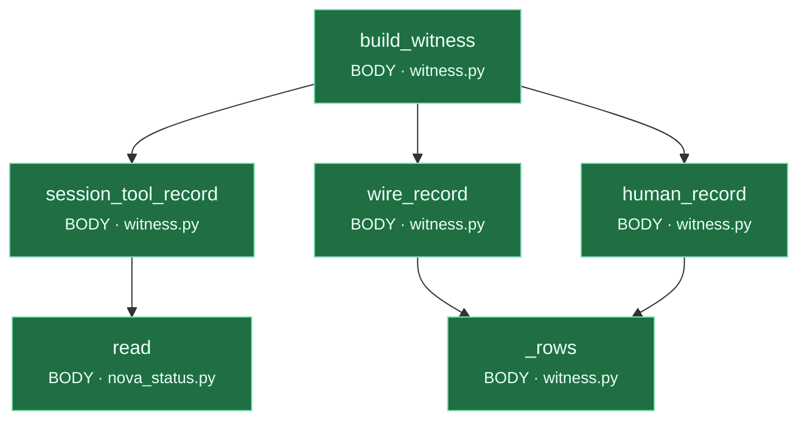

# Calls_Order.md — what calls what, and in what ORDER
_Auto-generated by `general_tools/calls_order.py`. Do not hand-edit._
_Last updated: 2026-10-01 02:44:37_

`calls.md` answers *what does this file import?*. This answers the question that actually
costs days: **when Nova runs a tool, what happens, in what order, and where does it live?**

Nodes are coloured by where they live:

- **BODY** (`nova_body/`) — this is *her*. Faculties: reaching, remembering, deciding, checking.
- **face** (`general_tools/`) — scaffolding. A window someone looks through. She survives losing it.

**An edge from BODY into face is a pluck-test failure** — it means part of her thinking is
living outside her. On 2026-07-14 her entire integrity faculty was doing exactly that, and it
took a human noticing rather than a tool showing it. Now the chart shows it.

---

## Cole sends a message → Nova answers (the tool loop)

> ⚠️ entry point `run_nova_response` not found (expected in `nova_body/nova_voice/nova.py`) — the code moved, or the name changed. This chart is stale; fix it.

## A tool actually executes (the receipt path)

Entry: `execute_tool` · `nova_body/nova_voice/tool_router.py`

```mermaid
flowchart TD
    n__bump_plays["_bump_plays<br/><small>BODY · curio.py</small>"]
    n__catastrophic["_catastrophic<br/><small>BODY · tool_router.py</small>"]
    n__coerce["_coerce<br/><small>BODY · tunables.py</small>"]
    n__execute_tool_inner["_execute_tool_inner<br/><small>BODY · tool_router.py</small>"]
    n__forged_section["_forged_section<br/><small>BODY · tool_router.py</small>"]
    n__log_tool_receipt["_log_tool_receipt<br/><small>BODY · tool_router.py</small>"]
    n__log_tool_receipt_fallback["_log_tool_receipt_fallback<br/><small>BODY · tool_router.py</small>"]
    n__md_headings["_md_headings<br/><small>BODY · tool_router.py</small>"]
    n__norm_rel["_norm_rel<br/><small>BODY · tool_router.py</small>"]
    n__orient["_orient<br/><small>BODY · tool_router.py</small>"]
    n__plays["_plays<br/><small>BODY · curio.py</small>"]
    n__route_bare_filename["_route_bare_filename<br/><small>BODY · tool_router.py</small>"]
    n__safe_target["_safe_target<br/><small>BODY · tool_router.py</small>"]
    n__save_last["_save_last<br/><small>BODY · curio.py</small>"]
    n__sealed_cmd["_sealed_cmd<br/><small>BODY · tool_router.py</small>"]
    n__sealed_path["_sealed_path<br/><small>BODY · tool_router.py</small>"]
    n__seed["_seed<br/><small>BODY · curio.py</small>"]
    n__shelf_count["_shelf_count<br/><small>BODY · curio.py</small>"]
    n__silent_miss_caution["_silent_miss_caution<br/><small>BODY · tool_router.py</small>"]
    n__timeout_help["_timeout_help<br/><small>BODY · tool_router.py</small>"]
    n__twist_bag["_twist_bag<br/><small>BODY · curio.py</small>"]
    n__update["_update<br/><small>BODY · tasking.py</small>"]
    n__vision["_vision<br/><small>BODY · curio.py</small>"]
    n__within_workspace["_within_workspace<br/><small>BODY · tool_router.py</small>"]
    n__wonder["_wonder<br/><small>BODY · curio.py</small>"]
    n_append_file["append_file<br/><small>BODY · tool_router.py</small>"]
    n_body_path["body_path<br/><small>BODY · nova_paths.py</small>"]
    n_complete["complete<br/><small>BODY · tasking.py</small>"]
    n_complete_task["complete_task<br/><small>BODY · tool_router.py</small>"]
    n_create["create<br/><small>BODY · tasking.py</small>"]
    n_create_task["create_task<br/><small>BODY · tool_router.py</small>"]
    n_critique["critique<br/><small>BODY · sight.py</small>"]
    n_execute_tool["execute_tool<br/><small>BODY · tool_router.py</small>"]
    n_journal["journal<br/><small>BODY · tool_router.py</small>"]
    n_journal_note["journal_note<br/><small>BODY · tool_router.py</small>"]
    n_keep["keep<br/><small>BODY · curio.py</small>"]
    n_keep_curio["keep_curio<br/><small>BODY · tool_router.py</small>"]
    n_list_dir["list_dir<br/><small>BODY · tool_router.py</small>"]
    n_list_tools["list_tools<br/><small>BODY · tool_router.py</small>"]
    n_look_at["look_at<br/><small>BODY · tool_router.py</small>"]
    n_memory_search["memory_search<br/><small>BODY · tool_router.py</small>"]
    n_my_shelf["my_shelf<br/><small>BODY · tool_router.py</small>"]
    n_ping_claude["ping_claude<br/><small>BODY · tool_router.py</small>"]
    n_progress["progress<br/><small>BODY · tasking.py</small>"]
    n_read["read<br/><small>BODY · nova_status.py</small>"]
    n_read_file["read_file<br/><small>BODY · tool_router.py</small>"]
    n_replace_file_content["replace_file_content<br/><small>BODY · tool_router.py</small>"]
    n_run_command["run_command<br/><small>BODY · tool_router.py</small>"]
    n_set["set<br/><small>BODY · tunables.py</small>"]
    n_shelf["shelf<br/><small>BODY · curio.py</small>"]
    n_surprise["surprise<br/><small>BODY · curio.py</small>"]
    n_surprise_me["surprise_me<br/><small>BODY · tool_router.py</small>"]
    n_task_progress["task_progress<br/><small>BODY · tool_router.py</small>"]
    n_workspace_path["workspace_path<br/><small>BODY · nova_paths.py</small>"]
    n_write_file["write_file<br/><small>BODY · tool_router.py</small>"]
    n_execute_tool --> n__execute_tool_inner
    n__execute_tool_inner --> n_list_tools
    n_list_tools --> n__forged_section
    n__execute_tool_inner --> n_run_command
    n_run_command --> n__catastrophic
    n_run_command --> n__sealed_cmd
    n_run_command --> n__sealed_path
    n_run_command --> n__silent_miss_caution
    n_run_command --> n__timeout_help
    n__execute_tool_inner --> n_read_file
    n_read_file --> n__safe_target
    n__safe_target --> n_workspace_path
    n_workspace_path --> n_body_path
    n__safe_target --> n__norm_rel
    n_read_file --> n__sealed_path
    n_read_file --> n__orient
    n__execute_tool_inner --> n_write_file
    n_write_file --> n__route_bare_filename
    n_write_file --> n__safe_target
    n_write_file --> n__sealed_path
    n__execute_tool_inner --> n_append_file
    n_append_file --> n__safe_target
    n_append_file --> n__sealed_path
    n_append_file --> n_set
    n_set --> n__coerce
    n_append_file --> n__md_headings
    n_append_file --> n_read
    n__execute_tool_inner --> n_replace_file_content
    n_replace_file_content --> n__safe_target
    n_replace_file_content --> n__sealed_path
    n__execute_tool_inner --> n_list_dir
    n_list_dir --> n__safe_target
    n_list_dir --> n__sealed_path
    n__execute_tool_inner --> n_create_task
    n_create_task --> n_create
    n__execute_tool_inner --> n_task_progress
    n_task_progress --> n_progress
    n__execute_tool_inner --> n_complete_task
    n_complete_task --> n_complete
    n_complete --> n__update
    n__execute_tool_inner --> n_surprise_me
    n_surprise_me --> n_surprise
    n_surprise --> n__bump_plays
    n__bump_plays --> n__plays
    n_surprise --> n__save_last
    n_surprise --> n__wonder
    n__wonder --> n__seed
    n__wonder --> n_read
    n_surprise --> n__vision
    n__vision --> n__twist_bag
    n_surprise --> n__seed
    n__execute_tool_inner --> n_keep_curio
    n_keep_curio --> n_keep
    n_keep --> n__shelf_count
    n__execute_tool_inner --> n_my_shelf
    n_my_shelf --> n_shelf
    n_shelf --> n__shelf_count
    n__execute_tool_inner --> n_look_at
    n_look_at --> n_critique
    n__execute_tool_inner --> n_memory_search
    n__execute_tool_inner --> n_journal_note
    n_journal_note --> n__within_workspace
    n_journal_note --> n_body_path
    n__execute_tool_inner --> n_ping_claude
    n_ping_claude --> n_body_path
    n__execute_tool_inner --> n_journal
    n_journal --> n__within_workspace
    n_journal --> n_body_path
    n_execute_tool --> n__log_tool_receipt
    n__log_tool_receipt --> n__log_tool_receipt_fallback
    n__log_tool_receipt_fallback --> n_body_path
    class n__bump_plays body;
    class n__catastrophic body;
    class n__coerce body;
    class n__execute_tool_inner body;
    class n__forged_section body;
    class n__log_tool_receipt body;
    class n__log_tool_receipt_fallback body;
    class n__md_headings body;
    class n__norm_rel body;
    class n__orient body;
    class n__plays body;
    class n__route_bare_filename body;
    class n__safe_target body;
    class n__save_last body;
    class n__sealed_cmd body;
    class n__sealed_path body;
    class n__seed body;
    class n__shelf_count body;
    class n__silent_miss_caution body;
    class n__timeout_help body;
    class n__twist_bag body;
    class n__update body;
    class n__vision body;
    class n__within_workspace body;
    class n__wonder body;
    class n_append_file body;
    class n_body_path body;
    class n_complete body;
    class n_complete_task body;
    class n_create body;
    class n_create_task body;
    class n_critique body;
    class n_execute_tool body;
    class n_journal body;
    class n_journal_note body;
    class n_keep body;
    class n_keep_curio body;
    class n_list_dir body;
    class n_list_tools body;
    class n_look_at body;
    class n_memory_search body;
    class n_my_shelf body;
    class n_ping_claude body;
    class n_progress body;
    class n_read body;
    class n_read_file body;
    class n_replace_file_content body;
    class n_run_command body;
    class n_set body;
    class n_shelf body;
    class n_surprise body;
    class n_surprise_me body;
    class n_task_progress body;
    class n_workspace_path body;
    class n_write_file body;
    classDef body fill:#1f6f43,stroke:#7ee2b8,color:#eafff5;
    classDef face fill:#3a3f5c,stroke:#8fa2ff,color:#eef1ff;
```



**Call order:**

  1. `execute_tool` → `_execute_tool_inner`  · **BODY** · `nova_body/nova_voice/tool_router.py`
  2.   `_execute_tool_inner` → `list_tools`  · **BODY** · `nova_body/nova_voice/tool_router.py`
  3.     `list_tools` → `_forged_section`  · **BODY** · `nova_body/nova_voice/tool_router.py`
  4.   `_execute_tool_inner` → `run_command`  · **BODY** · `nova_body/nova_voice/tool_router.py`
  5.     `run_command` → `_catastrophic`  · **BODY** · `nova_body/nova_voice/tool_router.py`
  6.     `run_command` → `_sealed_cmd`  · **BODY** · `nova_body/nova_voice/tool_router.py`
  7.     `run_command` → `_sealed_path`  · **BODY** · `nova_body/nova_voice/tool_router.py`
  8.     `run_command` → `_silent_miss_caution`  · **BODY** · `nova_body/nova_voice/tool_router.py`
  9.     `run_command` → `_timeout_help`  · **BODY** · `nova_body/nova_voice/tool_router.py`
 10.   `_execute_tool_inner` → `read_file`  · **BODY** · `nova_body/nova_voice/tool_router.py`
 11.     `read_file` → `_safe_target`  · **BODY** · `nova_body/nova_voice/tool_router.py`
 12.       `_safe_target` → `workspace_path`  · **BODY** · `nova_body/nova_paths.py`
 13.         `workspace_path` → `body_path`  · **BODY** · `nova_body/nova_paths.py`
 14.         `workspace_path` → `body_path`  · **BODY** · `nova_body/nova_paths.py`
 15.       `_safe_target` → `workspace_path`  · **BODY** · `nova_body/nova_paths.py`
 16.       `_safe_target` → `_norm_rel`  · **BODY** · `nova_body/nova_voice/tool_router.py`
 17.     `read_file` → `_sealed_path`  · **BODY** · `nova_body/nova_voice/tool_router.py`
 18.     `read_file` → `_orient`  · **BODY** · `nova_body/nova_voice/tool_router.py`
 19.   `_execute_tool_inner` → `write_file`  · **BODY** · `nova_body/nova_voice/tool_router.py`
 20.     `write_file` → `_route_bare_filename`  · **BODY** · `nova_body/nova_voice/tool_router.py`
 21.     `write_file` → `_safe_target`  · **BODY** · `nova_body/nova_voice/tool_router.py`
 22.     `write_file` → `_sealed_path`  · **BODY** · `nova_body/nova_voice/tool_router.py`
 23.   `_execute_tool_inner` → `append_file`  · **BODY** · `nova_body/nova_voice/tool_router.py`
 24.     `append_file` → `_safe_target`  · **BODY** · `nova_body/nova_voice/tool_router.py`
 25.     `append_file` → `_sealed_path`  · **BODY** · `nova_body/nova_voice/tool_router.py`
 26.     `append_file` → `set`  · **BODY** · `nova_body/nova_cortex/tunables.py`
 27.       `set` → `_coerce`  · **BODY** · `nova_body/nova_cortex/tunables.py`
 28.     `append_file` → `_md_headings`  · **BODY** · `nova_body/nova_voice/tool_router.py`
 29.     `append_file` → `_md_headings`  · **BODY** · `nova_body/nova_voice/tool_router.py`
 30.     `append_file` → `read`  · **BODY** · `nova_body/nova_cortex/nova_status.py`
 31.   `_execute_tool_inner` → `replace_file_content`  · **BODY** · `nova_body/nova_voice/tool_router.py`
 32.     `replace_file_content` → `_safe_target`  · **BODY** · `nova_body/nova_voice/tool_router.py`
 33.     `replace_file_content` → `_sealed_path`  · **BODY** · `nova_body/nova_voice/tool_router.py`
 34.   `_execute_tool_inner` → `list_dir`  · **BODY** · `nova_body/nova_voice/tool_router.py`
 35.     `list_dir` → `_safe_target`  · **BODY** · `nova_body/nova_voice/tool_router.py`
 36.     `list_dir` → `_sealed_path`  · **BODY** · `nova_body/nova_voice/tool_router.py`
 37.   `_execute_tool_inner` → `create_task`  · **BODY** · `nova_body/nova_voice/tool_router.py`
 38.     `create_task` → `create`  · **BODY** · `nova_body/nova_cortex/tasking.py`
 39.   `_execute_tool_inner` → `task_progress`  · **BODY** · `nova_body/nova_voice/tool_router.py`
 40.     `task_progress` → `progress`  · **BODY** · `nova_body/nova_cortex/tasking.py`
 41.   `_execute_tool_inner` → `complete_task`  · **BODY** · `nova_body/nova_voice/tool_router.py`
 42.     `complete_task` → `complete`  · **BODY** · `nova_body/nova_cortex/tasking.py`
 43.       `complete` → `_update`  · **BODY** · `nova_body/nova_cortex/tasking.py`
 44.   `_execute_tool_inner` → `surprise_me`  · **BODY** · `nova_body/nova_voice/tool_router.py`
 45.     `surprise_me` → `surprise`  · **BODY** · `nova_body/nova_play/curio.py`
 46.       `surprise` → `_bump_plays`  · **BODY** · `nova_body/nova_play/curio.py`
 47.         `_bump_plays` → `_plays`  · **BODY** · `nova_body/nova_play/curio.py`
 48.       `surprise` → `_save_last`  · **BODY** · `nova_body/nova_play/curio.py`
 49.       `surprise` → `_wonder`  · **BODY** · `nova_body/nova_play/curio.py`
 50.         `_wonder` → `_seed`  · **BODY** · `nova_body/nova_play/curio.py`
 51.         `_wonder` → `read`  · **BODY** · `nova_body/nova_cortex/nova_status.py`
 52.       `surprise` → `_vision`  · **BODY** · `nova_body/nova_play/curio.py`
 53.         `_vision` → `_twist_bag`  · **BODY** · `nova_body/nova_play/curio.py`
 54.       `surprise` → `_seed`  · **BODY** · `nova_body/nova_play/curio.py`
 55.   `_execute_tool_inner` → `keep_curio`  · **BODY** · `nova_body/nova_voice/tool_router.py`
 56.     `keep_curio` → `keep`  · **BODY** · `nova_body/nova_play/curio.py`
 57.       `keep` → `_shelf_count`  · **BODY** · `nova_body/nova_play/curio.py`
 58.   `_execute_tool_inner` → `my_shelf`  · **BODY** · `nova_body/nova_voice/tool_router.py`
 59.     `my_shelf` → `shelf`  · **BODY** · `nova_body/nova_play/curio.py`
 60.       `shelf` → `_shelf_count`  · **BODY** · `nova_body/nova_play/curio.py`
 61.       `shelf` → `_shelf_count`  · **BODY** · `nova_body/nova_play/curio.py`
 62.   `_execute_tool_inner` → `look_at`  · **BODY** · `nova_body/nova_voice/tool_router.py`
 63.     `look_at` → `critique`  · **BODY** · `nova_body/nova_senses/sight.py`
 64.   `_execute_tool_inner` → `memory_search`  · **BODY** · `nova_body/nova_voice/tool_router.py`
 65.   `_execute_tool_inner` → `journal_note`  · **BODY** · `nova_body/nova_voice/tool_router.py`
 66.     `journal_note` → `_within_workspace`  · **BODY** · `nova_body/nova_voice/tool_router.py`
 67.     `journal_note` → `body_path`  · **BODY** · `nova_body/nova_paths.py`
 68.   `_execute_tool_inner` → `ping_claude`  · **BODY** · `nova_body/nova_voice/tool_router.py`
 69.     `ping_claude` → `body_path`  · **BODY** · `nova_body/nova_paths.py`
 70.   `_execute_tool_inner` → `journal`  · **BODY** · `nova_body/nova_voice/tool_router.py`
 71.     `journal` → `_within_workspace`  · **BODY** · `nova_body/nova_voice/tool_router.py`
 72.     `journal` → `body_path`  · **BODY** · `nova_body/nova_paths.py`
 73. `execute_tool` → `_log_tool_receipt`  · **BODY** · `nova_body/nova_voice/tool_router.py`
 74.   `_log_tool_receipt` → `_log_tool_receipt_fallback`  · **BODY** · `nova_body/nova_voice/tool_router.py`
 75.     `_log_tool_receipt_fallback` → `body_path`  · **BODY** · `nova_body/nova_paths.py`
 76. `execute_tool` → `_log_tool_receipt`  · **BODY** · `nova_body/nova_voice/tool_router.py`

---

## Nova wakes on her own (autonomy: reflect → decide → act)

Entry: `run_autonomy` · `nova_body/nova_runtime/runtime.py`

```mermaid
flowchart TD
    n__artifact_hint["_artifact_hint<br/><small>BODY · executive.py</small>"]
    n__artifact_path["_artifact_path<br/><small>BODY · executive.py</small>"]
    n__asked_by["_asked_by<br/><small>BODY · executive.py</small>"]
    n__asker["_asker<br/><small>BODY · executive.py</small>"]
    n__cfg["_cfg<br/><small>BODY · executive.py</small>"]
    n__children_map["_children_map<br/><small>BODY · tasking.py</small>"]
    n__claims_a_receipt["_claims_a_receipt<br/><small>BODY · nova.py</small>"]
    n__cloud_verdict["_cloud_verdict<br/><small>BODY · nova.py</small>"]
    n__coerce["_coerce<br/><small>BODY · tunables.py</small>"]
    n__done_count["_done_count<br/><small>BODY · tasking.py</small>"]
    n__emit_new_activities["_emit_new_activities<br/><small>face · server.py</small>"]
    n__est["_est<br/><small>BODY · nova.py</small>"]
    n__execute_tool_inner["_execute_tool_inner<br/><small>BODY · tool_router.py</small>"]
    n__extract_for_cole["_extract_for_cole<br/><small>BODY · executive.py</small>"]
    n__fetch_llama_streaming["_fetch_llama_streaming<br/><small>BODY · nova.py</small>"]
    n__find_tool_call["_find_tool_call<br/><small>BODY · nova.py</small>"]
    n__fingerprint["_fingerprint<br/><small>BODY · drives.py</small>"]
    n__fit_messages_to_window["_fit_messages_to_window<br/><small>BODY · nova.py</small>"]
    n__h2s["_h2s<br/><small>BODY · nova.py</small>"]
    n__has_open_task_titled["_has_open_task_titled<br/><small>BODY · executive.py</small>"]
    n__heavy_correction_check["_heavy_correction_check<br/><small>BODY · nova.py</small>"]
    n__heavy_second_opinion["_heavy_second_opinion<br/><small>BODY · nova.py</small>"]
    n__ids["_ids<br/><small>BODY · executive.py</small>"]
    n__is_leaf["_is_leaf<br/><small>BODY · executive.py</small>"]
    n__jac["_jac<br/><small>BODY · executive.py</small>"]
    n__last_reconcile["_last_reconcile<br/><small>BODY · integrity.py</small>"]
    n__load_state["_load_state<br/><small>BODY · executive.py</small>"]
    n__log_heavy["_log_heavy<br/><small>face · cloud_call.py</small>"]
    n__log_nova_thought["_log_nova_thought<br/><small>BODY · nova.py</small>"]
    n__log_tool_receipt["_log_tool_receipt<br/><small>BODY · tool_router.py</small>"]
    n__mark_reconciled["_mark_reconciled<br/><small>BODY · integrity.py</small>"]
    n__parse_actions["_parse_actions<br/><small>BODY · executive.py</small>"]
    n__persist["_persist<br/><small>face · transcript.py</small>"]
    n__progress_loop_count["_progress_loop_count<br/><small>BODY · executive.py</small>"]
    n__rows["_rows<br/><small>BODY · witness.py</small>"]
    n__run_one_wake["_run_one_wake<br/><small>BODY · runtime.py</small>"]
    n__save_state["_save_state<br/><small>BODY · executive.py</small>"]
    n__set_active["_set_active<br/><small>BODY · executive.py</small>"]
    n__similar["_similar<br/><small>BODY · drives.py</small>"]
    n__stem["_stem<br/><small>BODY · drives.py</small>"]
    n__strip_tool_residue["_strip_tool_residue<br/><small>BODY · executive.py</small>"]
    n__subtree_open_leaves["_subtree_open_leaves<br/><small>BODY · executive.py</small>"]
    n__tokens["_tokens<br/><small>BODY · drives.py</small>"]
    n__truncate_to_context["_truncate_to_context<br/><small>BODY · nova.py</small>"]
    n__update["_update<br/><small>BODY · tasking.py</small>"]
    n__was_asked_to_act["_was_asked_to_act<br/><small>BODY · nova.py</small>"]
    n_abandon["abandon<br/><small>BODY · tasking.py</small>"]
    n_add["add<br/><small>face · transcript.py</small>"]
    n_add_want["add_want<br/><small>BODY · drives.py</small>"]
    n_all_tasks["all_tasks<br/><small>BODY · tasking.py</small>"]
    n_apply_actions["apply_actions<br/><small>BODY · tasking.py</small>"]
    n_apply_decision["apply_decision<br/><small>BODY · executive.py</small>"]
    n_autonomy_enabled["autonomy_enabled<br/><small>BODY · executive.py</small>"]
    n_begin_turn["begin_turn<br/><small>BODY · witness.py</small>"]
    n_body_path["body_path<br/><small>BODY · nova_paths.py</small>"]
    n_broadcast["broadcast<br/><small>face · server.py</small>"]
    n_build_challenge_turn["build_challenge_turn<br/><small>BODY · witness.py</small>"]
    n_build_decision["build_decision<br/><small>BODY · executive.py</small>"]
    n_build_execution["build_execution<br/><small>BODY · executive.py</small>"]
    n_build_free_execution["build_free_execution<br/><small>BODY · executive.py</small>"]
    n_build_heavy_witness["build_heavy_witness<br/><small>BODY · witness.py</small>"]
    n_build_promise_turn["build_promise_turn<br/><small>BODY · witness.py</small>"]
    n_build_reflection["build_reflection<br/><small>BODY · executive.py</small>"]
    n_build_witness["build_witness<br/><small>BODY · witness.py</small>"]
    n_check["check<br/><small>BODY · checkin.py</small>"]
    n_claims_a_perception["claims_a_perception<br/><small>BODY · witness.py</small>"]
    n_claims_a_presence["claims_a_presence<br/><small>BODY · witness.py</small>"]
    n_claims_a_receipt["claims_a_receipt<br/><small>BODY · integrity.py</small>"]
    n_claims_an_attribution["claims_an_attribution<br/><small>BODY · witness.py</small>"]
    n_clear_touch_active["clear_touch_active<br/><small>BODY · runtime.py</small>"]
    n_cloud_chat["cloud_chat<br/><small>face · cloud_call.py</small>"]
    n_cole_directive["cole_directive<br/><small>BODY · environment.py</small>"]
    n_cole_typing["cole_typing<br/><small>BODY · environment.py</small>"]
    n_complete["complete<br/><small>BODY · tasking.py</small>"]
    n_consume_cole_directive["consume_cole_directive<br/><small>BODY · environment.py</small>"]
    n_create["create<br/><small>BODY · tasking.py</small>"]
    n_create_task["create_task<br/><small>BODY · tool_router.py</small>"]
    n_echo_match["echo_match<br/><small>BODY · discourse.py</small>"]
    n_elapsed_seconds["elapsed_seconds<br/><small>BODY · clock.py</small>"]
    n_emit["emit<br/><small>BODY · runtime.py</small>"]
    n_ensure_standing_chores["ensure_standing_chores<br/><small>BODY · executive.py</small>"]
    n_execute_tool["execute_tool<br/><small>BODY · tool_router.py</small>"]
    n_find["find<br/><small>BODY · eyes.py</small>"]
    n_find_tool_call["find_tool_call<br/><small>BODY · integrity.py</small>"]
    n_fingerprint["fingerprint<br/><small>BODY · environment.py</small>"]
    n_future_iso["future_iso<br/><small>BODY · clock.py</small>"]
    n_generate["generate<br/><small>BODY · model_client.py</small>"]
    n_get_session_start["get_session_start<br/><small>BODY · checkin.py</small>"]
    n_heavy_witness["heavy_witness<br/><small>face · cloud_call.py</small>"]
    n_human_in_room["human_in_room<br/><small>BODY · witness.py</small>"]
    n_human_record["human_record<br/><small>BODY · witness.py</small>"]
    n_is_checkable_fact_concern["is_checkable_fact_concern<br/><small>BODY · witness.py</small>"]
    n_last_reflection["last_reflection<br/><small>BODY · executive.py</small>"]
    n_minutes_since_last_human["minutes_since_last_human<br/><small>BODY · witness.py</small>"]
    n_needs_witness["needs_witness<br/><small>BODY · witness.py</small>"]
    n_new_turn_id["new_turn_id<br/><small>BODY · witness.py</small>"]
    n_note_real_work["note_real_work<br/><small>BODY · executive.py</small>"]
    n_note_wake["note_wake<br/><small>BODY · drives.py</small>"]
    n_now_card["now_card<br/><small>BODY · witness.py</small>"]
    n_now_iso["now_iso<br/><small>BODY · clock.py</small>"]
    n_on_progress["on_progress<br/><small>face · server.py</small>"]
    n_on_think_token["on_think_token<br/><small>face · server.py</small>"]
    n_parse_execution["parse_execution<br/><small>BODY · executive.py</small>"]
    n_parse_witness["parse_witness<br/><small>BODY · witness.py</small>"]
    n_pick_execution_target["pick_execution_target<br/><small>BODY · executive.py</small>"]
    n_pipeline_event["pipeline_event<br/><small>BODY · witness.py</small>"]
    n_populate_touch["populate_touch<br/><small>BODY · runtime.py</small>"]
    n_progress["progress<br/><small>BODY · tasking.py</small>"]
    n_promised_to_check["promised_to_check<br/><small>BODY · witness.py</small>"]
    n_publish["publish<br/><small>BODY · event_bus.py</small>"]
    n_reconcile_board["reconcile_board<br/><small>BODY · integrity.py</small>"]
    n_record_pull["record_pull<br/><small>BODY · touch.py</small>"]
    n_render_board["render_board<br/><small>BODY · tasking.py</small>"]
    n_reprioritize["reprioritize<br/><small>BODY · tasking.py</small>"]
    n_reset_continuation["reset_continuation<br/><small>BODY · executive.py</small>"]
    n_run_autonomy["run_autonomy<br/><small>BODY · runtime.py</small>"]
    n_save_reflection["save_reflection<br/><small>BODY · executive.py</small>"]
    n_schedule_soon["schedule_soon<br/><small>BODY · executive.py</small>"]
    n_session_tool_record["session_tool_record<br/><small>BODY · witness.py</small>"]
    n_set["set<br/><small>BODY · tunables.py</small>"]
    n_set_active["set_active<br/><small>BODY · executive.py</small>"]
    n_should_wake["should_wake<br/><small>BODY · executive.py</small>"]
    n_since_human["since_human<br/><small>BODY · clock.py</small>"]
    n_stamp["stamp<br/><small>BODY · clock.py</small>"]
    n_stream_response["stream_response<br/><small>BODY · nova.py</small>"]
    n_surfaces_from_layout["surfaces_from_layout<br/><small>BODY · runtime.py</small>"]
    n_time_of_day["time_of_day<br/><small>BODY · clock.py</small>"]
    n_wait["wait<br/><small>BODY · tasking.py</small>"]
    n_wire_record["wire_record<br/><small>BODY · witness.py</small>"]
    n_work_done_since["work_done_since<br/><small>BODY · integrity.py</small>"]
    n_workspace_path["workspace_path<br/><small>BODY · nova_paths.py</small>"]
    n_run_autonomy --> n_check
    n_check --> n_get_session_start
    n_run_autonomy --> n_should_wake
    n_should_wake --> n_cole_typing
    n_should_wake --> n_cole_directive
    n_should_wake --> n__load_state
    n__load_state --> n_all_tasks
    n_should_wake --> n__cfg
    n_should_wake --> n_fingerprint
    n_fingerprint --> n_workspace_path
    n_workspace_path --> n_body_path
    n_should_wake --> n_now_iso
    n_run_autonomy --> n__run_one_wake
    n__run_one_wake --> n_emit
    n_emit --> n_publish
    n_emit --> n_body_path
    n__run_one_wake --> n_publish
    n__run_one_wake --> n_populate_touch
    n_populate_touch --> n_record_pull
    n_populate_touch --> n_cole_typing
    n_populate_touch --> n_surfaces_from_layout
    n_surfaces_from_layout --> n_body_path
    n__run_one_wake --> n_build_reflection
    n_build_reflection --> n__load_state
    n_build_reflection --> n_render_board
    n_render_board --> n_all_tasks
    n_render_board --> n__children_map
    n_render_board --> n_set
    n_set --> n__coerce
    n_render_board --> n_add
    n_add --> n__persist
    n_render_board --> n__done_count
    n_build_reflection --> n_cole_directive
    n_build_reflection --> n_stamp
    n_build_reflection --> n_time_of_day
    n_build_reflection --> n_now_iso
    n_build_reflection --> n_since_human
    n_since_human --> n_elapsed_seconds
    n_build_reflection --> n_all_tasks
    n__run_one_wake --> n_save_reflection
    n_save_reflection --> n__load_state
    n_save_reflection --> n__save_state
    n_save_reflection --> n__strip_tool_residue
    n__run_one_wake --> n_build_decision
    n_build_decision --> n__load_state
    n_build_decision --> n_render_board
    n_build_decision --> n_all_tasks
    n_build_decision --> n__progress_loop_count
    n__progress_loop_count --> n_set
    n__progress_loop_count --> n__jac
    n__jac --> n_set
    n_build_decision --> n_cole_directive
    n__run_one_wake --> n_apply_decision
    n_apply_decision --> n__parse_actions
    n_apply_decision --> n__load_state
    n_apply_decision --> n__cfg
    n_apply_decision --> n_now_iso
    n_apply_decision --> n_future_iso
    n_apply_decision --> n__save_state
    n_apply_decision --> n_cole_directive
    n_apply_decision --> n_apply_actions
    n_apply_actions --> n_all_tasks
    n_apply_actions --> n_create
    n_apply_actions --> n_progress
    n_apply_actions --> n_wait
    n_wait --> n__update
    n_apply_actions --> n_abandon
    n_abandon --> n__update
    n_apply_actions --> n_complete
    n_complete --> n__update
    n_apply_actions --> n_reprioritize
    n_reprioritize --> n__update
    n_apply_decision --> n__set_active
    n__set_active --> n__load_state
    n__set_active --> n__save_state
    n_apply_decision --> n__ids
    n_apply_decision --> n_fingerprint
    n_apply_decision --> n__extract_for_cole
    n__extract_for_cole --> n_pipeline_event
    n_apply_decision --> n_all_tasks
    n_apply_decision --> n_consume_cole_directive
    n__run_one_wake --> n_clear_touch_active
    n__run_one_wake --> n_ensure_standing_chores
    n_ensure_standing_chores --> n_body_path
    n_ensure_standing_chores --> n_now_iso
    n_ensure_standing_chores --> n__save_state
    n_ensure_standing_chores --> n_create
    n_ensure_standing_chores --> n__has_open_task_titled
    n__has_open_task_titled --> n_all_tasks
    n__run_one_wake --> n_last_reflection
    n_last_reflection --> n__load_state
    n__run_one_wake --> n_note_wake
    n_note_wake --> n__tokens
    n__tokens --> n__stem
    n_note_wake --> n_add_want
    n_add_want --> n__fingerprint
    n__fingerprint --> n__tokens
    n_add_want --> n__tokens
    n_add_want --> n__similar
    n__similar --> n_set
    n_note_wake --> n__similar
    n__run_one_wake --> n_reconcile_board
    n_reconcile_board --> n_work_done_since
    n_reconcile_board --> n__last_reconcile
    n_reconcile_board --> n__mark_reconciled
    n_reconcile_board --> n_progress
    n_reconcile_board --> n_all_tasks
    n__run_one_wake --> n_generate
    n_generate --> n_stream_response
    n_stream_response --> n__truncate_to_context
    n__truncate_to_context --> n__est
    n__truncate_to_context --> n_pipeline_event
    n_stream_response --> n__log_nova_thought
    n_stream_response --> n__find_tool_call
    n__find_tool_call --> n_find
    n_stream_response --> n_now_card
    n_now_card --> n__rows
    n_stream_response --> n_begin_turn
    n_begin_turn --> n_new_turn_id
    n_begin_turn --> n_set
    n_stream_response --> n__was_asked_to_act
    n_stream_response --> n_human_in_room
    n_human_in_room --> n_minutes_since_last_human
    n_stream_response --> n_minutes_since_last_human
    n_minutes_since_last_human --> n__rows
    n_stream_response --> n_parse_witness
    n_stream_response --> n_pipeline_event
    n_stream_response --> n__fetch_llama_streaming
    n__fetch_llama_streaming --> n__fit_messages_to_window
    n__fetch_llama_streaming --> n_body_path
    n__fetch_llama_streaming --> n_on_think_token
    n_stream_response --> n__claims_a_receipt
    n_stream_response --> n_needs_witness
    n_needs_witness --> n_claims_a_receipt
    n_needs_witness --> n_claims_a_perception
    n_needs_witness --> n_claims_an_attribution
    n_needs_witness --> n_claims_a_presence
    n_stream_response --> n_on_progress
    n_on_progress --> n_broadcast
    n_on_progress --> n__emit_new_activities
    n_stream_response --> n_on_think_token
    n_on_think_token --> n_broadcast
    n_stream_response --> n_find_tool_call
    n_find_tool_call --> n_find
    n_stream_response --> n_promised_to_check
    n_stream_response --> n_build_promise_turn
    n_stream_response --> n_build_challenge_turn
    n_stream_response --> n_echo_match
    n_stream_response --> n_is_checkable_fact_concern
    n_stream_response --> n_create_task
    n_create_task --> n_create
    n_stream_response --> n_add
    n_stream_response --> n_claims_an_attribution
    n_stream_response --> n_claims_a_presence
    n_stream_response --> n_build_witness
    n_build_witness --> n_session_tool_record
    n_build_witness --> n_wire_record
    n_build_witness --> n_human_record
    n_stream_response --> n__heavy_second_opinion
    n__heavy_second_opinion --> n_pipeline_event
    n__heavy_second_opinion --> n_find_tool_call
    n__heavy_second_opinion --> n_parse_witness
    n__heavy_second_opinion --> n__h2s
    n__heavy_second_opinion --> n_heavy_witness
    n_stream_response --> n_execute_tool
    n_execute_tool --> n__execute_tool_inner
    n_execute_tool --> n__log_tool_receipt
    n_stream_response --> n__cloud_verdict
    n__cloud_verdict --> n_find_tool_call
    n__cloud_verdict --> n_pipeline_event
    n__cloud_verdict --> n_parse_witness
    n__cloud_verdict --> n_heavy_witness
    n_stream_response --> n__heavy_correction_check
    n__heavy_correction_check --> n_parse_witness
    n__heavy_correction_check --> n_find_tool_call
    n__heavy_correction_check --> n_pipeline_event
    n__heavy_correction_check --> n_heavy_witness
    n_stream_response --> n__h2s
    n_stream_response --> n_heavy_witness
    n_heavy_witness --> n_build_heavy_witness
    n_heavy_witness --> n_cloud_chat
    n_heavy_witness --> n__log_heavy
    n__run_one_wake --> n_body_path
    n__run_one_wake --> n_pick_execution_target
    n_pick_execution_target --> n__load_state
    n_pick_execution_target --> n_all_tasks
    n_pick_execution_target --> n__is_leaf
    n_pick_execution_target --> n__set_active
    n_pick_execution_target --> n__subtree_open_leaves
    n__subtree_open_leaves --> n__is_leaf
    n__run_one_wake --> n_note_real_work
    n_note_real_work --> n__load_state
    n_note_real_work --> n_future_iso
    n_note_real_work --> n_now_iso
    n_note_real_work --> n__save_state
    n__run_one_wake --> n_build_execution
    n_build_execution --> n__progress_loop_count
    n_build_execution --> n__artifact_hint
    n__artifact_hint --> n__artifact_path
    n__artifact_hint --> n_workspace_path
    n_build_execution --> n_stamp
    n_build_execution --> n__asked_by
    n_build_execution --> n__asker
    n__run_one_wake --> n_parse_execution
    n__run_one_wake --> n_build_free_execution
    n_build_free_execution --> n__load_state
    n_build_free_execution --> n_stamp
    n__run_one_wake --> n_complete
    n__run_one_wake --> n_set_active
    n_set_active --> n__set_active
    n__run_one_wake --> n_reset_continuation
    n_reset_continuation --> n__load_state
    n_reset_continuation --> n__save_state
    n__run_one_wake --> n_all_tasks
    n__run_one_wake --> n_progress
    n__run_one_wake --> n_schedule_soon
    n_schedule_soon --> n__load_state
    n_schedule_soon --> n_future_iso
    n_schedule_soon --> n_now_iso
    n_schedule_soon --> n__save_state
    n_run_autonomy --> n_body_path
    n_run_autonomy --> n_autonomy_enabled
    n_autonomy_enabled --> n__load_state
    class n__artifact_hint body;
    class n__artifact_path body;
    class n__asked_by body;
    class n__asker body;
    class n__cfg body;
    class n__children_map body;
    class n__claims_a_receipt body;
    class n__cloud_verdict body;
    class n__coerce body;
    class n__done_count body;
    class n__emit_new_activities face;
    class n__est body;
    class n__execute_tool_inner body;
    class n__extract_for_cole body;
    class n__fetch_llama_streaming body;
    class n__find_tool_call body;
    class n__fingerprint body;
    class n__fit_messages_to_window body;
    class n__h2s body;
    class n__has_open_task_titled body;
    class n__heavy_correction_check body;
    class n__heavy_second_opinion body;
    class n__ids body;
    class n__is_leaf body;
    class n__jac body;
    class n__last_reconcile body;
    class n__load_state body;
    class n__log_heavy face;
    class n__log_nova_thought body;
    class n__log_tool_receipt body;
    class n__mark_reconciled body;
    class n__parse_actions body;
    class n__persist face;
    class n__progress_loop_count body;
    class n__rows body;
    class n__run_one_wake body;
    class n__save_state body;
    class n__set_active body;
    class n__similar body;
    class n__stem body;
    class n__strip_tool_residue body;
    class n__subtree_open_leaves body;
    class n__tokens body;
    class n__truncate_to_context body;
    class n__update body;
    class n__was_asked_to_act body;
    class n_abandon body;
    class n_add face;
    class n_add_want body;
    class n_all_tasks body;
    class n_apply_actions body;
    class n_apply_decision body;
    class n_autonomy_enabled body;
    class n_begin_turn body;
    class n_body_path body;
    class n_broadcast face;
    class n_build_challenge_turn body;
    class n_build_decision body;
    class n_build_execution body;
    class n_build_free_execution body;
    class n_build_heavy_witness body;
    class n_build_promise_turn body;
    class n_build_reflection body;
    class n_build_witness body;
    class n_check body;
    class n_claims_a_perception body;
    class n_claims_a_presence body;
    class n_claims_a_receipt body;
    class n_claims_an_attribution body;
    class n_clear_touch_active body;
    class n_cloud_chat face;
    class n_cole_directive body;
    class n_cole_typing body;
    class n_complete body;
    class n_consume_cole_directive body;
    class n_create body;
    class n_create_task body;
    class n_echo_match body;
    class n_elapsed_seconds body;
    class n_emit body;
    class n_ensure_standing_chores body;
    class n_execute_tool body;
    class n_find body;
    class n_find_tool_call body;
    class n_fingerprint body;
    class n_future_iso body;
    class n_generate body;
    class n_get_session_start body;
    class n_heavy_witness face;
    class n_human_in_room body;
    class n_human_record body;
    class n_is_checkable_fact_concern body;
    class n_last_reflection body;
    class n_minutes_since_last_human body;
    class n_needs_witness body;
    class n_new_turn_id body;
    class n_note_real_work body;
    class n_note_wake body;
    class n_now_card body;
    class n_now_iso body;
    class n_on_progress face;
    class n_on_think_token face;
    class n_parse_execution body;
    class n_parse_witness body;
    class n_pick_execution_target body;
    class n_pipeline_event body;
    class n_populate_touch body;
    class n_progress body;
    class n_promised_to_check body;
    class n_publish body;
    class n_reconcile_board body;
    class n_record_pull body;
    class n_render_board body;
    class n_reprioritize body;
    class n_reset_continuation body;
    class n_run_autonomy body;
    class n_save_reflection body;
    class n_schedule_soon body;
    class n_session_tool_record body;
    class n_set body;
    class n_set_active body;
    class n_should_wake body;
    class n_since_human body;
    class n_stamp body;
    class n_stream_response body;
    class n_surfaces_from_layout body;
    class n_time_of_day body;
    class n_wait body;
    class n_wire_record body;
    class n_work_done_since body;
    class n_workspace_path body;
    classDef body fill:#1f6f43,stroke:#7ee2b8,color:#eafff5;
    classDef face fill:#3a3f5c,stroke:#8fa2ff,color:#eef1ff;
```

**Call order:**

  1. `run_autonomy` → `check`  · **BODY** · `nova_body/nova_cortex/checkin.py`
  2.   `check` → `get_session_start`  · **BODY** · `nova_body/nova_cortex/checkin.py`
  3. `run_autonomy` → `should_wake`  · **BODY** · `nova_body/nova_cortex/executive.py`
  4.   `should_wake` → `cole_typing`  · **BODY** · `nova_body/nova_senses/environment.py`
  5.   `should_wake` → `cole_directive`  · **BODY** · `nova_body/nova_senses/environment.py`
  6.   `should_wake` → `_load_state`  · **BODY** · `nova_body/nova_cortex/executive.py`
  7.     `_load_state` → `all_tasks`  · **BODY** · `nova_body/nova_cortex/tasking.py`
  8.   `should_wake` → `_cfg`  · **BODY** · `nova_body/nova_cortex/executive.py`
  9.   `should_wake` → `fingerprint`  · **BODY** · `nova_body/nova_senses/environment.py`
 10.     `fingerprint` → `workspace_path`  · **BODY** · `nova_body/nova_paths.py`
 11.       `workspace_path` → `body_path`  · **BODY** · `nova_body/nova_paths.py`
 12.       `workspace_path` → `body_path`  · **BODY** · `nova_body/nova_paths.py`
 13.   `should_wake` → `now_iso`  · **BODY** · `nova_body/nova_senses/clock.py`
 14. `run_autonomy` → `_run_one_wake`  · **BODY** · `nova_body/nova_runtime/runtime.py`
 15.   `_run_one_wake` → `emit`  · **BODY** · `nova_body/nova_runtime/runtime.py`
 16.     `emit` → `publish`  · **BODY** · `nova_body/nova_runtime/event_bus.py`
 17.     `emit` → `body_path`  · **BODY** · `nova_body/nova_paths.py`
 18.   `_run_one_wake` → `publish`  · **BODY** · `nova_body/nova_runtime/event_bus.py`
 19.   `_run_one_wake` → `populate_touch`  · **BODY** · `nova_body/nova_runtime/runtime.py`
 20.     `populate_touch` → `record_pull`  · **BODY** · `nova_body/nova_senses/touch.py`
 21.     `populate_touch` → `cole_typing`  · **BODY** · `nova_body/nova_senses/environment.py`
 22.     `populate_touch` → `surfaces_from_layout`  · **BODY** · `nova_body/nova_runtime/runtime.py`
 23.       `surfaces_from_layout` → `body_path`  · **BODY** · `nova_body/nova_paths.py`
 24.   `_run_one_wake` → `build_reflection`  · **BODY** · `nova_body/nova_cortex/executive.py`
 25.     `build_reflection` → `_load_state`  · **BODY** · `nova_body/nova_cortex/executive.py`
 26.     `build_reflection` → `render_board`  · **BODY** · `nova_body/nova_cortex/tasking.py`
 27.       `render_board` → `all_tasks`  · **BODY** · `nova_body/nova_cortex/tasking.py`
 28.       `render_board` → `_children_map`  · **BODY** · `nova_body/nova_cortex/tasking.py`
 29.       `render_board` → `set`  · **BODY** · `nova_body/nova_cortex/tunables.py`
 30.         `set` → `_coerce`  · **BODY** · `nova_body/nova_cortex/tunables.py`
 31.       `render_board` → `add`  · face · `general_tools/nova_chat/transcript.py`
 32.         `add` → `_persist`  · face · `general_tools/nova_chat/transcript.py`
 33.       `render_board` → `_done_count`  · **BODY** · `nova_body/nova_cortex/tasking.py`
 34.     `build_reflection` → `cole_directive`  · **BODY** · `nova_body/nova_senses/environment.py`
 35.     `build_reflection` → `stamp`  · **BODY** · `nova_body/nova_senses/clock.py`
 36.     `build_reflection` → `time_of_day`  · **BODY** · `nova_body/nova_senses/clock.py`
 37.     `build_reflection` → `now_iso`  · **BODY** · `nova_body/nova_senses/clock.py`
 38.     `build_reflection` → `since_human`  · **BODY** · `nova_body/nova_senses/clock.py`
 39.       `since_human` → `elapsed_seconds`  · **BODY** · `nova_body/nova_senses/clock.py`
 40.     `build_reflection` → `all_tasks`  · **BODY** · `nova_body/nova_cortex/tasking.py`
 41.   `_run_one_wake` → `save_reflection`  · **BODY** · `nova_body/nova_cortex/executive.py`
 42.     `save_reflection` → `_load_state`  · **BODY** · `nova_body/nova_cortex/executive.py`
 43.     `save_reflection` → `_save_state`  · **BODY** · `nova_body/nova_cortex/executive.py`
 44.     `save_reflection` → `_strip_tool_residue`  · **BODY** · `nova_body/nova_cortex/executive.py`
 45.   `_run_one_wake` → `build_decision`  · **BODY** · `nova_body/nova_cortex/executive.py`
 46.     `build_decision` → `_load_state`  · **BODY** · `nova_body/nova_cortex/executive.py`
 47.     `build_decision` → `render_board`  · **BODY** · `nova_body/nova_cortex/tasking.py`
 48.     `build_decision` → `all_tasks`  · **BODY** · `nova_body/nova_cortex/tasking.py`
 49.     `build_decision` → `_progress_loop_count`  · **BODY** · `nova_body/nova_cortex/executive.py`
 50.       `_progress_loop_count` → `set`  · **BODY** · `nova_body/nova_cortex/tunables.py`
 51.       `_progress_loop_count` → `set`  · **BODY** · `nova_body/nova_cortex/tunables.py`
 52.       `_progress_loop_count` → `_jac`  · **BODY** · `nova_body/nova_cortex/executive.py`
 53.         `_jac` → `set`  · **BODY** · `nova_body/nova_cortex/tunables.py`
 54.         `_jac` → `set`  · **BODY** · `nova_body/nova_cortex/tunables.py`
 55.     `build_decision` → `cole_directive`  · **BODY** · `nova_body/nova_senses/environment.py`
 56.     `build_decision` → `all_tasks`  · **BODY** · `nova_body/nova_cortex/tasking.py`
 57.   `_run_one_wake` → `apply_decision`  · **BODY** · `nova_body/nova_cortex/executive.py`
 58.     `apply_decision` → `_parse_actions`  · **BODY** · `nova_body/nova_cortex/executive.py`
 59.     `apply_decision` → `_load_state`  · **BODY** · `nova_body/nova_cortex/executive.py`
 60.     `apply_decision` → `_cfg`  · **BODY** · `nova_body/nova_cortex/executive.py`
 61.     `apply_decision` → `now_iso`  · **BODY** · `nova_body/nova_senses/clock.py`
 62.     `apply_decision` → `future_iso`  · **BODY** · `nova_body/nova_senses/clock.py`
 63.     `apply_decision` → `_save_state`  · **BODY** · `nova_body/nova_cortex/executive.py`
 64.     `apply_decision` → `cole_directive`  · **BODY** · `nova_body/nova_senses/environment.py`
 65.     `apply_decision` → `apply_actions`  · **BODY** · `nova_body/nova_cortex/tasking.py`
 66.       `apply_actions` → `all_tasks`  · **BODY** · `nova_body/nova_cortex/tasking.py`
 67.       `apply_actions` → `create`  · **BODY** · `nova_body/nova_cortex/tasking.py`
 68.       `apply_actions` → `progress`  · **BODY** · `nova_body/nova_cortex/tasking.py`
 69.       `apply_actions` → `wait`  · **BODY** · `nova_body/nova_cortex/tasking.py`
 70.         `wait` → `_update`  · **BODY** · `nova_body/nova_cortex/tasking.py`
 71.       `apply_actions` → `abandon`  · **BODY** · `nova_body/nova_cortex/tasking.py`
 72.         `abandon` → `_update`  · **BODY** · `nova_body/nova_cortex/tasking.py`
 73.       `apply_actions` → `complete`  · **BODY** · `nova_body/nova_cortex/tasking.py`
 74.         `complete` → `_update`  · **BODY** · `nova_body/nova_cortex/tasking.py`
 75.       `apply_actions` → `reprioritize`  · **BODY** · `nova_body/nova_cortex/tasking.py`
 76.         `reprioritize` → `_update`  · **BODY** · `nova_body/nova_cortex/tasking.py`
 77.     `apply_decision` → `_set_active`  · **BODY** · `nova_body/nova_cortex/executive.py`
 78.       `_set_active` → `_load_state`  · **BODY** · `nova_body/nova_cortex/executive.py`
 79.       `_set_active` → `_save_state`  · **BODY** · `nova_body/nova_cortex/executive.py`
 80.     `apply_decision` → `_ids`  · **BODY** · `nova_body/nova_cortex/executive.py`
 81.     `apply_decision` → `_ids`  · **BODY** · `nova_body/nova_cortex/executive.py`
 82.     `apply_decision` → `_ids`  · **BODY** · `nova_body/nova_cortex/executive.py`
 83.     `apply_decision` → `_set_active`  · **BODY** · `nova_body/nova_cortex/executive.py`
 84.     `apply_decision` → `fingerprint`  · **BODY** · `nova_body/nova_senses/environment.py`
 85.     `apply_decision` → `_save_state`  · **BODY** · `nova_body/nova_cortex/executive.py`
 86.     `apply_decision` → `_extract_for_cole`  · **BODY** · `nova_body/nova_cortex/executive.py`
 87.       `_extract_for_cole` → `pipeline_event`  · **BODY** · `nova_body/nova_cortex/witness.py`
 88.       `_extract_for_cole` → `pipeline_event`  · **BODY** · `nova_body/nova_cortex/witness.py`
 89.     `apply_decision` → `all_tasks`  · **BODY** · `nova_body/nova_cortex/tasking.py`
 90.     `apply_decision` → `consume_cole_directive`  · **BODY** · `nova_body/nova_senses/environment.py`
 91.     `apply_decision` → `_save_state`  · **BODY** · `nova_body/nova_cortex/executive.py`
 92.     `apply_decision` → `_set_active`  · **BODY** · `nova_body/nova_cortex/executive.py`
 93.     `apply_decision` → `all_tasks`  · **BODY** · `nova_body/nova_cortex/tasking.py`
 94.     `apply_decision` → `all_tasks`  · **BODY** · `nova_body/nova_cortex/tasking.py`
 95.     `apply_decision` → `all_tasks`  · **BODY** · `nova_body/nova_cortex/tasking.py`
 96.   `_run_one_wake` → `clear_touch_active`  · **BODY** · `nova_body/nova_runtime/runtime.py`
 97.   `_run_one_wake` → `ensure_standing_chores`  · **BODY** · `nova_body/nova_cortex/executive.py`
 98.     `ensure_standing_chores` → `body_path`  · **BODY** · `nova_body/nova_paths.py`
 99.     `ensure_standing_chores` → `body_path`  · **BODY** · `nova_body/nova_paths.py`
100.     `ensure_standing_chores` → `body_path`  · **BODY** · `nova_body/nova_paths.py`
101.     `ensure_standing_chores` → `now_iso`  · **BODY** · `nova_body/nova_senses/clock.py`
102.     `ensure_standing_chores` → `_save_state`  · **BODY** · `nova_body/nova_cortex/executive.py`
103.     `ensure_standing_chores` → `now_iso`  · **BODY** · `nova_body/nova_senses/clock.py`
104.     `ensure_standing_chores` → `create`  · **BODY** · `nova_body/nova_cortex/tasking.py`
105.     `ensure_standing_chores` → `create`  · **BODY** · `nova_body/nova_cortex/tasking.py`
106.     `ensure_standing_chores` → `create`  · **BODY** · `nova_body/nova_cortex/tasking.py`
107.     `ensure_standing_chores` → `_has_open_task_titled`  · **BODY** · `nova_body/nova_cortex/executive.py`
108.       `_has_open_task_titled` → `all_tasks`  · **BODY** · `nova_body/nova_cortex/tasking.py`
109.     `ensure_standing_chores` → `_has_open_task_titled`  · **BODY** · `nova_body/nova_cortex/executive.py`
110.     `ensure_standing_chores` → `_has_open_task_titled`  · **BODY** · `nova_body/nova_cortex/executive.py`
111.   `_run_one_wake` → `last_reflection`  · **BODY** · `nova_body/nova_cortex/executive.py`
112.     `last_reflection` → `_load_state`  · **BODY** · `nova_body/nova_cortex/executive.py`
113.   `_run_one_wake` → `note_wake`  · **BODY** · `nova_body/nova_cortex/drives.py`
114.     `note_wake` → `_tokens`  · **BODY** · `nova_body/nova_cortex/drives.py`
115.       `_tokens` → `_stem`  · **BODY** · `nova_body/nova_cortex/drives.py`
116.       `_tokens` → `_stem`  · **BODY** · `nova_body/nova_cortex/drives.py`
117.     `note_wake` → `add_want`  · **BODY** · `nova_body/nova_cortex/drives.py`
118.       `add_want` → `_fingerprint`  · **BODY** · `nova_body/nova_cortex/drives.py`
119.         `_fingerprint` → `_tokens`  · **BODY** · `nova_body/nova_cortex/drives.py`
120.       `add_want` → `_tokens`  · **BODY** · `nova_body/nova_cortex/drives.py`
121.       `add_want` → `_similar`  · **BODY** · `nova_body/nova_cortex/drives.py`
122.         `_similar` → `set`  · **BODY** · `nova_body/nova_cortex/tunables.py`
123.         `_similar` → `set`  · **BODY** · `nova_body/nova_cortex/tunables.py`
124.       `add_want` → `_tokens`  · **BODY** · `nova_body/nova_cortex/drives.py`
125.     `note_wake` → `_similar`  · **BODY** · `nova_body/nova_cortex/drives.py`
126.   `_run_one_wake` → `emit`  · **BODY** · `nova_body/nova_runtime/runtime.py`
127.   `_run_one_wake` → `emit`  · **BODY** · `nova_body/nova_runtime/runtime.py`
128.   `_run_one_wake` → `reconcile_board`  · **BODY** · `nova_body/nova_cortex/integrity.py`
129.     `reconcile_board` → `work_done_since`  · **BODY** · `nova_body/nova_cortex/integrity.py`
130.     `reconcile_board` → `_last_reconcile`  · **BODY** · `nova_body/nova_cortex/integrity.py`
131.     `reconcile_board` → `_mark_reconciled`  · **BODY** · `nova_body/nova_cortex/integrity.py`
132.     `reconcile_board` → `progress`  · **BODY** · `nova_body/nova_cortex/tasking.py`
133.     `reconcile_board` → `_mark_reconciled`  · **BODY** · `nova_body/nova_cortex/integrity.py`
134.     `reconcile_board` → `_mark_reconciled`  · **BODY** · `nova_body/nova_cortex/integrity.py`
135.     `reconcile_board` → `all_tasks`  · **BODY** · `nova_body/nova_cortex/tasking.py`
136.   `_run_one_wake` → `publish`  · **BODY** · `nova_body/nova_runtime/event_bus.py`
137.   `_run_one_wake` → `generate`  · **BODY** · `nova_body/nova_runtime/model_client.py`
138.     `generate` → `stream_response`  · **BODY** · `nova_body/nova_voice/nova.py`
139.       `stream_response` → `_truncate_to_context`  · **BODY** · `nova_body/nova_voice/nova.py`
140.         `_truncate_to_context` → `_est`  · **BODY** · `nova_body/nova_voice/nova.py`
141.         `_truncate_to_context` → `_est`  · **BODY** · `nova_body/nova_voice/nova.py`
142.         `_truncate_to_context` → `pipeline_event`  · **BODY** · `nova_body/nova_cortex/witness.py`
143.         `_truncate_to_context` → `_est`  · **BODY** · `nova_body/nova_voice/nova.py`
144.       `stream_response` → `_log_nova_thought`  · **BODY** · `nova_body/nova_voice/nova.py`
145.       `stream_response` → `_find_tool_call`  · **BODY** · `nova_body/nova_voice/nova.py`
146.         `_find_tool_call` → `find`  · **BODY** · `nova_body/nova_senses/eyes.py`
147.         `_find_tool_call` → `find`  · **BODY** · `nova_body/nova_senses/eyes.py`
148.       `stream_response` → `now_card`  · **BODY** · `nova_body/nova_cortex/witness.py`
149.         `now_card` → `_rows`  · **BODY** · `nova_body/nova_cortex/witness.py`
150.       `stream_response` → `begin_turn`  · **BODY** · `nova_body/nova_cortex/witness.py`
151.         `begin_turn` → `new_turn_id`  · **BODY** · `nova_body/nova_cortex/witness.py`
152.         `begin_turn` → `set`  · **BODY** · `nova_body/nova_cortex/tunables.py`
153.       `stream_response` → `_find_tool_call`  · **BODY** · `nova_body/nova_voice/nova.py`
154.       `stream_response` → `_was_asked_to_act`  · **BODY** · `nova_body/nova_voice/nova.py`
155.       `stream_response` → `human_in_room`  · **BODY** · `nova_body/nova_cortex/witness.py`
156.         `human_in_room` → `minutes_since_last_human`  · **BODY** · `nova_body/nova_cortex/witness.py`
157.       `stream_response` → `minutes_since_last_human`  · **BODY** · `nova_body/nova_cortex/witness.py`
158.         `minutes_since_last_human` → `_rows`  · **BODY** · `nova_body/nova_cortex/witness.py`
159.       `stream_response` → `parse_witness`  · **BODY** · `nova_body/nova_cortex/witness.py`
160.       `stream_response` → `pipeline_event`  · **BODY** · `nova_body/nova_cortex/witness.py`
161.       `stream_response` → `_fetch_llama_streaming`  · **BODY** · `nova_body/nova_voice/nova.py`
162.         `_fetch_llama_streaming` → `_fit_messages_to_window`  · **BODY** · `nova_body/nova_voice/nova.py`
163.         `_fetch_llama_streaming` → `body_path`  · **BODY** · `nova_body/nova_paths.py`
164.         `_fetch_llama_streaming` → `on_think_token`  · face · `general_tools/nova_chat/server.py`
165.       `stream_response` → `_claims_a_receipt`  · **BODY** · `nova_body/nova_voice/nova.py`
166.       `stream_response` → `pipeline_event`  · **BODY** · `nova_body/nova_cortex/witness.py`
167.       `stream_response` → `needs_witness`  · **BODY** · `nova_body/nova_cortex/witness.py`
168.         `needs_witness` → `claims_a_receipt`  · **BODY** · `nova_body/nova_cortex/integrity.py`
169.         `needs_witness` → `claims_a_perception`  · **BODY** · `nova_body/nova_cortex/witness.py`
170.         `needs_witness` → `claims_an_attribution`  · **BODY** · `nova_body/nova_cortex/witness.py`
171.         `needs_witness` → `claims_a_presence`  · **BODY** · `nova_body/nova_cortex/witness.py`
172.       `stream_response` → `pipeline_event`  · **BODY** · `nova_body/nova_cortex/witness.py`
173.       `stream_response` → `pipeline_event`  · **BODY** · `nova_body/nova_cortex/witness.py`
174.       `stream_response` → `on_progress`  · face · `general_tools/nova_chat/server.py`
175.         `on_progress` → `broadcast`  · face · `general_tools/nova_chat/server.py`
176.         `on_progress` → `_emit_new_activities`  · face · `general_tools/nova_chat/server.py`
177.       `stream_response` → `on_think_token`  · face · `general_tools/nova_chat/server.py`
178.         `on_think_token` → `broadcast`  · face · `general_tools/nova_chat/server.py`
179.         `on_think_token` → `broadcast`  · face · `general_tools/nova_chat/server.py`
180.         `on_think_token` → `broadcast`  · face · `general_tools/nova_chat/server.py`
181.         `on_think_token` → `broadcast`  · face · `general_tools/nova_chat/server.py`
182.       `stream_response` → `on_progress`  · face · `general_tools/nova_chat/server.py`
183.       `stream_response` → `_fetch_llama_streaming`  · **BODY** · `nova_body/nova_voice/nova.py`
184.       `stream_response` → `human_in_room`  · **BODY** · `nova_body/nova_cortex/witness.py`
185.       `stream_response` → `find_tool_call`  · **BODY** · `nova_body/nova_cortex/integrity.py`
186.         `find_tool_call` → `find`  · **BODY** · `nova_body/nova_senses/eyes.py`
187.         `find_tool_call` → `find`  · **BODY** · `nova_body/nova_senses/eyes.py`
188.       `stream_response` → `pipeline_event`  · **BODY** · `nova_body/nova_cortex/witness.py`
189.       `stream_response` → `promised_to_check`  · **BODY** · `nova_body/nova_cortex/witness.py`
190.       `stream_response` → `build_promise_turn`  · **BODY** · `nova_body/nova_cortex/witness.py`
191.       `stream_response` → `build_challenge_turn`  · **BODY** · `nova_body/nova_cortex/witness.py`
192.       `stream_response` → `echo_match`  · **BODY** · `nova_body/nova_cortex/discourse.py`
193.       `stream_response` → `_claims_a_receipt`  · **BODY** · `nova_body/nova_voice/nova.py`
194.       `stream_response` → `pipeline_event`  · **BODY** · `nova_body/nova_cortex/witness.py`
195.       `stream_response` → `echo_match`  · **BODY** · `nova_body/nova_cortex/discourse.py`
196.       `stream_response` → `pipeline_event`  · **BODY** · `nova_body/nova_cortex/witness.py`
197.       `stream_response` → `echo_match`  · **BODY** · `nova_body/nova_cortex/discourse.py`
198.       `stream_response` → `pipeline_event`  · **BODY** · `nova_body/nova_cortex/witness.py`
199.       `stream_response` → `_claims_a_receipt`  · **BODY** · `nova_body/nova_voice/nova.py`
200.       `stream_response` → `pipeline_event`  · **BODY** · `nova_body/nova_cortex/witness.py`
201.       `stream_response` → `_fetch_llama_streaming`  · **BODY** · `nova_body/nova_voice/nova.py`
202.       `stream_response` → `pipeline_event`  · **BODY** · `nova_body/nova_cortex/witness.py`
203.       `stream_response` → `echo_match`  · **BODY** · `nova_body/nova_cortex/discourse.py`
204.       `stream_response` → `pipeline_event`  · **BODY** · `nova_body/nova_cortex/witness.py`
205.       `stream_response` → `pipeline_event`  · **BODY** · `nova_body/nova_cortex/witness.py`
206.       `stream_response` → `is_checkable_fact_concern`  · **BODY** · `nova_body/nova_cortex/witness.py`
207.       `stream_response` → `is_checkable_fact_concern`  · **BODY** · `nova_body/nova_cortex/witness.py`
208.       `stream_response` → `create_task`  · **BODY** · `nova_body/nova_voice/tool_router.py`
209.         `create_task` → `create`  · **BODY** · `nova_body/nova_cortex/tasking.py`
210.       `stream_response` → `add`  · face · `general_tools/nova_chat/transcript.py`
211.       `stream_response` → `pipeline_event`  · **BODY** · `nova_body/nova_cortex/witness.py`
212.       `stream_response` → `pipeline_event`  · **BODY** · `nova_body/nova_cortex/witness.py`
213.       `stream_response` → `claims_an_attribution`  · **BODY** · `nova_body/nova_cortex/witness.py`
214.       `stream_response` → `claims_a_presence`  · **BODY** · `nova_body/nova_cortex/witness.py`
215.       `stream_response` → `minutes_since_last_human`  · **BODY** · `nova_body/nova_cortex/witness.py`
216.       `stream_response` → `build_witness`  · **BODY** · `nova_body/nova_cortex/witness.py`
217.         `build_witness` → `session_tool_record`  · **BODY** · `nova_body/nova_cortex/witness.py`
218.         `build_witness` → `wire_record`  · **BODY** · `nova_body/nova_cortex/witness.py`
219.         `build_witness` → `human_record`  · **BODY** · `nova_body/nova_cortex/witness.py`
220.       `stream_response` → `pipeline_event`  · **BODY** · `nova_body/nova_cortex/witness.py`
221.       `stream_response` → `find_tool_call`  · **BODY** · `nova_body/nova_cortex/integrity.py`
222.       `stream_response` → `pipeline_event`  · **BODY** · `nova_body/nova_cortex/witness.py`
223.       `stream_response` → `_heavy_second_opinion`  · **BODY** · `nova_body/nova_voice/nova.py`
224.         `_heavy_second_opinion` → `pipeline_event`  · **BODY** · `nova_body/nova_cortex/witness.py`
225.         `_heavy_second_opinion` → `find_tool_call`  · **BODY** · `nova_body/nova_cortex/integrity.py`
226.         `_heavy_second_opinion` → `parse_witness`  · **BODY** · `nova_body/nova_cortex/witness.py`
227.         `_heavy_second_opinion` → `pipeline_event`  · **BODY** · `nova_body/nova_cortex/witness.py`
228.         `_heavy_second_opinion` → `_h2s`  · **BODY** · `nova_body/nova_voice/nova.py`
229.         `_heavy_second_opinion` → `heavy_witness`  · face · `general_tools/cloud_call.py`
230.       `stream_response` → `is_checkable_fact_concern`  · **BODY** · `nova_body/nova_cortex/witness.py`
231.       `stream_response` → `create_task`  · **BODY** · `nova_body/nova_voice/tool_router.py`
232.       `stream_response` → `add`  · face · `general_tools/nova_chat/transcript.py`
233.       `stream_response` → `execute_tool`  · **BODY** · `nova_body/nova_voice/tool_router.py`
234.         `execute_tool` → `_execute_tool_inner`  · **BODY** · `nova_body/nova_voice/tool_router.py`
235.         `execute_tool` → `_log_tool_receipt`  · **BODY** · `nova_body/nova_voice/tool_router.py`
236.         `execute_tool` → `_log_tool_receipt`  · **BODY** · `nova_body/nova_voice/tool_router.py`
237.       `stream_response` → `find_tool_call`  · **BODY** · `nova_body/nova_cortex/integrity.py`
238.       `stream_response` → `parse_witness`  · **BODY** · `nova_body/nova_cortex/witness.py`
239.       `stream_response` → `parse_witness`  · **BODY** · `nova_body/nova_cortex/witness.py`
240.       `stream_response` → `_cloud_verdict`  · **BODY** · `nova_body/nova_voice/nova.py`
241.         `_cloud_verdict` → `find_tool_call`  · **BODY** · `nova_body/nova_cortex/integrity.py`
242.         `_cloud_verdict` → `pipeline_event`  · **BODY** · `nova_body/nova_cortex/witness.py`
243.         `_cloud_verdict` → `parse_witness`  · **BODY** · `nova_body/nova_cortex/witness.py`
244.         `_cloud_verdict` → `heavy_witness`  · face · `general_tools/cloud_call.py`
245.       `stream_response` → `pipeline_event`  · **BODY** · `nova_body/nova_cortex/witness.py`
246.       `stream_response` → `pipeline_event`  · **BODY** · `nova_body/nova_cortex/witness.py`
247.       `stream_response` → `parse_witness`  · **BODY** · `nova_body/nova_cortex/witness.py`
248.       `stream_response` → `_heavy_correction_check`  · **BODY** · `nova_body/nova_voice/nova.py`
249.         `_heavy_correction_check` → `parse_witness`  · **BODY** · `nova_body/nova_cortex/witness.py`
250.         `_heavy_correction_check` → `find_tool_call`  · **BODY** · `nova_body/nova_cortex/integrity.py`
251.         `_heavy_correction_check` → `pipeline_event`  · **BODY** · `nova_body/nova_cortex/witness.py`
252.         `_heavy_correction_check` → `pipeline_event`  · **BODY** · `nova_body/nova_cortex/witness.py`
253.         `_heavy_correction_check` → `pipeline_event`  · **BODY** · `nova_body/nova_cortex/witness.py`
254.         `_heavy_correction_check` → `heavy_witness`  · face · `general_tools/cloud_call.py`
255.       `stream_response` → `pipeline_event`  · **BODY** · `nova_body/nova_cortex/witness.py`
256.       `stream_response` → `pipeline_event`  · **BODY** · `nova_body/nova_cortex/witness.py`
257.       `stream_response` → `find_tool_call`  · **BODY** · `nova_body/nova_cortex/integrity.py`
258.       `stream_response` → `pipeline_event`  · **BODY** · `nova_body/nova_cortex/witness.py`
259.       `stream_response` → `pipeline_event`  · **BODY** · `nova_body/nova_cortex/witness.py`
260.       `stream_response` → `pipeline_event`  · **BODY** · `nova_body/nova_cortex/witness.py`
261.       `stream_response` → `_h2s`  · **BODY** · `nova_body/nova_voice/nova.py`
262.       `stream_response` → `claims_an_attribution`  · **BODY** · `nova_body/nova_cortex/witness.py`
263.       `stream_response` → `claims_a_presence`  · **BODY** · `nova_body/nova_cortex/witness.py`
264.       `stream_response` → `heavy_witness`  · face · `general_tools/cloud_call.py`
265.         `heavy_witness` → `build_heavy_witness`  · **BODY** · `nova_body/nova_cortex/witness.py`
266.         `heavy_witness` → `cloud_chat`  · face · `general_tools/cloud_call.py`
267.         `heavy_witness` → `_log_heavy`  · face · `general_tools/cloud_call.py`
268.       `stream_response` → `heavy_witness`  · face · `general_tools/cloud_call.py`
269.       `stream_response` → `heavy_witness`  · face · `general_tools/cloud_call.py`
270.     `generate` → `stream_response`  · **BODY** · `nova_body/nova_voice/nova.py`
271.   `_run_one_wake` → `generate`  · **BODY** · `nova_body/nova_runtime/model_client.py`
272.   `_run_one_wake` → `body_path`  · **BODY** · `nova_body/nova_paths.py`
273.   `_run_one_wake` → `pick_execution_target`  · **BODY** · `nova_body/nova_cortex/executive.py`
274.     `pick_execution_target` → `_load_state`  · **BODY** · `nova_body/nova_cortex/executive.py`
275.     `pick_execution_target` → `all_tasks`  · **BODY** · `nova_body/nova_cortex/tasking.py`
276.     `pick_execution_target` → `_is_leaf`  · **BODY** · `nova_body/nova_cortex/executive.py`
277.     `pick_execution_target` → `_set_active`  · **BODY** · `nova_body/nova_cortex/executive.py`
278.     `pick_execution_target` → `_subtree_open_leaves`  · **BODY** · `nova_body/nova_cortex/executive.py`
279.       `_subtree_open_leaves` → `_is_leaf`  · **BODY** · `nova_body/nova_cortex/executive.py`
280.     `pick_execution_target` → `_set_active`  · **BODY** · `nova_body/nova_cortex/executive.py`
281.     `pick_execution_target` → `_is_leaf`  · **BODY** · `nova_body/nova_cortex/executive.py`
282.     `pick_execution_target` → `_is_leaf`  · **BODY** · `nova_body/nova_cortex/executive.py`
283.     `pick_execution_target` → `_subtree_open_leaves`  · **BODY** · `nova_body/nova_cortex/executive.py`
284.   `_run_one_wake` → `note_real_work`  · **BODY** · `nova_body/nova_cortex/executive.py`
285.     `note_real_work` → `_load_state`  · **BODY** · `nova_body/nova_cortex/executive.py`
286.     `note_real_work` → `future_iso`  · **BODY** · `nova_body/nova_senses/clock.py`
287.     `note_real_work` → `now_iso`  · **BODY** · `nova_body/nova_senses/clock.py`
288.     `note_real_work` → `_save_state`  · **BODY** · `nova_body/nova_cortex/executive.py`
289.   `_run_one_wake` → `emit`  · **BODY** · `nova_body/nova_runtime/runtime.py`
290.   `_run_one_wake` → `emit`  · **BODY** · `nova_body/nova_runtime/runtime.py`
291.   `_run_one_wake` → `emit`  · **BODY** · `nova_body/nova_runtime/runtime.py`
292.   `_run_one_wake` → `build_execution`  · **BODY** · `nova_body/nova_cortex/executive.py`
293.     `build_execution` → `_progress_loop_count`  · **BODY** · `nova_body/nova_cortex/executive.py`
294.     `build_execution` → `_artifact_hint`  · **BODY** · `nova_body/nova_cortex/executive.py`
295.       `_artifact_hint` → `_artifact_path`  · **BODY** · `nova_body/nova_cortex/executive.py`
296.       `_artifact_hint` → `workspace_path`  · **BODY** · `nova_body/nova_paths.py`
297.     `build_execution` → `stamp`  · **BODY** · `nova_body/nova_senses/clock.py`
298.     `build_execution` → `_asked_by`  · **BODY** · `nova_body/nova_cortex/executive.py`
299.     `build_execution` → `_asker`  · **BODY** · `nova_body/nova_cortex/executive.py`
300.   `_run_one_wake` → `parse_execution`  · **BODY** · `nova_body/nova_cortex/executive.py`
301.   `_run_one_wake` → `build_free_execution`  · **BODY** · `nova_body/nova_cortex/executive.py`
302.     `build_free_execution` → `_load_state`  · **BODY** · `nova_body/nova_cortex/executive.py`
303.     `build_free_execution` → `stamp`  · **BODY** · `nova_body/nova_senses/clock.py`
304.   `_run_one_wake` → `parse_execution`  · **BODY** · `nova_body/nova_cortex/executive.py`
305.   `_run_one_wake` → `emit`  · **BODY** · `nova_body/nova_runtime/runtime.py`
306.   `_run_one_wake` → `emit`  · **BODY** · `nova_body/nova_runtime/runtime.py`
307.   `_run_one_wake` → `complete`  · **BODY** · `nova_body/nova_cortex/tasking.py`
308.   `_run_one_wake` → `set_active`  · **BODY** · `nova_body/nova_cortex/executive.py`
309.     `set_active` → `_set_active`  · **BODY** · `nova_body/nova_cortex/executive.py`
310.   `_run_one_wake` → `reset_continuation`  · **BODY** · `nova_body/nova_cortex/executive.py`
311.     `reset_continuation` → `_load_state`  · **BODY** · `nova_body/nova_cortex/executive.py`
312.     `reset_continuation` → `_save_state`  · **BODY** · `nova_body/nova_cortex/executive.py`
313.   `_run_one_wake` → `emit`  · **BODY** · `nova_body/nova_runtime/runtime.py`
314.   `_run_one_wake` → `all_tasks`  · **BODY** · `nova_body/nova_cortex/tasking.py`
315.   `_run_one_wake` → `generate`  · **BODY** · `nova_body/nova_runtime/model_client.py`
316.   `_run_one_wake` → `emit`  · **BODY** · `nova_body/nova_runtime/runtime.py`
317.   `_run_one_wake` → `progress`  · **BODY** · `nova_body/nova_cortex/tasking.py`
318.   `_run_one_wake` → `schedule_soon`  · **BODY** · `nova_body/nova_cortex/executive.py`
319.     `schedule_soon` → `_load_state`  · **BODY** · `nova_body/nova_cortex/executive.py`
320.     `schedule_soon` → `future_iso`  · **BODY** · `nova_body/nova_senses/clock.py`
321.     `schedule_soon` → `now_iso`  · **BODY** · `nova_body/nova_senses/clock.py`
322.     `schedule_soon` → `_save_state`  · **BODY** · `nova_body/nova_cortex/executive.py`
323.   `_run_one_wake` → `reset_continuation`  · **BODY** · `nova_body/nova_cortex/executive.py`
324.   `_run_one_wake` → `generate`  · **BODY** · `nova_body/nova_runtime/model_client.py`
325.   `_run_one_wake` → `emit`  · **BODY** · `nova_body/nova_runtime/runtime.py`
326.   `_run_one_wake` → `emit`  · **BODY** · `nova_body/nova_runtime/runtime.py`
327.   `_run_one_wake` → `body_path`  · **BODY** · `nova_body/nova_paths.py`
328. `run_autonomy` → `body_path`  · **BODY** · `nova_body/nova_paths.py`
329. `run_autonomy` → `autonomy_enabled`  · **BODY** · `nova_body/nova_cortex/executive.py`
330.   `autonomy_enabled` → `_load_state`  · **BODY** · `nova_body/nova_cortex/executive.py`

---

## Her witness (the present-tense audit — 2026-07-21 consolidation)

Entry: `build_witness` · `nova_body/nova_cortex/witness.py`



**Call order:**

  1. `build_witness` → `session_tool_record`  · **BODY** · `nova_body/nova_cortex/witness.py`
  2.   `session_tool_record` → `read`  · **BODY** · `nova_body/nova_cortex/nova_status.py`
  3. `build_witness` → `wire_record`  · **BODY** · `nova_body/nova_cortex/witness.py`
  4.   `wire_record` → `_rows`  · **BODY** · `nova_body/nova_cortex/witness.py`
  5. `build_witness` → `human_record`  · **BODY** · `nova_body/nova_cortex/witness.py`
  6.   `human_record` → `_rows`  · **BODY** · `nova_body/nova_cortex/witness.py`

---

## Pluck-test audit — is any of her thinking living in the face?

Her body currently reaches OUT into the face for these. Each one is a faculty that
would vanish if you plucked the chat server off:

- `_cloud_verdict` (**BODY** `nova_body/nova_voice/nova.py`) → `heavy_witness` (face `general_tools/cloud_call.py`)
- `_fetch_llama_streaming` (**BODY** `nova_body/nova_voice/nova.py`) → `on_think_token` (face `general_tools/nova_chat/server.py`)
- `_heavy_correction_check` (**BODY** `nova_body/nova_voice/nova.py`) → `heavy_witness` (face `general_tools/cloud_call.py`)
- `_heavy_second_opinion` (**BODY** `nova_body/nova_voice/nova.py`) → `heavy_witness` (face `general_tools/cloud_call.py`)
- `render_board` (**BODY** `nova_body/nova_cortex/tasking.py`) → `add` (face `general_tools/nova_chat/transcript.py`)
- `stream_response` (**BODY** `nova_body/nova_voice/nova.py`) → `add` (face `general_tools/nova_chat/transcript.py`)
- `stream_response` (**BODY** `nova_body/nova_voice/nova.py`) → `heavy_witness` (face `general_tools/cloud_call.py`)
- `stream_response` (**BODY** `nova_body/nova_voice/nova.py`) → `on_progress` (face `general_tools/nova_chat/server.py`)
- `stream_response` (**BODY** `nova_body/nova_voice/nova.py`) → `on_think_token` (face `general_tools/nova_chat/server.py`)


### What this chart deliberately does NOT claim

80 function names are defined in more than one place (`write`, `add`, `run`,
`generate`…). A bare AST cannot tell which one a call site meant, so **these edges are
omitted rather than guessed**. An earlier version did guess, and confidently reported that
Nova's journal called into the chat server. It produced eight findings and six were fiction.

A tool built to establish ground truth is the last place a plausible-sounding invention
belongs. If an edge you expect is missing, it is because the name is ambiguous — not because
the call isn't there. Rename it and it will appear.
