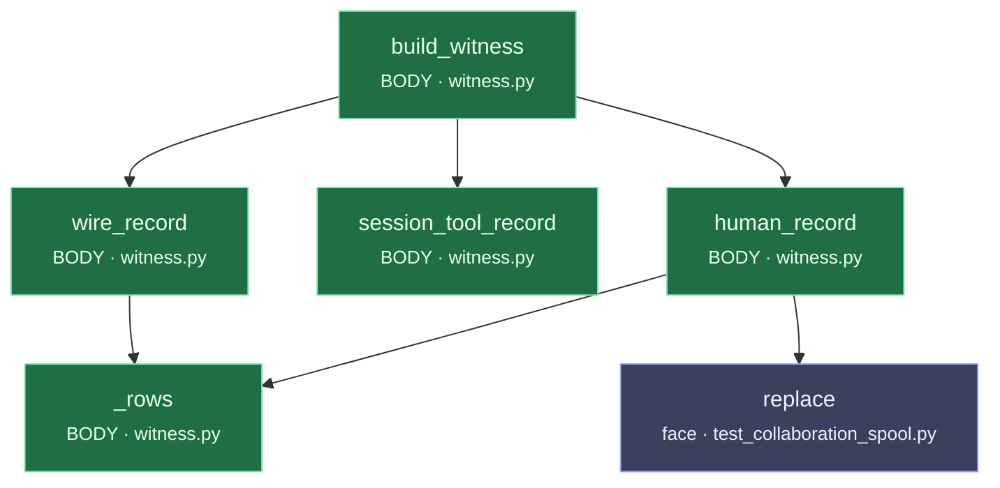

<!-- @nova: Generated source-level call reference; not proof of live execution. -->
# Calls_Order.md — what calls what, and in what ORDER
_Auto-generated by `general_tools/calls_order.py`. Do not hand-edit._
_Last updated: 2026-10-04 14:12:43_

`calls.md` answers *what does this file import?*. This answers the question that actually
costs days: **when Nova runs a tool, what happens, in what order, and where does it live?**

Nodes are coloured by where they live:

- **BODY** (`nova_body/`) — this is *her*. Faculties: reaching, remembering, deciding, checking.
- **face** (`general_tools/`) — scaffolding. A window someone looks through. She survives losing it.

**An edge from BODY into face is a pluck-test failure** — it means part of her thinking is
living outside her. On 2026-07-14 her entire integrity faculty was doing exactly that, and it
took a human noticing rather than a tool showing it. Now the chart shows it.

---

## Cole sends a message → Nova answers (the tool loop)

> ⚠️ entry point `run_nova_response` not found (expected in `nova_body/nova_voice/nova.py`) — the code moved, or the name changed. This chart is stale; fix it.

## A tool actually executes (the receipt path)

Entry: `execute_tool` · `nova_body/nova_voice/tool_router.py`

```mermaid
flowchart TD
    n__bump_plays["_bump_plays<br/><small>BODY · curio.py</small>"]
    n__catastrophic["_catastrophic<br/><small>BODY · tool_router.py</small>"]
    n__coerce["_coerce<br/><small>BODY · tunables.py</small>"]
    n__execute_tool_inner["_execute_tool_inner<br/><small>BODY · tool_router.py</small>"]
    n__forged_section["_forged_section<br/><small>BODY · tool_router.py</small>"]
    n__load_state["_load_state<br/><small>BODY · executive.py</small>"]
    n__log_tool_receipt["_log_tool_receipt<br/><small>BODY · tool_router.py</small>"]
    n__log_tool_receipt_fallback["_log_tool_receipt_fallback<br/><small>BODY · tool_router.py</small>"]
    n__md_headings["_md_headings<br/><small>BODY · tool_router.py</small>"]
    n__norm_rel["_norm_rel<br/><small>BODY · tool_router.py</small>"]
    n__orient["_orient<br/><small>BODY · tool_router.py</small>"]
    n__plays["_plays<br/><small>BODY · curio.py</small>"]
    n__route_bare_filename["_route_bare_filename<br/><small>BODY · tool_router.py</small>"]
    n__safe_target["_safe_target<br/><small>BODY · tool_router.py</small>"]
    n__save_last["_save_last<br/><small>BODY · curio.py</small>"]
    n__save_state["_save_state<br/><small>BODY · executive.py</small>"]
    n__sealed_cmd["_sealed_cmd<br/><small>BODY · tool_router.py</small>"]
    n__sealed_path["_sealed_path<br/><small>BODY · tool_router.py</small>"]
    n__seed["_seed<br/><small>BODY · curio.py</small>"]
    n__set_active["_set_active<br/><small>BODY · executive.py</small>"]
    n__shelf_count["_shelf_count<br/><small>BODY · curio.py</small>"]
    n__silent_miss_caution["_silent_miss_caution<br/><small>BODY · tool_router.py</small>"]
    n__timeout_help["_timeout_help<br/><small>BODY · tool_router.py</small>"]
    n__twist_bag["_twist_bag<br/><small>BODY · curio.py</small>"]
    n__update["_update<br/><small>BODY · tasking.py</small>"]
    n__vision["_vision<br/><small>BODY · curio.py</small>"]
    n__within_workspace["_within_workspace<br/><small>BODY · tool_router.py</small>"]
    n__wonder["_wonder<br/><small>BODY · curio.py</small>"]
    n_active_focus["active_focus<br/><small>BODY · executive.py</small>"]
    n_all_tasks["all_tasks<br/><small>BODY · tasking.py</small>"]
    n_append_file["append_file<br/><small>BODY · tool_router.py</small>"]
    n_body_path["body_path<br/><small>BODY · nova_paths.py</small>"]
    n_complete["complete<br/><small>BODY · tasking.py</small>"]
    n_complete_task["complete_task<br/><small>BODY · tool_router.py</small>"]
    n_create_task["create_task<br/><small>BODY · tool_router.py</small>"]
    n_critique["critique<br/><small>BODY · sight.py</small>"]
    n_execute_tool["execute_tool<br/><small>BODY · tool_router.py</small>"]
    n_journal["journal<br/><small>BODY · tool_router.py</small>"]
    n_journal_note["journal_note<br/><small>BODY · tool_router.py</small>"]
    n_keep_curio["keep_curio<br/><small>BODY · tool_router.py</small>"]
    n_list_dir["list_dir<br/><small>BODY · tool_router.py</small>"]
    n_list_tools["list_tools<br/><small>BODY · tool_router.py</small>"]
    n_look_at["look_at<br/><small>BODY · tool_router.py</small>"]
    n_memory_search["memory_search<br/><small>BODY · tool_router.py</small>"]
    n_my_shelf["my_shelf<br/><small>BODY · tool_router.py</small>"]
    n_normalize_result["normalize_result<br/><small>BODY · tool_result.py</small>"]
    n_poll["poll<br/><small>face · test_launcher_mode.py</small>"]
    n_prepare["prepare<br/><small>BODY · task_workspace.py</small>"]
    n_progress["progress<br/><small>BODY · tasking.py</small>"]
    n_promote["promote<br/><small>BODY · task_workspace.py</small>"]
    n_read_file["read_file<br/><small>BODY · tool_router.py</small>"]
    n_replace["replace<br/><small>face · test_collaboration_spool.py</small>"]
    n_replace_file_content["replace_file_content<br/><small>BODY · tool_router.py</small>"]
    n_reply["reply<br/><small>face · test_collaboration_spool.py</small>"]
    n_run_command["run_command<br/><small>BODY · tool_router.py</small>"]
    n_run_process["run_process<br/><small>BODY · operations.py</small>"]
    n_scheduling["scheduling<br/><small>BODY · tasking.py</small>"]
    n_set["set<br/><small>BODY · tunables.py</small>"]
    n_set_acceptance["set_acceptance<br/><small>BODY · tasking.py</small>"]
    n_set_active["set_active<br/><small>BODY · executive.py</small>"]
    n_shelf["shelf<br/><small>BODY · curio.py</small>"]
    n_surprise["surprise<br/><small>BODY · curio.py</small>"]
    n_surprise_me["surprise_me<br/><small>BODY · tool_router.py</small>"]
    n_task_progress["task_progress<br/><small>BODY · tool_router.py</small>"]
    n_unlink["unlink<br/><small>face · test_collaboration_spool.py</small>"]
    n_validate_checks["validate_checks<br/><small>BODY · verification.py</small>"]
    n_workspace_path["workspace_path<br/><small>BODY · nova_paths.py</small>"]
    n_write_file["write_file<br/><small>BODY · tool_router.py</small>"]
    n_execute_tool --> n__log_tool_receipt
    n__log_tool_receipt --> n__log_tool_receipt_fallback
    n__log_tool_receipt_fallback --> n_body_path
    n__log_tool_receipt_fallback --> n_normalize_result
    n__log_tool_receipt --> n_normalize_result
    n_execute_tool --> n_normalize_result
    n_execute_tool --> n__execute_tool_inner
    n__execute_tool_inner --> n_set_acceptance
    n_set_acceptance --> n__update
    n_set_acceptance --> n_validate_checks
    n__execute_tool_inner --> n_list_tools
    n_list_tools --> n__forged_section
    n__execute_tool_inner --> n_run_command
    n_run_command --> n__catastrophic
    n_run_command --> n__sealed_cmd
    n_run_command --> n__sealed_path
    n_run_command --> n_run_process
    n_run_process --> n_poll
    n_run_command --> n__silent_miss_caution
    n_run_command --> n__timeout_help
    n__execute_tool_inner --> n_prepare
    n_prepare --> n_workspace_path
    n_workspace_path --> n_body_path
    n_prepare --> n__update
    n__execute_tool_inner --> n_promote
    n_promote --> n_workspace_path
    n_promote --> n_body_path
    n_promote --> n__update
    n_promote --> n_replace
    n_promote --> n_unlink
    n_unlink --> n_reply
    n__execute_tool_inner --> n_scheduling
    n_scheduling --> n__update
    n__execute_tool_inner --> n_read_file
    n_read_file --> n__safe_target
    n__safe_target --> n_workspace_path
    n__safe_target --> n__norm_rel
    n__norm_rel --> n_replace
    n_read_file --> n__sealed_path
    n_read_file --> n__orient
    n__orient --> n_replace
    n__execute_tool_inner --> n_active_focus
    n_active_focus --> n__load_state
    n__load_state --> n_all_tasks
    n__execute_tool_inner --> n_set_active
    n_set_active --> n__set_active
    n__set_active --> n__load_state
    n__set_active --> n__save_state
    n__save_state --> n_replace
    n__execute_tool_inner --> n_write_file
    n_write_file --> n__route_bare_filename
    n__route_bare_filename --> n_replace
    n_write_file --> n__safe_target
    n_write_file --> n__sealed_path
    n__execute_tool_inner --> n_append_file
    n_append_file --> n__safe_target
    n_append_file --> n__sealed_path
    n_append_file --> n_set
    n_set --> n__coerce
    n_set --> n_replace
    n_append_file --> n__md_headings
    n__execute_tool_inner --> n_replace_file_content
    n_replace_file_content --> n__safe_target
    n_replace_file_content --> n__sealed_path
    n_replace_file_content --> n_replace
    n__execute_tool_inner --> n_list_dir
    n_list_dir --> n__safe_target
    n_list_dir --> n__sealed_path
    n__execute_tool_inner --> n_create_task
    n__execute_tool_inner --> n_task_progress
    n_task_progress --> n_progress
    n__execute_tool_inner --> n_complete_task
    n_complete_task --> n_complete
    n_complete --> n__update
    n__execute_tool_inner --> n_surprise_me
    n_surprise_me --> n_surprise
    n_surprise --> n__bump_plays
    n__bump_plays --> n__plays
    n_surprise --> n__save_last
    n_surprise --> n__wonder
    n__wonder --> n__seed
    n_surprise --> n__vision
    n__vision --> n__twist_bag
    n_surprise --> n__seed
    n__execute_tool_inner --> n_keep_curio
    n__execute_tool_inner --> n_my_shelf
    n_my_shelf --> n_shelf
    n_shelf --> n__shelf_count
    n__execute_tool_inner --> n_look_at
    n_look_at --> n_critique
    n__execute_tool_inner --> n_memory_search
    n__execute_tool_inner --> n_journal_note
    n_journal_note --> n__within_workspace
    n_journal_note --> n_body_path
    n__execute_tool_inner --> n_journal
    n_journal --> n__within_workspace
    n_journal --> n_body_path
    class n__bump_plays body;
    class n__catastrophic body;
    class n__coerce body;
    class n__execute_tool_inner body;
    class n__forged_section body;
    class n__load_state body;
    class n__log_tool_receipt body;
    class n__log_tool_receipt_fallback body;
    class n__md_headings body;
    class n__norm_rel body;
    class n__orient body;
    class n__plays body;
    class n__route_bare_filename body;
    class n__safe_target body;
    class n__save_last body;
    class n__save_state body;
    class n__sealed_cmd body;
    class n__sealed_path body;
    class n__seed body;
    class n__set_active body;
    class n__shelf_count body;
    class n__silent_miss_caution body;
    class n__timeout_help body;
    class n__twist_bag body;
    class n__update body;
    class n__vision body;
    class n__within_workspace body;
    class n__wonder body;
    class n_active_focus body;
    class n_all_tasks body;
    class n_append_file body;
    class n_body_path body;
    class n_complete body;
    class n_complete_task body;
    class n_create_task body;
    class n_critique body;
    class n_execute_tool body;
    class n_journal body;
    class n_journal_note body;
    class n_keep_curio body;
    class n_list_dir body;
    class n_list_tools body;
    class n_look_at body;
    class n_memory_search body;
    class n_my_shelf body;
    class n_normalize_result body;
    class n_poll face;
    class n_prepare body;
    class n_progress body;
    class n_promote body;
    class n_read_file body;
    class n_replace face;
    class n_replace_file_content body;
    class n_reply face;
    class n_run_command body;
    class n_run_process body;
    class n_scheduling body;
    class n_set body;
    class n_set_acceptance body;
    class n_set_active body;
    class n_shelf body;
    class n_surprise body;
    class n_surprise_me body;
    class n_task_progress body;
    class n_unlink face;
    class n_validate_checks body;
    class n_workspace_path body;
    class n_write_file body;
    classDef body fill:#1f6f43,stroke:#7ee2b8,color:#eafff5;
    classDef face fill:#3a3f5c,stroke:#8fa2ff,color:#eef1ff;
```

**Call order:**

  1. `execute_tool` → `_log_tool_receipt`  · **BODY** · `nova_body/nova_voice/tool_router.py`
  2.   `_log_tool_receipt` → `_log_tool_receipt_fallback`  · **BODY** · `nova_body/nova_voice/tool_router.py`
  3.     `_log_tool_receipt_fallback` → `body_path`  · **BODY** · `nova_body/nova_paths.py`
  4.     `_log_tool_receipt_fallback` → `normalize_result`  · **BODY** · `nova_body/nova_voice/tool_result.py`
  5.     `_log_tool_receipt_fallback` → `normalize_result`  · **BODY** · `nova_body/nova_voice/tool_result.py`
  6.   `_log_tool_receipt` → `normalize_result`  · **BODY** · `nova_body/nova_voice/tool_result.py`
  7. `execute_tool` → `normalize_result`  · **BODY** · `nova_body/nova_voice/tool_result.py`
  8. `execute_tool` → `_log_tool_receipt`  · **BODY** · `nova_body/nova_voice/tool_router.py`
  9. `execute_tool` → `_execute_tool_inner`  · **BODY** · `nova_body/nova_voice/tool_router.py`
 10.   `_execute_tool_inner` → `set_acceptance`  · **BODY** · `nova_body/nova_cortex/tasking.py`
 11.     `set_acceptance` → `_update`  · **BODY** · `nova_body/nova_cortex/tasking.py`
 12.     `set_acceptance` → `validate_checks`  · **BODY** · `nova_body/nova_cortex/verification.py`
 13.   `_execute_tool_inner` → `list_tools`  · **BODY** · `nova_body/nova_voice/tool_router.py`
 14.     `list_tools` → `_forged_section`  · **BODY** · `nova_body/nova_voice/tool_router.py`
 15.   `_execute_tool_inner` → `run_command`  · **BODY** · `nova_body/nova_voice/tool_router.py`
 16.     `run_command` → `_catastrophic`  · **BODY** · `nova_body/nova_voice/tool_router.py`
 17.     `run_command` → `_sealed_cmd`  · **BODY** · `nova_body/nova_voice/tool_router.py`
 18.     `run_command` → `_sealed_path`  · **BODY** · `nova_body/nova_voice/tool_router.py`
 19.     `run_command` → `run_process`  · **BODY** · `nova_body/nova_runtime/operations.py`
 20.       `run_process` → `poll`  · face · `general_tools/nova_chat/tests/test_launcher_mode.py`
 21.       `run_process` → `poll`  · face · `general_tools/nova_chat/tests/test_launcher_mode.py`
 22.     `run_command` → `_silent_miss_caution`  · **BODY** · `nova_body/nova_voice/tool_router.py`
 23.     `run_command` → `_timeout_help`  · **BODY** · `nova_body/nova_voice/tool_router.py`
 24.   `_execute_tool_inner` → `prepare`  · **BODY** · `nova_body/nova_cortex/task_workspace.py`
 25.     `prepare` → `workspace_path`  · **BODY** · `nova_body/nova_paths.py`
 26.       `workspace_path` → `body_path`  · **BODY** · `nova_body/nova_paths.py`
 27.       `workspace_path` → `body_path`  · **BODY** · `nova_body/nova_paths.py`
 28.     `prepare` → `_update`  · **BODY** · `nova_body/nova_cortex/tasking.py`
 29.     `prepare` → `workspace_path`  · **BODY** · `nova_body/nova_paths.py`
 30.   `_execute_tool_inner` → `promote`  · **BODY** · `nova_body/nova_cortex/task_workspace.py`
 31.     `promote` → `workspace_path`  · **BODY** · `nova_body/nova_paths.py`
 32.     `promote` → `body_path`  · **BODY** · `nova_body/nova_paths.py`
 33.     `promote` → `_update`  · **BODY** · `nova_body/nova_cortex/tasking.py`
 34.     `promote` → `_update`  · **BODY** · `nova_body/nova_cortex/tasking.py`
 35.     `promote` → `replace`  · face · `general_tools/nova_chat/tests/test_collaboration_spool.py`
 36.     `promote` → `unlink`  · face · `general_tools/nova_chat/tests/test_collaboration_spool.py`
 37.       `unlink` → `reply`  · face · `general_tools/nova_chat/tests/test_collaboration_spool.py`
 38.   `_execute_tool_inner` → `scheduling`  · **BODY** · `nova_body/nova_cortex/tasking.py`
 39.     `scheduling` → `_update`  · **BODY** · `nova_body/nova_cortex/tasking.py`
 40.   `_execute_tool_inner` → `read_file`  · **BODY** · `nova_body/nova_voice/tool_router.py`
 41.     `read_file` → `_safe_target`  · **BODY** · `nova_body/nova_voice/tool_router.py`
 42.       `_safe_target` → `workspace_path`  · **BODY** · `nova_body/nova_paths.py`
 43.       `_safe_target` → `workspace_path`  · **BODY** · `nova_body/nova_paths.py`
 44.       `_safe_target` → `_norm_rel`  · **BODY** · `nova_body/nova_voice/tool_router.py`
 45.         `_norm_rel` → `replace`  · face · `general_tools/nova_chat/tests/test_collaboration_spool.py`
 46.     `read_file` → `_sealed_path`  · **BODY** · `nova_body/nova_voice/tool_router.py`
 47.     `read_file` → `_orient`  · **BODY** · `nova_body/nova_voice/tool_router.py`
 48.       `_orient` → `replace`  · face · `general_tools/nova_chat/tests/test_collaboration_spool.py`
 49.   `_execute_tool_inner` → `active_focus`  · **BODY** · `nova_body/nova_cortex/executive.py`
 50.     `active_focus` → `_load_state`  · **BODY** · `nova_body/nova_cortex/executive.py`
 51.       `_load_state` → `all_tasks`  · **BODY** · `nova_body/nova_cortex/tasking.py`
 52.   `_execute_tool_inner` → `set_active`  · **BODY** · `nova_body/nova_cortex/executive.py`
 53.     `set_active` → `_set_active`  · **BODY** · `nova_body/nova_cortex/executive.py`
 54.       `_set_active` → `_load_state`  · **BODY** · `nova_body/nova_cortex/executive.py`
 55.       `_set_active` → `_save_state`  · **BODY** · `nova_body/nova_cortex/executive.py`
 56.         `_save_state` → `replace`  · face · `general_tools/nova_chat/tests/test_collaboration_spool.py`
 57.   `_execute_tool_inner` → `write_file`  · **BODY** · `nova_body/nova_voice/tool_router.py`
 58.     `write_file` → `_route_bare_filename`  · **BODY** · `nova_body/nova_voice/tool_router.py`
 59.       `_route_bare_filename` → `replace`  · face · `general_tools/nova_chat/tests/test_collaboration_spool.py`
 60.     `write_file` → `_safe_target`  · **BODY** · `nova_body/nova_voice/tool_router.py`
 61.     `write_file` → `_sealed_path`  · **BODY** · `nova_body/nova_voice/tool_router.py`
 62.   `_execute_tool_inner` → `append_file`  · **BODY** · `nova_body/nova_voice/tool_router.py`
 63.     `append_file` → `_safe_target`  · **BODY** · `nova_body/nova_voice/tool_router.py`
 64.     `append_file` → `_sealed_path`  · **BODY** · `nova_body/nova_voice/tool_router.py`
 65.     `append_file` → `set`  · **BODY** · `nova_body/nova_cortex/tunables.py`
 66.       `set` → `_coerce`  · **BODY** · `nova_body/nova_cortex/tunables.py`
 67.       `set` → `replace`  · face · `general_tools/nova_chat/tests/test_collaboration_spool.py`
 68.     `append_file` → `_md_headings`  · **BODY** · `nova_body/nova_voice/tool_router.py`
 69.     `append_file` → `_md_headings`  · **BODY** · `nova_body/nova_voice/tool_router.py`
 70.   `_execute_tool_inner` → `replace_file_content`  · **BODY** · `nova_body/nova_voice/tool_router.py`
 71.     `replace_file_content` → `_safe_target`  · **BODY** · `nova_body/nova_voice/tool_router.py`
 72.     `replace_file_content` → `_sealed_path`  · **BODY** · `nova_body/nova_voice/tool_router.py`
 73.     `replace_file_content` → `replace`  · face · `general_tools/nova_chat/tests/test_collaboration_spool.py`
 74.   `_execute_tool_inner` → `list_dir`  · **BODY** · `nova_body/nova_voice/tool_router.py`
 75.     `list_dir` → `_safe_target`  · **BODY** · `nova_body/nova_voice/tool_router.py`
 76.     `list_dir` → `_sealed_path`  · **BODY** · `nova_body/nova_voice/tool_router.py`
 77.   `_execute_tool_inner` → `create_task`  · **BODY** · `nova_body/nova_voice/tool_router.py`
 78.   `_execute_tool_inner` → `task_progress`  · **BODY** · `nova_body/nova_voice/tool_router.py`
 79.     `task_progress` → `progress`  · **BODY** · `nova_body/nova_cortex/tasking.py`
 80.   `_execute_tool_inner` → `complete_task`  · **BODY** · `nova_body/nova_voice/tool_router.py`
 81.     `complete_task` → `complete`  · **BODY** · `nova_body/nova_cortex/tasking.py`
 82.       `complete` → `_update`  · **BODY** · `nova_body/nova_cortex/tasking.py`
 83.       `complete` → `_update`  · **BODY** · `nova_body/nova_cortex/tasking.py`
 84.   `_execute_tool_inner` → `surprise_me`  · **BODY** · `nova_body/nova_voice/tool_router.py`
 85.     `surprise_me` → `surprise`  · **BODY** · `nova_body/nova_play/curio.py`
 86.       `surprise` → `_bump_plays`  · **BODY** · `nova_body/nova_play/curio.py`
 87.         `_bump_plays` → `_plays`  · **BODY** · `nova_body/nova_play/curio.py`
 88.       `surprise` → `_save_last`  · **BODY** · `nova_body/nova_play/curio.py`
 89.       `surprise` → `_wonder`  · **BODY** · `nova_body/nova_play/curio.py`
 90.         `_wonder` → `_seed`  · **BODY** · `nova_body/nova_play/curio.py`
 91.       `surprise` → `_vision`  · **BODY** · `nova_body/nova_play/curio.py`
 92.         `_vision` → `_twist_bag`  · **BODY** · `nova_body/nova_play/curio.py`
 93.       `surprise` → `_seed`  · **BODY** · `nova_body/nova_play/curio.py`
 94.   `_execute_tool_inner` → `keep_curio`  · **BODY** · `nova_body/nova_voice/tool_router.py`
 95.   `_execute_tool_inner` → `my_shelf`  · **BODY** · `nova_body/nova_voice/tool_router.py`
 96.     `my_shelf` → `shelf`  · **BODY** · `nova_body/nova_play/curio.py`
 97.       `shelf` → `_shelf_count`  · **BODY** · `nova_body/nova_play/curio.py`
 98.       `shelf` → `_shelf_count`  · **BODY** · `nova_body/nova_play/curio.py`
 99.   `_execute_tool_inner` → `look_at`  · **BODY** · `nova_body/nova_voice/tool_router.py`
100.     `look_at` → `critique`  · **BODY** · `nova_body/nova_senses/sight.py`
101.   `_execute_tool_inner` → `memory_search`  · **BODY** · `nova_body/nova_voice/tool_router.py`
102.   `_execute_tool_inner` → `journal_note`  · **BODY** · `nova_body/nova_voice/tool_router.py`
103.     `journal_note` → `_within_workspace`  · **BODY** · `nova_body/nova_voice/tool_router.py`
104.     `journal_note` → `body_path`  · **BODY** · `nova_body/nova_paths.py`
105.   `_execute_tool_inner` → `journal`  · **BODY** · `nova_body/nova_voice/tool_router.py`
106.     `journal` → `_within_workspace`  · **BODY** · `nova_body/nova_voice/tool_router.py`
107.     `journal` → `body_path`  · **BODY** · `nova_body/nova_paths.py`

---

## Nova wakes on her own (autonomy: reflect → decide → act)

Entry: `run_autonomy` · `nova_body/nova_runtime/runtime.py`

```mermaid
flowchart TD
    n__anchors["_anchors<br/><small>face · orient.py</small>"]
    n__artifact_hint["_artifact_hint<br/><small>BODY · executive.py</small>"]
    n__artifact_path["_artifact_path<br/><small>BODY · executive.py</small>"]
    n__asked_by["_asked_by<br/><small>BODY · executive.py</small>"]
    n__asker["_asker<br/><small>BODY · executive.py</small>"]
    n__cfg["_cfg<br/><small>BODY · executive.py</small>"]
    n__children_map["_children_map<br/><small>BODY · tasking.py</small>"]
    n__coerce["_coerce<br/><small>BODY · tunables.py</small>"]
    n__done_count["_done_count<br/><small>BODY · tasking.py</small>"]
    n__expand_watch["_expand_watch<br/><small>face · orient.py</small>"]
    n__extra_inputs["_extra_inputs<br/><small>face · orient.py</small>"]
    n__fingerprint["_fingerprint<br/><small>BODY · drives.py</small>"]
    n__has_open_task_titled["_has_open_task_titled<br/><small>BODY · executive.py</small>"]
    n__intact["_intact<br/><small>face · orient.py</small>"]
    n__is_leaf["_is_leaf<br/><small>BODY · executive.py</small>"]
    n__jac["_jac<br/><small>BODY · executive.py</small>"]
    n__last_reconcile["_last_reconcile<br/><small>BODY · integrity.py</small>"]
    n__load_state["_load_state<br/><small>BODY · executive.py</small>"]
    n__mark_reconciled["_mark_reconciled<br/><small>BODY · integrity.py</small>"]
    n__persist["_persist<br/><small>face · transcript.py</small>"]
    n__previous["_previous<br/><small>face · orient.py</small>"]
    n__progress_loop_count["_progress_loop_count<br/><small>BODY · executive.py</small>"]
    n__publish["_publish<br/><small>face · orient.py</small>"]
    n__review_line["_review_line<br/><small>face · orient.py</small>"]
    n__run_one_wake["_run_one_wake<br/><small>BODY · runtime.py</small>"]
    n__save_state["_save_state<br/><small>BODY · executive.py</small>"]
    n__set_active["_set_active<br/><small>BODY · executive.py</small>"]
    n__signature["_signature<br/><small>face · orient.py</small>"]
    n__similar["_similar<br/><small>BODY · drives.py</small>"]
    n__slug["_slug<br/><small>face · orient.py</small>"]
    n__stem["_stem<br/><small>BODY · drives.py</small>"]
    n__strip_tool_residue["_strip_tool_residue<br/><small>BODY · executive.py</small>"]
    n__subtree_open_leaves["_subtree_open_leaves<br/><small>BODY · executive.py</small>"]
    n__symbol_bytes["_symbol_bytes<br/><small>face · orient.py</small>"]
    n__tokens["_tokens<br/><small>BODY · drives.py</small>"]
    n__update["_update<br/><small>BODY · tasking.py</small>"]
    n__watch_digest["_watch_digest<br/><small>face · orient.py</small>"]
    n_add["add<br/><small>face · transcript.py</small>"]
    n_add_want["add_want<br/><small>BODY · drives.py</small>"]
    n_ai_notes["ai_notes<br/><small>face · orient.py</small>"]
    n_all_tasks["all_tasks<br/><small>BODY · tasking.py</small>"]
    n_anchors_of["anchors_of<br/><small>face · orient.py</small>"]
    n_apply_reviews["apply_reviews<br/><small>face · orient.py</small>"]
    n_autonomy_enabled["autonomy_enabled<br/><small>BODY · executive.py</small>"]
    n_body_path["body_path<br/><small>BODY · nova_paths.py</small>"]
    n_build_decision["build_decision<br/><small>BODY · executive.py</small>"]
    n_build_execution["build_execution<br/><small>BODY · executive.py</small>"]
    n_build_free_execution["build_free_execution<br/><small>BODY · executive.py</small>"]
    n_build_reflection["build_reflection<br/><small>BODY · executive.py</small>"]
    n_check["check<br/><small>face · orient.py</small>"]
    n_claim["claim<br/><small>BODY · work_queue.py</small>"]
    n_clear_touch_active["clear_touch_active<br/><small>BODY · runtime.py</small>"]
    n_cole_directive["cole_directive<br/><small>BODY · environment.py</small>"]
    n_cole_typing["cole_typing<br/><small>BODY · environment.py</small>"]
    n_connect["connect<br/><small>BODY · work_queue.py</small>"]
    n_damaged_sources["damaged_sources<br/><small>face · orient.py</small>"]
    n_directive_is_fresh["directive_is_fresh<br/><small>BODY · environment.py</small>"]
    n_elapsed_seconds["elapsed_seconds<br/><small>BODY · clock.py</small>"]
    n_ensure_standing_chores["ensure_standing_chores<br/><small>BODY · executive.py</small>"]
    n_explorer_stamp["explorer_stamp<br/><small>face · orient.py</small>"]
    n_find_dangling["find_dangling<br/><small>face · orient.py</small>"]
    n_fingerprint["fingerprint<br/><small>BODY · environment.py</small>"]
    n_future_iso["future_iso<br/><small>BODY · clock.py</small>"]
    n_health_section["health_section<br/><small>face · orient.py</small>"]
    n_inventory["inventory<br/><small>face · orient.py</small>"]
    n_last_reflection["last_reflection<br/><small>BODY · executive.py</small>"]
    n_load_reviews["load_reviews<br/><small>face · orient.py</small>"]
    n_moved["moved<br/><small>face · orient.py</small>"]
    n_note_real_work["note_real_work<br/><small>BODY · executive.py</small>"]
    n_note_wake["note_wake<br/><small>BODY · drives.py</small>"]
    n_parse_execution["parse_execution<br/><small>BODY · executive.py</small>"]
    n_phase_generate["phase_generate<br/><small>BODY · runtime.py</small>"]
    n_pick_execution_target["pick_execution_target<br/><small>BODY · executive.py</small>"]
    n_populate_touch["populate_touch<br/><small>BODY · runtime.py</small>"]
    n_progress["progress<br/><small>BODY · tasking.py</small>"]
    n_ready["ready<br/><small>BODY · work_queue.py</small>"]
    n_reconcile_board["reconcile_board<br/><small>BODY · integrity.py</small>"]
    n_record_pull["record_pull<br/><small>BODY · touch.py</small>"]
    n_render_board["render_board<br/><small>BODY · tasking.py</small>"]
    n_replace["replace<br/><small>face · test_collaboration_spool.py</small>"]
    n_reset_continuation["reset_continuation<br/><small>BODY · executive.py</small>"]
    n_review_status["review_status<br/><small>face · orient.py</small>"]
    n_run_autonomy["run_autonomy<br/><small>BODY · runtime.py</small>"]
    n_run_in_worker["run_in_worker<br/><small>BODY · operations.py</small>"]
    n_save_reflection["save_reflection<br/><small>BODY · executive.py</small>"]
    n_schedule_soon["schedule_soon<br/><small>BODY · executive.py</small>"]
    n_scheduling["scheduling<br/><small>BODY · tasking.py</small>"]
    n_set["set<br/><small>BODY · tunables.py</small>"]
    n_set_active["set_active<br/><small>BODY · executive.py</small>"]
    n_should_wake["should_wake<br/><small>BODY · executive.py</small>"]
    n_since_human["since_human<br/><small>BODY · clock.py</small>"]
    n_source_snapshot["source_snapshot<br/><small>face · orient.py</small>"]
    n_stamp["stamp<br/><small>BODY · clock.py</small>"]
    n_surfaces_from_layout["surfaces_from_layout<br/><small>BODY · runtime.py</small>"]
    n_time_of_day["time_of_day<br/><small>BODY · clock.py</small>"]
    n_walk["walk<br/><small>face · calls_order.py</small>"]
    n_work_done_since["work_done_since<br/><small>BODY · integrity.py</small>"]
    n_workspace_path["workspace_path<br/><small>BODY · nova_paths.py</small>"]
    n_run_autonomy --> n_check
    n_check --> n_source_snapshot
    n_check --> n__signature
    n__signature --> n__extra_inputs
    n__extra_inputs --> n_ai_notes
    n__extra_inputs --> n_explorer_stamp
    n__extra_inputs --> n_load_reviews
    n_check --> n__previous
    n_check --> n__publish
    n__publish --> n_review_status
    n_review_status --> n__expand_watch
    n__expand_watch --> n_set
    n__expand_watch --> n_add
    n_review_status --> n__watch_digest
    n__watch_digest --> n_replace
    n__watch_digest --> n__symbol_bytes
    n_review_status --> n_moved
    n_moved --> n__watch_digest
    n__publish --> n_apply_reviews
    n_apply_reviews --> n__review_line
    n__publish --> n_find_dangling
    n_find_dangling --> n__anchors
    n__anchors --> n__slug
    n_find_dangling --> n_replace
    n_find_dangling --> n_anchors_of
    n_anchors_of --> n__anchors
    n__publish --> n_load_reviews
    n__publish --> n_health_section
    n__publish --> n_damaged_sources
    n__publish --> n_ai_notes
    n_check --> n_damaged_sources
    n_check --> n_inventory
    n_inventory --> n_walk
    n_walk --> n_add
    n_add --> n__persist
    n_check --> n__intact
    n_run_autonomy --> n_should_wake
    n_should_wake --> n_cole_typing
    n_should_wake --> n_ready
    n_ready --> n_connect
    n_should_wake --> n__load_state
    n__load_state --> n_all_tasks
    n_should_wake --> n__cfg
    n_should_wake --> n_fingerprint
    n_fingerprint --> n_workspace_path
    n_workspace_path --> n_body_path
    n_should_wake --> n__save_state
    n__save_state --> n_replace
    n_should_wake --> n_cole_directive
    n_cole_directive --> n_directive_is_fresh
    n_should_wake --> n_directive_is_fresh
    n_run_autonomy --> n_body_path
    n_run_autonomy --> n_autonomy_enabled
    n_autonomy_enabled --> n__load_state
    n_run_autonomy --> n_schedule_soon
    n_schedule_soon --> n__load_state
    n_schedule_soon --> n_future_iso
    n_schedule_soon --> n__save_state
    n_run_autonomy --> n__run_one_wake
    n__run_one_wake --> n_claim
    n_claim --> n_connect
    n__run_one_wake --> n_set
    n_set --> n__coerce
    n_set --> n_replace
    n__run_one_wake --> n_populate_touch
    n_populate_touch --> n_record_pull
    n_populate_touch --> n_cole_typing
    n_populate_touch --> n_surfaces_from_layout
    n_surfaces_from_layout --> n_body_path
    n__run_one_wake --> n_clear_touch_active
    n__run_one_wake --> n_ensure_standing_chores
    n_ensure_standing_chores --> n_body_path
    n_ensure_standing_chores --> n__save_state
    n_ensure_standing_chores --> n_replace
    n_ensure_standing_chores --> n__has_open_task_titled
    n__has_open_task_titled --> n_all_tasks
    n__run_one_wake --> n_pick_execution_target
    n_pick_execution_target --> n__load_state
    n_pick_execution_target --> n_all_tasks
    n_pick_execution_target --> n__set_active
    n__set_active --> n__load_state
    n__set_active --> n__save_state
    n_pick_execution_target --> n__update
    n_pick_execution_target --> n__save_state
    n_pick_execution_target --> n__is_leaf
    n_pick_execution_target --> n_scheduling
    n_scheduling --> n__update
    n_pick_execution_target --> n__subtree_open_leaves
    n__subtree_open_leaves --> n__is_leaf
    n__run_one_wake --> n_build_reflection
    n_build_reflection --> n__load_state
    n_build_reflection --> n_render_board
    n_render_board --> n_all_tasks
    n_render_board --> n__children_map
    n_render_board --> n_set
    n_render_board --> n_add
    n_render_board --> n__done_count
    n_build_reflection --> n_cole_directive
    n_build_reflection --> n_stamp
    n_build_reflection --> n_time_of_day
    n_build_reflection --> n_since_human
    n_since_human --> n_elapsed_seconds
    n_build_reflection --> n_all_tasks
    n__run_one_wake --> n_save_reflection
    n_save_reflection --> n__load_state
    n_save_reflection --> n__save_state
    n_save_reflection --> n__strip_tool_residue
    n__run_one_wake --> n_build_decision
    n_build_decision --> n__load_state
    n_build_decision --> n_render_board
    n_build_decision --> n_all_tasks
    n_build_decision --> n__progress_loop_count
    n__progress_loop_count --> n_set
    n__progress_loop_count --> n__jac
    n__jac --> n_set
    n_build_decision --> n_cole_directive
    n__run_one_wake --> n_reconcile_board
    n_reconcile_board --> n_work_done_since
    n_reconcile_board --> n__last_reconcile
    n_reconcile_board --> n__mark_reconciled
    n_reconcile_board --> n_progress
    n_reconcile_board --> n_all_tasks
    n__run_one_wake --> n_last_reflection
    n_last_reflection --> n__load_state
    n__run_one_wake --> n_note_wake
    n_note_wake --> n__tokens
    n__tokens --> n__stem
    n_note_wake --> n_add_want
    n_add_want --> n__fingerprint
    n__fingerprint --> n__tokens
    n_add_want --> n__tokens
    n_add_want --> n__similar
    n__similar --> n_set
    n_note_wake --> n__similar
    n__run_one_wake --> n_run_in_worker
    n__run_one_wake --> n_body_path
    n__run_one_wake --> n_note_real_work
    n_note_real_work --> n__load_state
    n_note_real_work --> n_future_iso
    n_note_real_work --> n__save_state
    n__run_one_wake --> n_phase_generate
    n_phase_generate --> n_set
    n__run_one_wake --> n_build_execution
    n_build_execution --> n__progress_loop_count
    n_build_execution --> n__artifact_hint
    n__artifact_hint --> n__artifact_path
    n__artifact_hint --> n_workspace_path
    n_build_execution --> n_stamp
    n_build_execution --> n__asked_by
    n_build_execution --> n__asker
    n__run_one_wake --> n_parse_execution
    n__run_one_wake --> n_build_free_execution
    n_build_free_execution --> n__load_state
    n_build_free_execution --> n_stamp
    n__run_one_wake --> n_set_active
    n_set_active --> n__set_active
    n__run_one_wake --> n_reset_continuation
    n_reset_continuation --> n__load_state
    n_reset_continuation --> n__save_state
    n__run_one_wake --> n_all_tasks
    n__run_one_wake --> n_progress
    n__run_one_wake --> n_schedule_soon
    n_run_autonomy --> n__cfg
    class n__anchors face;
    class n__artifact_hint body;
    class n__artifact_path body;
    class n__asked_by body;
    class n__asker body;
    class n__cfg body;
    class n__children_map body;
    class n__coerce body;
    class n__done_count body;
    class n__expand_watch face;
    class n__extra_inputs face;
    class n__fingerprint body;
    class n__has_open_task_titled body;
    class n__intact face;
    class n__is_leaf body;
    class n__jac body;
    class n__last_reconcile body;
    class n__load_state body;
    class n__mark_reconciled body;
    class n__persist face;
    class n__previous face;
    class n__progress_loop_count body;
    class n__publish face;
    class n__review_line face;
    class n__run_one_wake body;
    class n__save_state body;
    class n__set_active body;
    class n__signature face;
    class n__similar body;
    class n__slug face;
    class n__stem body;
    class n__strip_tool_residue body;
    class n__subtree_open_leaves body;
    class n__symbol_bytes face;
    class n__tokens body;
    class n__update body;
    class n__watch_digest face;
    class n_add face;
    class n_add_want body;
    class n_ai_notes face;
    class n_all_tasks body;
    class n_anchors_of face;
    class n_apply_reviews face;
    class n_autonomy_enabled body;
    class n_body_path body;
    class n_build_decision body;
    class n_build_execution body;
    class n_build_free_execution body;
    class n_build_reflection body;
    class n_check face;
    class n_claim body;
    class n_clear_touch_active body;
    class n_cole_directive body;
    class n_cole_typing body;
    class n_connect body;
    class n_damaged_sources face;
    class n_directive_is_fresh body;
    class n_elapsed_seconds body;
    class n_ensure_standing_chores body;
    class n_explorer_stamp face;
    class n_find_dangling face;
    class n_fingerprint body;
    class n_future_iso body;
    class n_health_section face;
    class n_inventory face;
    class n_last_reflection body;
    class n_load_reviews face;
    class n_moved face;
    class n_note_real_work body;
    class n_note_wake body;
    class n_parse_execution body;
    class n_phase_generate body;
    class n_pick_execution_target body;
    class n_populate_touch body;
    class n_progress body;
    class n_ready body;
    class n_reconcile_board body;
    class n_record_pull body;
    class n_render_board body;
    class n_replace face;
    class n_reset_continuation body;
    class n_review_status face;
    class n_run_autonomy body;
    class n_run_in_worker body;
    class n_save_reflection body;
    class n_schedule_soon body;
    class n_scheduling body;
    class n_set body;
    class n_set_active body;
    class n_should_wake body;
    class n_since_human body;
    class n_source_snapshot face;
    class n_stamp body;
    class n_surfaces_from_layout body;
    class n_time_of_day body;
    class n_walk face;
    class n_work_done_since body;
    class n_workspace_path body;
    classDef body fill:#1f6f43,stroke:#7ee2b8,color:#eafff5;
    classDef face fill:#3a3f5c,stroke:#8fa2ff,color:#eef1ff;
```

**Call order:**

  1. `run_autonomy` → `check`  · face · `general_tools/architecture_map/orient.py`
  2.   `check` → `source_snapshot`  · face · `general_tools/architecture_map/orient.py`
  3.   `check` → `_signature`  · face · `general_tools/architecture_map/orient.py`
  4.     `_signature` → `_extra_inputs`  · face · `general_tools/architecture_map/orient.py`
  5.       `_extra_inputs` → `ai_notes`  · face · `general_tools/architecture_map/orient.py`
  6.       `_extra_inputs` → `explorer_stamp`  · face · `general_tools/architecture_map/orient.py`
  7.       `_extra_inputs` → `load_reviews`  · face · `general_tools/architecture_map/orient.py`
  8.   `check` → `_previous`  · face · `general_tools/architecture_map/orient.py`
  9.   `check` → `_publish`  · face · `general_tools/architecture_map/orient.py`
 10.     `_publish` → `review_status`  · face · `general_tools/architecture_map/orient.py`
 11.       `review_status` → `_expand_watch`  · face · `general_tools/architecture_map/orient.py`
 12.         `_expand_watch` → `set`  · **BODY** · `nova_body/nova_cortex/tunables.py`
 13.         `_expand_watch` → `add`  · face · `general_tools/nova_chat/transcript.py`
 14.       `review_status` → `_watch_digest`  · face · `general_tools/architecture_map/orient.py`
 15.         `_watch_digest` → `replace`  · face · `general_tools/nova_chat/tests/test_collaboration_spool.py`
 16.         `_watch_digest` → `_symbol_bytes`  · face · `general_tools/architecture_map/orient.py`
 17.       `review_status` → `_watch_digest`  · face · `general_tools/architecture_map/orient.py`
 18.       `review_status` → `moved`  · face · `general_tools/architecture_map/orient.py`
 19.         `moved` → `_watch_digest`  · face · `general_tools/architecture_map/orient.py`
 20.     `_publish` → `apply_reviews`  · face · `general_tools/architecture_map/orient.py`
 21.       `apply_reviews` → `_review_line`  · face · `general_tools/architecture_map/orient.py`
 22.     `_publish` → `find_dangling`  · face · `general_tools/architecture_map/orient.py`
 23.       `find_dangling` → `_anchors`  · face · `general_tools/architecture_map/orient.py`
 24.         `_anchors` → `_slug`  · face · `general_tools/architecture_map/orient.py`
 25.       `find_dangling` → `replace`  · face · `general_tools/nova_chat/tests/test_collaboration_spool.py`
 26.       `find_dangling` → `anchors_of`  · face · `general_tools/architecture_map/orient.py`
 27.         `anchors_of` → `_anchors`  · face · `general_tools/architecture_map/orient.py`
 28.       `find_dangling` → `_anchors`  · face · `general_tools/architecture_map/orient.py`
 29.       `find_dangling` → `anchors_of`  · face · `general_tools/architecture_map/orient.py`
 30.     `_publish` → `load_reviews`  · face · `general_tools/architecture_map/orient.py`
 31.     `_publish` → `health_section`  · face · `general_tools/architecture_map/orient.py`
 32.     `_publish` → `damaged_sources`  · face · `general_tools/architecture_map/orient.py`
 33.     `_publish` → `ai_notes`  · face · `general_tools/architecture_map/orient.py`
 34.   `check` → `damaged_sources`  · face · `general_tools/architecture_map/orient.py`
 35.   `check` → `inventory`  · face · `general_tools/architecture_map/orient.py`
 36.     `inventory` → `walk`  · face · `general_tools/calls_order.py`
 37.       `walk` → `add`  · face · `general_tools/nova_chat/transcript.py`
 38.         `add` → `_persist`  · face · `general_tools/nova_chat/transcript.py`
 39.   `check` → `_intact`  · face · `general_tools/architecture_map/orient.py`
 40. `run_autonomy` → `should_wake`  · **BODY** · `nova_body/nova_cortex/executive.py`
 41.   `should_wake` → `cole_typing`  · **BODY** · `nova_body/nova_senses/environment.py`
 42.   `should_wake` → `ready`  · **BODY** · `nova_body/nova_runtime/work_queue.py`
 43.     `ready` → `connect`  · **BODY** · `nova_body/nova_runtime/work_queue.py`
 44.   `should_wake` → `_load_state`  · **BODY** · `nova_body/nova_cortex/executive.py`
 45.     `_load_state` → `all_tasks`  · **BODY** · `nova_body/nova_cortex/tasking.py`
 46.   `should_wake` → `_cfg`  · **BODY** · `nova_body/nova_cortex/executive.py`
 47.   `should_wake` → `fingerprint`  · **BODY** · `nova_body/nova_senses/environment.py`
 48.     `fingerprint` → `workspace_path`  · **BODY** · `nova_body/nova_paths.py`
 49.       `workspace_path` → `body_path`  · **BODY** · `nova_body/nova_paths.py`
 50.       `workspace_path` → `body_path`  · **BODY** · `nova_body/nova_paths.py`
 51.   `should_wake` → `_save_state`  · **BODY** · `nova_body/nova_cortex/executive.py`
 52.     `_save_state` → `replace`  · face · `general_tools/nova_chat/tests/test_collaboration_spool.py`
 53.   `should_wake` → `cole_directive`  · **BODY** · `nova_body/nova_senses/environment.py`
 54.     `cole_directive` → `directive_is_fresh`  · **BODY** · `nova_body/nova_senses/environment.py`
 55.   `should_wake` → `directive_is_fresh`  · **BODY** · `nova_body/nova_senses/environment.py`
 56.   `should_wake` → `fingerprint`  · **BODY** · `nova_body/nova_senses/environment.py`
 57. `run_autonomy` → `body_path`  · **BODY** · `nova_body/nova_paths.py`
 58. `run_autonomy` → `autonomy_enabled`  · **BODY** · `nova_body/nova_cortex/executive.py`
 59.   `autonomy_enabled` → `_load_state`  · **BODY** · `nova_body/nova_cortex/executive.py`
 60. `run_autonomy` → `schedule_soon`  · **BODY** · `nova_body/nova_cortex/executive.py`
 61.   `schedule_soon` → `_load_state`  · **BODY** · `nova_body/nova_cortex/executive.py`
 62.   `schedule_soon` → `future_iso`  · **BODY** · `nova_body/nova_senses/clock.py`
 63.   `schedule_soon` → `_save_state`  · **BODY** · `nova_body/nova_cortex/executive.py`
 64. `run_autonomy` → `_run_one_wake`  · **BODY** · `nova_body/nova_runtime/runtime.py`
 65.   `_run_one_wake` → `claim`  · **BODY** · `nova_body/nova_runtime/work_queue.py`
 66.     `claim` → `connect`  · **BODY** · `nova_body/nova_runtime/work_queue.py`
 67.   `_run_one_wake` → `set`  · **BODY** · `nova_body/nova_cortex/tunables.py`
 68.     `set` → `_coerce`  · **BODY** · `nova_body/nova_cortex/tunables.py`
 69.     `set` → `replace`  · face · `general_tools/nova_chat/tests/test_collaboration_spool.py`
 70.   `_run_one_wake` → `populate_touch`  · **BODY** · `nova_body/nova_runtime/runtime.py`
 71.     `populate_touch` → `record_pull`  · **BODY** · `nova_body/nova_senses/touch.py`
 72.     `populate_touch` → `cole_typing`  · **BODY** · `nova_body/nova_senses/environment.py`
 73.     `populate_touch` → `surfaces_from_layout`  · **BODY** · `nova_body/nova_runtime/runtime.py`
 74.       `surfaces_from_layout` → `body_path`  · **BODY** · `nova_body/nova_paths.py`
 75.   `_run_one_wake` → `clear_touch_active`  · **BODY** · `nova_body/nova_runtime/runtime.py`
 76.   `_run_one_wake` → `ensure_standing_chores`  · **BODY** · `nova_body/nova_cortex/executive.py`
 77.     `ensure_standing_chores` → `body_path`  · **BODY** · `nova_body/nova_paths.py`
 78.     `ensure_standing_chores` → `body_path`  · **BODY** · `nova_body/nova_paths.py`
 79.     `ensure_standing_chores` → `body_path`  · **BODY** · `nova_body/nova_paths.py`
 80.     `ensure_standing_chores` → `_save_state`  · **BODY** · `nova_body/nova_cortex/executive.py`
 81.     `ensure_standing_chores` → `replace`  · face · `general_tools/nova_chat/tests/test_collaboration_spool.py`
 82.     `ensure_standing_chores` → `_has_open_task_titled`  · **BODY** · `nova_body/nova_cortex/executive.py`
 83.       `_has_open_task_titled` → `all_tasks`  · **BODY** · `nova_body/nova_cortex/tasking.py`
 84.     `ensure_standing_chores` → `_has_open_task_titled`  · **BODY** · `nova_body/nova_cortex/executive.py`
 85.     `ensure_standing_chores` → `_has_open_task_titled`  · **BODY** · `nova_body/nova_cortex/executive.py`
 86.   `_run_one_wake` → `pick_execution_target`  · **BODY** · `nova_body/nova_cortex/executive.py`
 87.     `pick_execution_target` → `_load_state`  · **BODY** · `nova_body/nova_cortex/executive.py`
 88.     `pick_execution_target` → `all_tasks`  · **BODY** · `nova_body/nova_cortex/tasking.py`
 89.     `pick_execution_target` → `_set_active`  · **BODY** · `nova_body/nova_cortex/executive.py`
 90.       `_set_active` → `_load_state`  · **BODY** · `nova_body/nova_cortex/executive.py`
 91.       `_set_active` → `_save_state`  · **BODY** · `nova_body/nova_cortex/executive.py`
 92.     `pick_execution_target` → `_update`  · **BODY** · `nova_body/nova_cortex/tasking.py`
 93.     `pick_execution_target` → `_load_state`  · **BODY** · `nova_body/nova_cortex/executive.py`
 94.     `pick_execution_target` → `_save_state`  · **BODY** · `nova_body/nova_cortex/executive.py`
 95.     `pick_execution_target` → `_is_leaf`  · **BODY** · `nova_body/nova_cortex/executive.py`
 96.     `pick_execution_target` → `scheduling`  · **BODY** · `nova_body/nova_cortex/tasking.py`
 97.       `scheduling` → `_update`  · **BODY** · `nova_body/nova_cortex/tasking.py`
 98.     `pick_execution_target` → `_subtree_open_leaves`  · **BODY** · `nova_body/nova_cortex/executive.py`
 99.       `_subtree_open_leaves` → `_is_leaf`  · **BODY** · `nova_body/nova_cortex/executive.py`
100.     `pick_execution_target` → `_is_leaf`  · **BODY** · `nova_body/nova_cortex/executive.py`
101.     `pick_execution_target` → `scheduling`  · **BODY** · `nova_body/nova_cortex/tasking.py`
102.     `pick_execution_target` → `_is_leaf`  · **BODY** · `nova_body/nova_cortex/executive.py`
103.     `pick_execution_target` → `_subtree_open_leaves`  · **BODY** · `nova_body/nova_cortex/executive.py`
104.     `pick_execution_target` → `scheduling`  · **BODY** · `nova_body/nova_cortex/tasking.py`
105.   `_run_one_wake` → `build_reflection`  · **BODY** · `nova_body/nova_cortex/executive.py`
106.     `build_reflection` → `_load_state`  · **BODY** · `nova_body/nova_cortex/executive.py`
107.     `build_reflection` → `render_board`  · **BODY** · `nova_body/nova_cortex/tasking.py`
108.       `render_board` → `all_tasks`  · **BODY** · `nova_body/nova_cortex/tasking.py`
109.       `render_board` → `_children_map`  · **BODY** · `nova_body/nova_cortex/tasking.py`
110.       `render_board` → `set`  · **BODY** · `nova_body/nova_cortex/tunables.py`
111.       `render_board` → `add`  · face · `general_tools/nova_chat/transcript.py`
112.       `render_board` → `_done_count`  · **BODY** · `nova_body/nova_cortex/tasking.py`
113.     `build_reflection` → `cole_directive`  · **BODY** · `nova_body/nova_senses/environment.py`
114.     `build_reflection` → `stamp`  · **BODY** · `nova_body/nova_senses/clock.py`
115.     `build_reflection` → `time_of_day`  · **BODY** · `nova_body/nova_senses/clock.py`
116.     `build_reflection` → `since_human`  · **BODY** · `nova_body/nova_senses/clock.py`
117.       `since_human` → `elapsed_seconds`  · **BODY** · `nova_body/nova_senses/clock.py`
118.     `build_reflection` → `all_tasks`  · **BODY** · `nova_body/nova_cortex/tasking.py`
119.   `_run_one_wake` → `save_reflection`  · **BODY** · `nova_body/nova_cortex/executive.py`
120.     `save_reflection` → `_load_state`  · **BODY** · `nova_body/nova_cortex/executive.py`
121.     `save_reflection` → `_save_state`  · **BODY** · `nova_body/nova_cortex/executive.py`
122.     `save_reflection` → `_strip_tool_residue`  · **BODY** · `nova_body/nova_cortex/executive.py`
123.   `_run_one_wake` → `build_decision`  · **BODY** · `nova_body/nova_cortex/executive.py`
124.     `build_decision` → `_load_state`  · **BODY** · `nova_body/nova_cortex/executive.py`
125.     `build_decision` → `render_board`  · **BODY** · `nova_body/nova_cortex/tasking.py`
126.     `build_decision` → `all_tasks`  · **BODY** · `nova_body/nova_cortex/tasking.py`
127.     `build_decision` → `_progress_loop_count`  · **BODY** · `nova_body/nova_cortex/executive.py`
128.       `_progress_loop_count` → `set`  · **BODY** · `nova_body/nova_cortex/tunables.py`
129.       `_progress_loop_count` → `set`  · **BODY** · `nova_body/nova_cortex/tunables.py`
130.       `_progress_loop_count` → `_jac`  · **BODY** · `nova_body/nova_cortex/executive.py`
131.         `_jac` → `set`  · **BODY** · `nova_body/nova_cortex/tunables.py`
132.         `_jac` → `set`  · **BODY** · `nova_body/nova_cortex/tunables.py`
133.     `build_decision` → `cole_directive`  · **BODY** · `nova_body/nova_senses/environment.py`
134.     `build_decision` → `all_tasks`  · **BODY** · `nova_body/nova_cortex/tasking.py`
135.   `_run_one_wake` → `reconcile_board`  · **BODY** · `nova_body/nova_cortex/integrity.py`
136.     `reconcile_board` → `work_done_since`  · **BODY** · `nova_body/nova_cortex/integrity.py`
137.     `reconcile_board` → `_last_reconcile`  · **BODY** · `nova_body/nova_cortex/integrity.py`
138.     `reconcile_board` → `_mark_reconciled`  · **BODY** · `nova_body/nova_cortex/integrity.py`
139.     `reconcile_board` → `progress`  · **BODY** · `nova_body/nova_cortex/tasking.py`
140.     `reconcile_board` → `_mark_reconciled`  · **BODY** · `nova_body/nova_cortex/integrity.py`
141.     `reconcile_board` → `_mark_reconciled`  · **BODY** · `nova_body/nova_cortex/integrity.py`
142.     `reconcile_board` → `all_tasks`  · **BODY** · `nova_body/nova_cortex/tasking.py`
143.   `_run_one_wake` → `last_reflection`  · **BODY** · `nova_body/nova_cortex/executive.py`
144.     `last_reflection` → `_load_state`  · **BODY** · `nova_body/nova_cortex/executive.py`
145.   `_run_one_wake` → `note_wake`  · **BODY** · `nova_body/nova_cortex/drives.py`
146.     `note_wake` → `_tokens`  · **BODY** · `nova_body/nova_cortex/drives.py`
147.       `_tokens` → `_stem`  · **BODY** · `nova_body/nova_cortex/drives.py`
148.       `_tokens` → `_stem`  · **BODY** · `nova_body/nova_cortex/drives.py`
149.     `note_wake` → `add_want`  · **BODY** · `nova_body/nova_cortex/drives.py`
150.       `add_want` → `_fingerprint`  · **BODY** · `nova_body/nova_cortex/drives.py`
151.         `_fingerprint` → `_tokens`  · **BODY** · `nova_body/nova_cortex/drives.py`
152.       `add_want` → `_tokens`  · **BODY** · `nova_body/nova_cortex/drives.py`
153.       `add_want` → `_similar`  · **BODY** · `nova_body/nova_cortex/drives.py`
154.         `_similar` → `set`  · **BODY** · `nova_body/nova_cortex/tunables.py`
155.         `_similar` → `set`  · **BODY** · `nova_body/nova_cortex/tunables.py`
156.       `add_want` → `_tokens`  · **BODY** · `nova_body/nova_cortex/drives.py`
157.     `note_wake` → `_similar`  · **BODY** · `nova_body/nova_cortex/drives.py`
158.   `_run_one_wake` → `run_in_worker`  · **BODY** · `nova_body/nova_runtime/operations.py`
159.   `_run_one_wake` → `body_path`  · **BODY** · `nova_body/nova_paths.py`
160.   `_run_one_wake` → `pick_execution_target`  · **BODY** · `nova_body/nova_cortex/executive.py`
161.   `_run_one_wake` → `note_real_work`  · **BODY** · `nova_body/nova_cortex/executive.py`
162.     `note_real_work` → `_load_state`  · **BODY** · `nova_body/nova_cortex/executive.py`
163.     `note_real_work` → `future_iso`  · **BODY** · `nova_body/nova_senses/clock.py`
164.     `note_real_work` → `_save_state`  · **BODY** · `nova_body/nova_cortex/executive.py`
165.   `_run_one_wake` → `phase_generate`  · **BODY** · `nova_body/nova_runtime/runtime.py`
166.     `phase_generate` → `set`  · **BODY** · `nova_body/nova_cortex/tunables.py`
167.   `_run_one_wake` → `phase_generate`  · **BODY** · `nova_body/nova_runtime/runtime.py`
168.   `_run_one_wake` → `build_execution`  · **BODY** · `nova_body/nova_cortex/executive.py`
169.     `build_execution` → `_progress_loop_count`  · **BODY** · `nova_body/nova_cortex/executive.py`
170.     `build_execution` → `_artifact_hint`  · **BODY** · `nova_body/nova_cortex/executive.py`
171.       `_artifact_hint` → `_artifact_path`  · **BODY** · `nova_body/nova_cortex/executive.py`
172.       `_artifact_hint` → `workspace_path`  · **BODY** · `nova_body/nova_paths.py`
173.     `build_execution` → `stamp`  · **BODY** · `nova_body/nova_senses/clock.py`
174.     `build_execution` → `_asked_by`  · **BODY** · `nova_body/nova_cortex/executive.py`
175.     `build_execution` → `_asker`  · **BODY** · `nova_body/nova_cortex/executive.py`
176.   `_run_one_wake` → `parse_execution`  · **BODY** · `nova_body/nova_cortex/executive.py`
177.   `_run_one_wake` → `build_free_execution`  · **BODY** · `nova_body/nova_cortex/executive.py`
178.     `build_free_execution` → `_load_state`  · **BODY** · `nova_body/nova_cortex/executive.py`
179.     `build_free_execution` → `stamp`  · **BODY** · `nova_body/nova_senses/clock.py`
180.   `_run_one_wake` → `parse_execution`  · **BODY** · `nova_body/nova_cortex/executive.py`
181.   `_run_one_wake` → `set_active`  · **BODY** · `nova_body/nova_cortex/executive.py`
182.     `set_active` → `_set_active`  · **BODY** · `nova_body/nova_cortex/executive.py`
183.   `_run_one_wake` → `reset_continuation`  · **BODY** · `nova_body/nova_cortex/executive.py`
184.     `reset_continuation` → `_load_state`  · **BODY** · `nova_body/nova_cortex/executive.py`
185.     `reset_continuation` → `_save_state`  · **BODY** · `nova_body/nova_cortex/executive.py`
186.   `_run_one_wake` → `all_tasks`  · **BODY** · `nova_body/nova_cortex/tasking.py`
187.   `_run_one_wake` → `phase_generate`  · **BODY** · `nova_body/nova_runtime/runtime.py`
188.   `_run_one_wake` → `run_in_worker`  · **BODY** · `nova_body/nova_runtime/operations.py`
189.   `_run_one_wake` → `progress`  · **BODY** · `nova_body/nova_cortex/tasking.py`
190.   `_run_one_wake` → `schedule_soon`  · **BODY** · `nova_body/nova_cortex/executive.py`
191.   `_run_one_wake` → `reset_continuation`  · **BODY** · `nova_body/nova_cortex/executive.py`
192.   `_run_one_wake` → `phase_generate`  · **BODY** · `nova_body/nova_runtime/runtime.py`
193.   `_run_one_wake` → `body_path`  · **BODY** · `nova_body/nova_paths.py`
194. `run_autonomy` → `_cfg`  · **BODY** · `nova_body/nova_cortex/executive.py`

---

## Her witness (the present-tense audit — 2026-07-21 consolidation)

Entry: `build_witness` · `nova_body/nova_cortex/witness.py`

**Call order:**

  1. `build_witness` → `session_tool_record`  · **BODY** · `nova_body/nova_cortex/witness.py`
  2. `build_witness` → `wire_record`  · **BODY** · `nova_body/nova_cortex/witness.py`
  3.   `wire_record` → `_rows`  · **BODY** · `nova_body/nova_cortex/witness.py`
  4. `build_witness` → `human_record`  · **BODY** · `nova_body/nova_cortex/witness.py`
  5.   `human_record` → `_rows`  · **BODY** · `nova_body/nova_cortex/witness.py`
  6.   `human_record` → `replace`  · face · `general_tools/nova_chat/tests/test_collaboration_spool.py`

---

## Pluck-test audit — is any of her thinking living in the face?

Her body currently reaches OUT into the face for these. Each one is a faculty that
would vanish if you plucked the chat server off:

- `_norm_rel` (**BODY** `nova_body/nova_voice/tool_router.py`) → `replace` (face `general_tools/nova_chat/tests/test_collaboration_spool.py`)
- `_orient` (**BODY** `nova_body/nova_voice/tool_router.py`) → `replace` (face `general_tools/nova_chat/tests/test_collaboration_spool.py`)
- `_route_bare_filename` (**BODY** `nova_body/nova_voice/tool_router.py`) → `replace` (face `general_tools/nova_chat/tests/test_collaboration_spool.py`)
- `_save_state` (**BODY** `nova_body/nova_cortex/executive.py`) → `replace` (face `general_tools/nova_chat/tests/test_collaboration_spool.py`)
- `ensure_standing_chores` (**BODY** `nova_body/nova_cortex/executive.py`) → `replace` (face `general_tools/nova_chat/tests/test_collaboration_spool.py`)
- `human_record` (**BODY** `nova_body/nova_cortex/witness.py`) → `replace` (face `general_tools/nova_chat/tests/test_collaboration_spool.py`)
- `promote` (**BODY** `nova_body/nova_cortex/task_workspace.py`) → `replace` (face `general_tools/nova_chat/tests/test_collaboration_spool.py`)
- `promote` (**BODY** `nova_body/nova_cortex/task_workspace.py`) → `unlink` (face `general_tools/nova_chat/tests/test_collaboration_spool.py`)
- `render_board` (**BODY** `nova_body/nova_cortex/tasking.py`) → `add` (face `general_tools/nova_chat/transcript.py`)
- `replace_file_content` (**BODY** `nova_body/nova_voice/tool_router.py`) → `replace` (face `general_tools/nova_chat/tests/test_collaboration_spool.py`)
- `run_autonomy` (**BODY** `nova_body/nova_runtime/runtime.py`) → `check` (face `general_tools/architecture_map/orient.py`)
- `run_process` (**BODY** `nova_body/nova_runtime/operations.py`) → `poll` (face `general_tools/nova_chat/tests/test_launcher_mode.py`)
- `set` (**BODY** `nova_body/nova_cortex/tunables.py`) → `replace` (face `general_tools/nova_chat/tests/test_collaboration_spool.py`)

### What this chart deliberately does NOT claim

155 function names are defined in more than one place (`write`, `add`, `run`,
`generate`…). A bare AST cannot tell which one a call site meant, so **these edges are
omitted rather than guessed**. An earlier version did guess, and confidently reported that
Nova's journal called into the chat server. It produced eight findings and six were fiction.

A tool built to establish ground truth is the last place a plausible-sounding invention
belongs. If an edge you expect is missing, it is because the name is ambiguous — not because
the call isn't there. Rename it and it will appear.
