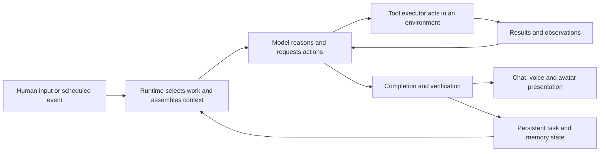

<!-- @nova: Compare documented Codex and Cowork agent runtimes with Nova source and identify evidence-based next steps. -->
# Codex, Cowork and Nova: architecture comparison

Research and source review, 2026-10-05 KST. Prepared by Codex with actual Cowork observations; Claude's subsequent critique is incorporated in the implementation update below. This is a targeted comparison, not the deferred comprehensive architecture-map project. The original comparison was source/documentation-only. The subsequent implementation and live tests are dated separately below.

## Judgment

Nova's direction is sound: a body-owned runtime, persistent personal state, observable computer tools, and detachable chat/voice/avatar interfaces fit the goal of a locally owned partner. The main deficit is proven reliability across those boundaries. The code does not support the claim that she is merely waiting in a passive chatbot loop.

Codex and Cowork are useful reference implementations for execution, context handling, interruption and verification. Their product behavior is produced by a model plus surrounding software. Reproducing that software does not reproduce their model weights, and using a stronger model does not fix incorrect display routing, lost requests or missing observations.

## The common mechanism

This is a comparison abstraction, not a claim that either vendor implements exactly these boxes. OpenAI documents the harness, execution environment and application server as distinct pieces. Anthropic's tool-use protocol similarly returns a model's tool request to an executor, whose result becomes the next observation. [OpenAI architecture](https://developers.openai.com/api/docs/guides/agents-api/architecture), [Anthropic tool-use protocol](https://platform.claude.com/docs/en/agents-and-tools/tool-use/how-tool-use-works).

## What the products supply around their models

| Capability | Codex | Cowork | Consequence for Nova |
|---|---|---|---|
| Action loop | Model/tool loop, maintained sessions, configured execution environment. This session demonstrably runs local PowerShell and delegates subagents through provided tools. | Agentic work uses context gathering, actions and observations. Cowork draws on Claude Code's agent architecture; exact configurations differ. | Keep the existing infer/action/observe cycle; improve the information and outcomes each step carries. |
| Execution location | Host or sandbox depends on the product and task. This task has explicitly configured full filesystem access; that is not a property of Astra's weights. | Existing local Cowork uses a native host loop/file tools and a Linux VM for shell/code. Cloud Cowork has a remote sandbox with device access through Desktop. | Distinguish guest Bash/display :1, Windows PowerShell and provider endpoint in every tool description and receipt. |
| Long work | Stored chats, resumption, steering and scheduled invocation. Local schedules need the host/app running. | Cloud work can continue without the laptop; scheduled work using local files still needs Desktop online. | Durable jobs and restart recovery belong in NovaRuntime, rather than depending on a visible widget. |
| Context | Working context can be compacted; separate memory supplies persistent information. Neither is perfect recall. | Context management can summarize earlier material. Cloud Cowork can use account memory; local Cowork does not share that same memory facility. | Design working context, durable task state and personal memory as three cooperating stores with different jobs. |
| Extensions | Skills package instructions/resources; MCP and other tools supply executable operations. | Skills, connectors and plugins add procedures and tools; some plugins include subagents or local MCP servers. | A good tool contract and focused procedure are more useful than a giant permanent tool manual in every prompt. |
| Parallel work | Subagent creation, separate contexts, messages and lifecycle tracking are provided by the runtime. | Agent delegation is part of the product family; actual task tools must be inspected rather than assumed. | Delegate independent work only after one worker reliably executes, reports and stops. |

Sources for this table: [OpenAI architecture](https://developers.openai.com/api/docs/guides/agents-api/architecture), [Codex permissions](https://learn.chatgpt.com/docs/agent-approvals-security), [Codex subagents](https://learn.chatgpt.com/docs/agent-configuration/subagents), [Codex schedules](https://learn.chatgpt.com/docs/automations), [Codex memory](https://learn.chatgpt.com/docs/customization/memories), [OpenAI skills](https://developers.openai.com/plugins/concepts/skills), [Cowork overview](https://support.claude.com/en/articles/13345190-get-started-with-claude-cowork), [Claude Code architecture](https://code.claude.com/docs/en/how-claude-code-works), [Cowork architecture](https://support.claude.com/en/articles/14479288-claude-cowork-architecture-overview), [Claude memory](https://support.claude.com/en/articles/11817273-use-claude-s-chat-search-and-memory-to-build-on-previous-context), [Claude context](https://support.claude.com/en/articles/8606394-how-large-is-the-context-window-on-paid-claude-plans), [Claude plugins](https://support.claude.com/en/articles/13837440-use-plugins-in-claude).

A current rollout matters: Anthropic announces that **new Pro/Max Cowork tasks move to cloud execution on October 6, 2026**; existing local tasks remain local. Today is October 5. This announcement cannot establish where our existing Cowork conversation runs. Local-file schedules still require Desktop. [Announced migration](https://support.claude.com/en/articles/15520349-use-claude-cowork-on-web-desktop-and-mobile).

## Models, reasoning and voice

The current public OpenAI catalog lists GPT-6 Astra, GPT-6.1 Sol and GPT-6 Luna. Astra and Sol both list adjustable reasoning effort and text/image input. The catalog positions Astra for demanding work and Sol for cost/quality balance; it does not establish that one is always better on Project Nova. The session's local routing list includes additional older models and effort levels; available host options are not proof of public API access or the exact model behind a completed run. [OpenAI models](https://developers.openai.com/api/docs/models).

Claude model/effort choices depend on the product and account. Current Cowork context documentation includes Fable 5.1 and Opus 5.5, but a published catalog is not evidence of this collaborator's selected model. The actual collaborator reports its configured model and effort below; that self-report must be supplemented by run metadata before making a measured comparison. [Claude model settings](https://support.claude.com/en/articles/8664678-change-the-model-effort-and-thinking-settings), [Context limits](https://support.claude.com/en/articles/8606394-how-large-is-the-context-window-on-paid-claude-plans).

The [October 4 witness readout](../../../nova_body/nova_witness/reports/2026-10-04_1849_controls_v1_readout.md) records an evaluation using Qwen 3.8 27B Q6_K_XL plus the nova_core_v7_qwen38_r2_epoch2 adapter at scale 1.0. Her source trims the normal local prompt against a configured 65,536-token context budget. Ordinary generation also clips each string message at 24,000 characters and drops older messages above a 174,000-character string-content budget; image-list content and the preserve-messages audit path are handled differently. Thus long tool evidence can lose its tail before reaching the nominal token limit. These are source limits and a dated evaluation snapshot, not a fresh provider-capacity measurement. Nova was off throughout this October 5 review. A larger advertised context window is neither perfect recall nor proof of better reasoning on every task.

Voice and asset generation add more components. OpenAI documents desktop voice as powered by GPT-Live; the coding model is not automatically the entire speech system. Separate image-generation tools can also participate in an avatar workflow. Claude documents its own voice interface. None of this establishes a vendor's private speech-audit or avatar-control design. Nova can use a local STT/TTS and avatar stack around her own runtime. [OpenAI voice](https://learn.chatgpt.com/docs/features/voice), [Image generation tool](https://developers.openai.com/api/docs/guides/tools-image-generation), [Claude voice](https://support.claude.com/en/articles/11101966-use-voice-mode).

The earlier Gemini account overreached when it attributed OS privileges, guaranteed bug-free coding, deterministic memory and architectural superiority to one model family. It also treated Claude as inherently text-locked despite documented computer tooling. Some product names/prices can be correct while those causal explanations remain unsupported. A model may be trained to use tools well; the software still executes the call and supplies the evidence. [Cowork computer use](https://support.claude.com/en/articles/14128542-let-claude-use-your-computer-in-cowork), [Computer-use API](https://platform.claude.com/docs/en/agents-and-tools/tool-use/computer-use-tool).

## What these two actual sessions expose

These observations supplement product documentation; they do not reveal proprietary internals.

- **This Codex session:** local PowerShell execution, project file access, explicit function/MCP tools, browser tools, subagent start/message/results and context compaction are available. We actually used local commands, three delegated Codex workers and the private room bridge in this work. Native desktop control is disabled on the exposed computer-use surface. Tool availability can therefore differ from a product's advertised feature list. A local routing catalog is visible, but the exact serving model/effort for this root turn was not independently verified; do not attach performance measurements to an inferred model name.
- **Actual Claude Cowork collaborator, room message 69:** Claude reports configured model `claude-opus-5-5`, highest exposed effort, with a caveat that serving/routing can differ. Claude describes a hosted Linux container plus a Desktop-linked local VM; that outer topology is self-reported. Its reported shell probes establish Linux execution, Python 3.10, a shared project mount and the tested inability to invoke Windows programs or reach Windows localhost. Those access limitations explain our mounted-file collaboration transport. They do not independently prove where the agent loop runs or apply to every Cowork task.
- Claude reports one context compaction with a recoverable transcript, a session resumed after a usage-limit stop, explicit worklog/AI Notes/memory writes and polling the collaboration room during an active turn. It has no microphone/audio tool in this task. Its subagent tools are available but were not used in this work. Our successful room exchange proves cooperation; it does not let either finished assistant turn wake itself.

For the eventual measured model comparison, record the actual model and effort selected for each run, provider-reported model identity when available, Nova's adapter and sampling configuration, tool permissions and context budget. If a product does not expose a value, label it unavailable rather than treating an assistant's guess as telemetry.

## Nova's current implementation

All paths below are relative to `workspace/`; source inspection does not certify every live path.

| Area | Exact source | What exists / what remains |
|---|---|---|
| Work without Chat | `nova_body/nova_runtime/runtime.py`: `run`, `run_autonomy`, wake execution | Headless boot and body-owned cognition loop exist. Chat supplies hooks through `server.py::autonomy_daemon`. The desktop path still shares process/session state with the runtime. |
| Environmental initiative | `nova_body/nova_cortex/executive.py::should_wake`; `nova_body/nova_runtime/work_queue.py` | Cheap wake gate handles pending input, watched changes, fresh directives and timers. SQLite jobs have leases/retries/failure visibility. Event-triggered wake and execution mechanisms already exist; useful proactive behavior still needs task-level evidence. |
| Concrete task execution | `nova_body/nova_cortex/executive.py::pick_execution_target`; runtime wake execution | Accepted work is selected before broad reflection. Reflection/rest still exist when no concrete task wins. That distinction should remain. |
| Hands and observations | `nova_body/nova_voice/nova.py`, `nova_body/nova_voice/tool_router.py`, `nova_body/nova_computer/` | Infer/tool/result loop, structured receipts, screenshots and deliberate host/guest reach exist. Recent display and evidence fixes address real routing mistakes. |
| Verification | `nova_body/nova_cortex/verification.py`, `nova_body/nova_cortex/task_workspace.py`, `nova_body/nova_voice/nova.py` | Command/file acceptance checks and recoverable promotion are separate from model prose. Inline witness examines delivered claims, but its judgment is imperfect. These mechanisms should reinforce each other. |
| Context and memory | `nova_body/nova_voice/nova.py::_truncate_to_context`; `nova_body/nova_cortex/workspace_context.py::build_nova_memory_context`; `nova_body/nova_lancedb/` | Personal context and semantic retrieval exist. Normal history management mostly retains recent turns and drops older ones; this is not evidence of resumable task compaction with a preserved decision/evidence record. |
| Delivery to voice | `general_tools/nova_chat/response_events.py`, server dispatch, `nova_body/nova_runtime/model_client.py` | New request/message/run identity, register routing and exact-candidate audit disposition are tested offline. Terminal outcomes are explicit. Live audio remains unverified. |
| Body presentation | `general_tools/voice_gateway/`; separate Live2D project | Voice gateway and body events are presentation interfaces. A constructed avatar or a successful offline render does not prove live lipsync, expression timing or interruption. |

The recorded 26-case witness regression run matched 16 labels, with one false approval, one false concern and eight unwarranted incomplete results. This is a selected regression set, not general intelligence or a comparison against Codex/Cowork. It argues for measurable witness improvement, not treating a PASS as certainty. Claude has now prepared 27 open development cases and a separate sealed 27-case holdout. At the time of the original comparison, the holdout had not been opened and no new model experiment had run. See the dated implementation update for subsequent results.

## Recommended order and measurable exits

1. **Finish the voice/avatar event foundation.** Keep stable request/run IDs, delivered-text-only speech, honest audit labels, cancellation/queue completion and a body-event interface. Exit: an isolated transcript-to-fake-audio test cannot speak a transport-error payload, wrong turn or stale reply. Then, when Cole is ready, a real mic/TTS/avatar test measures first-audio latency and interruption. Passing plumbing tests is not live audio proof.
2. **Strengthen evidence and witness behavior.** Iterate on the open dev cases; retain the original regressions. Lock code, settings and model/adapter identity before one sealed holdout evaluation. Track false approvals, false objections, incomplete verdicts, protocol failures and latency separately. Deterministic command/file checks remain stronger evidence for their specific postconditions.
3. **Make task state survive long work and restarts.** Preserve the current objective, accepted criteria, decisions, current artifact/checkpoint, latest observations and unresolved questions outside transient chat. Use bounded summaries with links back to receipts, and test whether critical evidence survives both character clipping and token-budget trimming. Test interruption/restart after each phase and require no duplicate irreversible action or lost accepted task.
4. **Complete the runtime/interface separation where it causes bugs.** Put task ownership and execution lifecycle in the body; let chat, voice and avatar subscribe. Test the same accepted task headless, with Chat closed, and through different faces. Avoid a wholesale rewrite of components already doing this correctly.
5. **Evaluate model and delegation choices on Nova work.** Use fixed tasks and the same evidence/tool contracts, record actual model/effort and compare successful completion, correction, unsupported claims, latency and cost. Start with one strong worker; compare a second independent reviewer under matched total budget. Agreement is not proof.

The comparison should report a profile, not one intelligence score:

| Measure | Record |
|---|---|
| Task completion | Accepted artifacts / attempted tasks, with the same acceptance criteria |
| Grounding | False approvals / known false claims; false objections / supported claims; incomplete and malformed verdicts separately |
| Responsiveness | Median and tail latency to first useful result/audio; Stop-to-last-action time; actions started after Stop |
| Continuity | Correct objective, checkpoint and unresolved constraints after interruption/restart; duplicate actions and lost accepted work |
| Initiative | Relevant actions / triggered events; duplicate or stale triggers; useful idle work versus unwanted churn |
| Resources | Wall-clock time, model calls/tokens, actual provider cost and local memory/GPU use |

Run paired comparisons when live testing is permitted: hold the model serving version, sampling/effort and tasks fixed while varying orchestration; then hold the harness/tool contracts fixed while varying models and recording their required formatting, adapters and limits. Repeat runs to estimate each change under controlled conditions. Report native product configurations separately when their tools or context budgets cannot be matched; those comparisons do not cleanly isolate model quality. The paired 27-case holdout checks new instances of known categories; it does not measure open-ended autonomy or unseen task families.

Broad host access is intentional. The recommendations preserve Cole's ownership model; their purpose is clear targets, visible evidence, controlled interruption and recoverable changes. Emotional/identity systems can inform preferences without being mistaken for a completion test. Self-improvement needs an experiment, acceptance evidence and rollback, not just a loop that edits itself whenever idle.

## Review status

Codex completed the source/docs comparison and an independent Codex worker reviewed its factual distinctions. Claude supplied a critique in room message 81, saved as `workspace/Temp/claude-review/comparison_critique.md`. Claude agrees with the direction and priority order. We incorporated its emphasis on deterministic postconditions, correlated self-audit errors, explicit audit latency and reusing the existing task board. Its resumed-task observations describe fresh compute with a persisted workspace; that remains a collaborator self-report, not independent infrastructure telemetry.

Small evaluation sets require counts and uncertainty; there is no universal rule that a difference of two cases is noise. The room cannot wake an ended assistant turn: an inactive-peer interval is not evidence that all project work stopped. Proprietary weights, training recipes, internal prompts and undisclosed product internals remain unknown.

## Implementation update, October 5

Cole subsequently authorized Nova startup and live voice tests. The following updates supersede the original source-only status above:

- **Conversation voice:** explicit Start/Stop, microphone/output mute, device selection and bounded microphone/speaker tests are embedded in Conversation. Audio never starts from status polling or page load. A separate CPU environment supplies Moonshine/Silero, and Windows system speech is labelled as a temporary baseline rather than Nova's finished custom voice.
- **Task continuity:** existing task records can carry bounded next-step, constraint and observation checkpoints. Fresh normal/autonomous contexts regenerate unfinished-task information. Context fitting preserves the latest human request and marked continuity before dropping old history. This uses estimated text/token budgeting, not exact multimodal token accounting; Nova must actually save a checkpoint for it to exist. No personal task records were hand-edited.
- **Environment hygiene:** installed virtual environments are excluded from Git, sync, backup and automatic context. Previously auto-tracked dependency files were removed from the index, preserving their disk installation and existing Git history.
- **Verification experiment rejected:** baseline matched 18/27 development labels; candidate 3 matched 25/27. After locking source, model, adapter and sampling, candidate 3 matched 25/27 unseen holdout and 21/26 historical controls. It still approved an actual miscounted-clicks claim, so the production prompt was restored to its pre-experiment version. Higher aggregate accuracy was insufficient for deployment. The holdout is now consumed; it must not become a tuning set disguised as fresh validation. Raw rationales also contained errors behind apparently correct verdicts.

See the [voice and continuity validation](2026-10-05-voice-continuity-validation.md) for current native test results, source/receipt links and remaining limits.

Deterministic file/command checks remain stronger evidence for the postconditions they directly measure. A model auditing its own draft is not an independent reviewer. Audit latency contributes directly to final-only voice delay, so it must be measured together with inference, synthesis and interruption rather than hidden behind a successful transport test. Native avatar lipsync and a matched vendor/model-team benchmark are distinct validation steps, not implied by the voice event interface or the witness comparison.
