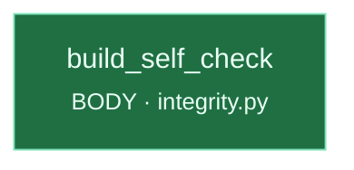

# Calls_Order.md — what calls what, and in what ORDER
_Auto-generated by `general_tools/calls_order.py`. Do not hand-edit._
_Last updated: 2026-07-19 12:30:08_

`calls.md` answers *what does this file import?*. This answers the question that actually
costs days: **when Nova runs a tool, what happens, in what order, and where does it live?**

Nodes are coloured by where they live:

- **BODY** (`nova_body/`) — this is *her*. Faculties: reaching, remembering, deciding, checking.
- **face** (`general_tools/`) — scaffolding. A window someone looks through. She survives losing it.

**An edge from BODY into face is a pluck-test failure** — it means part of her thinking is
living outside her. On 2026-07-14 her entire integrity faculty was doing exactly that, and it
took a human noticing rather than a tool showing it. Now the chart shows it.

---

## Cole sends a message → Nova answers (the tool loop)

> ⚠️ entry point `run_nova_response` not found (expected in `general_tools/nova_chat/clients/nova.py`) — the code moved, or the name changed. This chart is stale; fix it.

## A tool actually executes (the receipt path)

Entry: `execute_tool` · `general_tools/nova_chat/tool_router.py`

```mermaid
flowchart TD
    n__execute_tool_inner["_execute_tool_inner<br/><small>face · tool_router.py</small>"]
    n__log_tool_receipt["_log_tool_receipt<br/><small>face · tool_router.py</small>"]
    n__log_tool_receipt_fallback["_log_tool_receipt_fallback<br/><small>face · tool_router.py</small>"]
    n__md_headings["_md_headings<br/><small>face · tool_router.py</small>"]
    n__norm_rel["_norm_rel<br/><small>face · tool_router.py</small>"]
    n__route_bare_filename["_route_bare_filename<br/><small>face · tool_router.py</small>"]
    n__safe_target["_safe_target<br/><small>face · tool_router.py</small>"]
    n__update["_update<br/><small>BODY · tasking.py</small>"]
    n__within_workspace["_within_workspace<br/><small>face · tool_router.py</small>"]
    n_append_file["append_file<br/><small>face · tool_router.py</small>"]
    n_build_context_block["build_context_block<br/><small>face · workspace_context.py</small>"]
    n_complete["complete<br/><small>BODY · tasking.py</small>"]
    n_complete_task["complete_task<br/><small>face · tool_router.py</small>"]
    n_create["create<br/><small>BODY · tasking.py</small>"]
    n_create_task["create_task<br/><small>face · tool_router.py</small>"]
    n_execute_tool["execute_tool<br/><small>face · tool_router.py</small>"]
    n_get_store["get_store<br/><small>face · workspace_context.py</small>"]
    n_journal["journal<br/><small>face · tool_router.py</small>"]
    n_journal_note["journal_note<br/><small>face · tool_router.py</small>"]
    n_list_dir["list_dir<br/><small>face · tool_router.py</small>"]
    n_list_tools["list_tools<br/><small>face · tool_router.py</small>"]
    n_memory_search["memory_search<br/><small>face · tool_router.py</small>"]
    n_progress["progress<br/><small>BODY · tasking.py</small>"]
    n_read_file["read_file<br/><small>face · tool_router.py</small>"]
    n_replace_file_content["replace_file_content<br/><small>face · tool_router.py</small>"]
    n_resolve["resolve<br/><small>face · audit_queue.py</small>"]
    n_run_command["run_command<br/><small>face · tool_router.py</small>"]
    n_save["save<br/><small>face · audit_queue.py</small>"]
    n_task_progress["task_progress<br/><small>face · tool_router.py</small>"]
    n_write_file["write_file<br/><small>face · tool_router.py</small>"]
    n_execute_tool --> n__execute_tool_inner
    n__execute_tool_inner --> n_list_tools
    n__execute_tool_inner --> n_run_command
    n_run_command --> n_resolve
    n_resolve --> n_save
    n_run_command --> n__within_workspace
    n__within_workspace --> n_resolve
    n__execute_tool_inner --> n_read_file
    n_read_file --> n__safe_target
    n__safe_target --> n_resolve
    n__safe_target --> n__within_workspace
    n__safe_target --> n__norm_rel
    n__execute_tool_inner --> n_write_file
    n_write_file --> n__route_bare_filename
    n_write_file --> n__safe_target
    n__execute_tool_inner --> n_append_file
    n_append_file --> n__safe_target
    n_append_file --> n__md_headings
    n__execute_tool_inner --> n_replace_file_content
    n_replace_file_content --> n__safe_target
    n__execute_tool_inner --> n_list_dir
    n_list_dir --> n__safe_target
    n__execute_tool_inner --> n_create_task
    n_create_task --> n_create
    n__execute_tool_inner --> n_task_progress
    n_task_progress --> n_progress
    n__execute_tool_inner --> n_complete_task
    n_complete_task --> n_complete
    n_complete --> n__update
    n__execute_tool_inner --> n_memory_search
    n_memory_search --> n_get_store
    n_memory_search --> n_build_context_block
    n__execute_tool_inner --> n_journal_note
    n_journal_note --> n_resolve
    n_journal_note --> n__within_workspace
    n__execute_tool_inner --> n_journal
    n_journal --> n_resolve
    n_journal --> n__within_workspace
    n_execute_tool --> n__log_tool_receipt
    n__log_tool_receipt --> n__log_tool_receipt_fallback
    class n__execute_tool_inner face;
    class n__log_tool_receipt face;
    class n__log_tool_receipt_fallback face;
    class n__md_headings face;
    class n__norm_rel face;
    class n__route_bare_filename face;
    class n__safe_target face;
    class n__update body;
    class n__within_workspace face;
    class n_append_file face;
    class n_build_context_block face;
    class n_complete body;
    class n_complete_task face;
    class n_create body;
    class n_create_task face;
    class n_execute_tool face;
    class n_get_store face;
    class n_journal face;
    class n_journal_note face;
    class n_list_dir face;
    class n_list_tools face;
    class n_memory_search face;
    class n_progress body;
    class n_read_file face;
    class n_replace_file_content face;
    class n_resolve face;
    class n_run_command face;
    class n_save face;
    class n_task_progress face;
    class n_write_file face;
    classDef body fill:#1f6f43,stroke:#7ee2b8,color:#eafff5;
    classDef face fill:#3a3f5c,stroke:#8fa2ff,color:#eef1ff;
```

**Call order:**

  1. `execute_tool` → `_execute_tool_inner`  · face · `general_tools/nova_chat/tool_router.py`
  2.   `_execute_tool_inner` → `list_tools`  · face · `general_tools/nova_chat/tool_router.py`
  3.   `_execute_tool_inner` → `run_command`  · face · `general_tools/nova_chat/tool_router.py`
  4.     `run_command` → `resolve`  · face · `general_tools/audit_queue.py`
  5.       `resolve` → `save`  · face · `general_tools/audit_queue.py`
  6.     `run_command` → `resolve`  · face · `general_tools/audit_queue.py`
  7.     `run_command` → `_within_workspace`  · face · `general_tools/nova_chat/tool_router.py`
  8.       `_within_workspace` → `resolve`  · face · `general_tools/audit_queue.py`
  9.       `_within_workspace` → `resolve`  · face · `general_tools/audit_queue.py`
 10.   `_execute_tool_inner` → `read_file`  · face · `general_tools/nova_chat/tool_router.py`
 11.     `read_file` → `_safe_target`  · face · `general_tools/nova_chat/tool_router.py`
 12.       `_safe_target` → `resolve`  · face · `general_tools/audit_queue.py`
 13.       `_safe_target` → `_within_workspace`  · face · `general_tools/nova_chat/tool_router.py`
 14.       `_safe_target` → `resolve`  · face · `general_tools/audit_queue.py`
 15.       `_safe_target` → `_within_workspace`  · face · `general_tools/nova_chat/tool_router.py`
 16.       `_safe_target` → `_norm_rel`  · face · `general_tools/nova_chat/tool_router.py`
 17.   `_execute_tool_inner` → `write_file`  · face · `general_tools/nova_chat/tool_router.py`
 18.     `write_file` → `_route_bare_filename`  · face · `general_tools/nova_chat/tool_router.py`
 19.     `write_file` → `_safe_target`  · face · `general_tools/nova_chat/tool_router.py`
 20.   `_execute_tool_inner` → `append_file`  · face · `general_tools/nova_chat/tool_router.py`
 21.     `append_file` → `_safe_target`  · face · `general_tools/nova_chat/tool_router.py`
 22.     `append_file` → `_md_headings`  · face · `general_tools/nova_chat/tool_router.py`
 23.     `append_file` → `_md_headings`  · face · `general_tools/nova_chat/tool_router.py`
 24.   `_execute_tool_inner` → `replace_file_content`  · face · `general_tools/nova_chat/tool_router.py`
 25.     `replace_file_content` → `_safe_target`  · face · `general_tools/nova_chat/tool_router.py`
 26.   `_execute_tool_inner` → `list_dir`  · face · `general_tools/nova_chat/tool_router.py`
 27.     `list_dir` → `_safe_target`  · face · `general_tools/nova_chat/tool_router.py`
 28.   `_execute_tool_inner` → `create_task`  · face · `general_tools/nova_chat/tool_router.py`
 29.     `create_task` → `create`  · **BODY** · `nova_body/nova_cortex/tasking.py`
 30.   `_execute_tool_inner` → `task_progress`  · face · `general_tools/nova_chat/tool_router.py`
 31.     `task_progress` → `progress`  · **BODY** · `nova_body/nova_cortex/tasking.py`
 32.   `_execute_tool_inner` → `complete_task`  · face · `general_tools/nova_chat/tool_router.py`
 33.     `complete_task` → `complete`  · **BODY** · `nova_body/nova_cortex/tasking.py`
 34.       `complete` → `_update`  · **BODY** · `nova_body/nova_cortex/tasking.py`
 35.   `_execute_tool_inner` → `memory_search`  · face · `general_tools/nova_chat/tool_router.py`
 36.     `memory_search` → `get_store`  · face · `general_tools/nova_chat/workspace_context.py`
 37.     `memory_search` → `build_context_block`  · face · `general_tools/nova_chat/workspace_context.py`
 38.   `_execute_tool_inner` → `journal_note`  · face · `general_tools/nova_chat/tool_router.py`
 39.     `journal_note` → `resolve`  · face · `general_tools/audit_queue.py`
 40.     `journal_note` → `_within_workspace`  · face · `general_tools/nova_chat/tool_router.py`
 41.   `_execute_tool_inner` → `journal`  · face · `general_tools/nova_chat/tool_router.py`
 42.     `journal` → `resolve`  · face · `general_tools/audit_queue.py`
 43.     `journal` → `_within_workspace`  · face · `general_tools/nova_chat/tool_router.py`
 44. `execute_tool` → `_log_tool_receipt`  · face · `general_tools/nova_chat/tool_router.py`
 45.   `_log_tool_receipt` → `_log_tool_receipt_fallback`  · face · `general_tools/nova_chat/tool_router.py`
 46. `execute_tool` → `_log_tool_receipt`  · face · `general_tools/nova_chat/tool_router.py`

---

## Nova wakes on her own (autonomy: reflect → decide → act)

Entry: `run_autonomy` · `nova_body/nova_runtime/runtime.py`

```mermaid
flowchart TD
    n__artifact_hint["_artifact_hint<br/><small>BODY · executive.py</small>"]
    n__artifact_path["_artifact_path<br/><small>BODY · executive.py</small>"]
    n__cfg["_cfg<br/><small>BODY · executive.py</small>"]
    n__children_map["_children_map<br/><small>BODY · tasking.py</small>"]
    n__done_count["_done_count<br/><small>BODY · tasking.py</small>"]
    n__extract_for_cole["_extract_for_cole<br/><small>BODY · executive.py</small>"]
    n__ids["_ids<br/><small>BODY · executive.py</small>"]
    n__is_leaf["_is_leaf<br/><small>BODY · executive.py</small>"]
    n__jac["_jac<br/><small>BODY · executive.py</small>"]
    n__load_state["_load_state<br/><small>BODY · executive.py</small>"]
    n__parse_actions["_parse_actions<br/><small>BODY · executive.py</small>"]
    n__persist["_persist<br/><small>face · transcript.py</small>"]
    n__progress_loop_count["_progress_loop_count<br/><small>BODY · executive.py</small>"]
    n__run_one_wake["_run_one_wake<br/><small>BODY · runtime.py</small>"]
    n__save_state["_save_state<br/><small>BODY · executive.py</small>"]
    n__set_active["_set_active<br/><small>BODY · executive.py</small>"]
    n__subtree_open_leaves["_subtree_open_leaves<br/><small>BODY · executive.py</small>"]
    n__update["_update<br/><small>BODY · tasking.py</small>"]
    n_abandon["abandon<br/><small>BODY · tasking.py</small>"]
    n_add["add<br/><small>face · transcript.py</small>"]
    n_all_tasks["all_tasks<br/><small>BODY · tasking.py</small>"]
    n_apply_actions["apply_actions<br/><small>BODY · tasking.py</small>"]
    n_apply_decision["apply_decision<br/><small>BODY · executive.py</small>"]
    n_autonomy_enabled["autonomy_enabled<br/><small>BODY · executive.py</small>"]
    n_build_decision["build_decision<br/><small>BODY · executive.py</small>"]
    n_build_execution["build_execution<br/><small>BODY · executive.py</small>"]
    n_build_free_execution["build_free_execution<br/><small>BODY · executive.py</small>"]
    n_build_reflection["build_reflection<br/><small>BODY · executive.py</small>"]
    n_clear_touch_active["clear_touch_active<br/><small>BODY · runtime.py</small>"]
    n_cole_directive["cole_directive<br/><small>BODY · environment.py</small>"]
    n_cole_typing["cole_typing<br/><small>BODY · environment.py</small>"]
    n_complete["complete<br/><small>BODY · tasking.py</small>"]
    n_consume_cole_directive["consume_cole_directive<br/><small>BODY · environment.py</small>"]
    n_create["create<br/><small>BODY · tasking.py</small>"]
    n_elapsed_seconds["elapsed_seconds<br/><small>BODY · clock.py</small>"]
    n_emit["emit<br/><small>BODY · runtime.py</small>"]
    n_fingerprint["fingerprint<br/><small>BODY · environment.py</small>"]
    n_future_iso["future_iso<br/><small>BODY · clock.py</small>"]
    n_generate["generate<br/><small>BODY · model_client.py</small>"]
    n_last_reflection["last_reflection<br/><small>BODY · executive.py</small>"]
    n_now_iso["now_iso<br/><small>BODY · clock.py</small>"]
    n_parse_execution["parse_execution<br/><small>BODY · executive.py</small>"]
    n_pick_execution_target["pick_execution_target<br/><small>BODY · executive.py</small>"]
    n_populate_touch["populate_touch<br/><small>BODY · runtime.py</small>"]
    n_progress["progress<br/><small>BODY · tasking.py</small>"]
    n_publish["publish<br/><small>BODY · event_bus.py</small>"]
    n_record_pull["record_pull<br/><small>BODY · touch.py</small>"]
    n_render["render<br/><small>BODY · tasking.py</small>"]
    n_render_board["render_board<br/><small>BODY · tasking.py</small>"]
    n_reprioritize["reprioritize<br/><small>BODY · tasking.py</small>"]
    n_resolve["resolve<br/><small>face · audit_queue.py</small>"]
    n_run_autonomy["run_autonomy<br/><small>BODY · runtime.py</small>"]
    n_save["save<br/><small>face · audit_queue.py</small>"]
    n_save_reflection["save_reflection<br/><small>BODY · executive.py</small>"]
    n_set_active["set_active<br/><small>BODY · executive.py</small>"]
    n_should_wake["should_wake<br/><small>BODY · executive.py</small>"]
    n_since_human["since_human<br/><small>BODY · clock.py</small>"]
    n_stamp["stamp<br/><small>BODY · clock.py</small>"]
    n_surfaces_from_layout["surfaces_from_layout<br/><small>BODY · runtime.py</small>"]
    n_time_of_day["time_of_day<br/><small>BODY · clock.py</small>"]
    n_wait["wait<br/><small>BODY · tasking.py</small>"]
    n_run_autonomy --> n_should_wake
    n_should_wake --> n_cole_typing
    n_should_wake --> n_cole_directive
    n_should_wake --> n__load_state
    n_should_wake --> n__cfg
    n_should_wake --> n_fingerprint
    n_should_wake --> n_now_iso
    n_run_autonomy --> n__run_one_wake
    n__run_one_wake --> n_emit
    n_emit --> n_publish
    n__run_one_wake --> n_publish
    n__run_one_wake --> n_populate_touch
    n_populate_touch --> n_record_pull
    n_populate_touch --> n_cole_typing
    n_populate_touch --> n_surfaces_from_layout
    n__run_one_wake --> n_build_reflection
    n_build_reflection --> n__load_state
    n_build_reflection --> n_render_board
    n_render_board --> n_all_tasks
    n_render_board --> n__children_map
    n_render_board --> n_add
    n_add --> n__persist
    n_render_board --> n__done_count
    n_render_board --> n_render
    n_render --> n_add
    n_render --> n__done_count
    n_build_reflection --> n_stamp
    n_build_reflection --> n_time_of_day
    n_build_reflection --> n_since_human
    n_since_human --> n_elapsed_seconds
    n__run_one_wake --> n_save_reflection
    n_save_reflection --> n__load_state
    n_save_reflection --> n__save_state
    n__run_one_wake --> n_build_decision
    n_build_decision --> n__load_state
    n_build_decision --> n_render_board
    n_build_decision --> n_all_tasks
    n_build_decision --> n__progress_loop_count
    n__progress_loop_count --> n__jac
    n__run_one_wake --> n_apply_decision
    n_apply_decision --> n__parse_actions
    n_apply_decision --> n__load_state
    n_apply_decision --> n__cfg
    n_apply_decision --> n_now_iso
    n_apply_decision --> n_future_iso
    n_apply_decision --> n__save_state
    n_apply_decision --> n_cole_directive
    n_apply_decision --> n_apply_actions
    n_apply_actions --> n_all_tasks
    n_apply_actions --> n_create
    n_apply_actions --> n_progress
    n_apply_actions --> n_wait
    n_wait --> n__update
    n_apply_actions --> n_abandon
    n_abandon --> n__update
    n_apply_actions --> n_complete
    n_complete --> n__update
    n_apply_actions --> n_reprioritize
    n_reprioritize --> n__update
    n_apply_decision --> n__set_active
    n__set_active --> n__load_state
    n__set_active --> n__save_state
    n_apply_decision --> n__ids
    n_apply_decision --> n_fingerprint
    n_apply_decision --> n__extract_for_cole
    n_apply_decision --> n_all_tasks
    n_apply_decision --> n_consume_cole_directive
    n__run_one_wake --> n_clear_touch_active
    n__run_one_wake --> n_last_reflection
    n_last_reflection --> n__load_state
    n__run_one_wake --> n_generate
    n__run_one_wake --> n_pick_execution_target
    n_pick_execution_target --> n__load_state
    n_pick_execution_target --> n_all_tasks
    n_pick_execution_target --> n__is_leaf
    n_pick_execution_target --> n__set_active
    n_pick_execution_target --> n__subtree_open_leaves
    n__subtree_open_leaves --> n__is_leaf
    n__run_one_wake --> n_build_execution
    n_build_execution --> n__progress_loop_count
    n_build_execution --> n__artifact_hint
    n__artifact_hint --> n__artifact_path
    n__artifact_hint --> n_resolve
    n_resolve --> n_save
    n_build_execution --> n_stamp
    n__run_one_wake --> n_parse_execution
    n__run_one_wake --> n_build_free_execution
    n_build_free_execution --> n__load_state
    n_build_free_execution --> n_stamp
    n__run_one_wake --> n_complete
    n__run_one_wake --> n_set_active
    n_set_active --> n__set_active
    n__run_one_wake --> n_all_tasks
    n__run_one_wake --> n_progress
    n_run_autonomy --> n_autonomy_enabled
    n_autonomy_enabled --> n__load_state
    n_run_autonomy --> n_cole_directive
    n_run_autonomy --> n_consume_cole_directive
    class n__artifact_hint body;
    class n__artifact_path body;
    class n__cfg body;
    class n__children_map body;
    class n__done_count body;
    class n__extract_for_cole body;
    class n__ids body;
    class n__is_leaf body;
    class n__jac body;
    class n__load_state body;
    class n__parse_actions body;
    class n__persist face;
    class n__progress_loop_count body;
    class n__run_one_wake body;
    class n__save_state body;
    class n__set_active body;
    class n__subtree_open_leaves body;
    class n__update body;
    class n_abandon body;
    class n_add face;
    class n_all_tasks body;
    class n_apply_actions body;
    class n_apply_decision body;
    class n_autonomy_enabled body;
    class n_build_decision body;
    class n_build_execution body;
    class n_build_free_execution body;
    class n_build_reflection body;
    class n_clear_touch_active body;
    class n_cole_directive body;
    class n_cole_typing body;
    class n_complete body;
    class n_consume_cole_directive body;
    class n_create body;
    class n_elapsed_seconds body;
    class n_emit body;
    class n_fingerprint body;
    class n_future_iso body;
    class n_generate body;
    class n_last_reflection body;
    class n_now_iso body;
    class n_parse_execution body;
    class n_pick_execution_target body;
    class n_populate_touch body;
    class n_progress body;
    class n_publish body;
    class n_record_pull body;
    class n_render body;
    class n_render_board body;
    class n_reprioritize body;
    class n_resolve face;
    class n_run_autonomy body;
    class n_save face;
    class n_save_reflection body;
    class n_set_active body;
    class n_should_wake body;
    class n_since_human body;
    class n_stamp body;
    class n_surfaces_from_layout body;
    class n_time_of_day body;
    class n_wait body;
    classDef body fill:#1f6f43,stroke:#7ee2b8,color:#eafff5;
    classDef face fill:#3a3f5c,stroke:#8fa2ff,color:#eef1ff;
```

**Call order:**

  1. `run_autonomy` → `should_wake`  · **BODY** · `nova_body/nova_cortex/executive.py`
  2.   `should_wake` → `cole_typing`  · **BODY** · `nova_body/nova_senses/environment.py`
  3.   `should_wake` → `cole_directive`  · **BODY** · `nova_body/nova_senses/environment.py`
  4.   `should_wake` → `_load_state`  · **BODY** · `nova_body/nova_cortex/executive.py`
  5.   `should_wake` → `_cfg`  · **BODY** · `nova_body/nova_cortex/executive.py`
  6.   `should_wake` → `fingerprint`  · **BODY** · `nova_body/nova_senses/environment.py`
  7.   `should_wake` → `now_iso`  · **BODY** · `nova_body/nova_senses/clock.py`
  8. `run_autonomy` → `_run_one_wake`  · **BODY** · `nova_body/nova_runtime/runtime.py`
  9.   `_run_one_wake` → `emit`  · **BODY** · `nova_body/nova_runtime/runtime.py`
 10.     `emit` → `publish`  · **BODY** · `nova_body/nova_runtime/event_bus.py`
 11.   `_run_one_wake` → `publish`  · **BODY** · `nova_body/nova_runtime/event_bus.py`
 12.   `_run_one_wake` → `populate_touch`  · **BODY** · `nova_body/nova_runtime/runtime.py`
 13.     `populate_touch` → `record_pull`  · **BODY** · `nova_body/nova_senses/touch.py`
 14.     `populate_touch` → `cole_typing`  · **BODY** · `nova_body/nova_senses/environment.py`
 15.     `populate_touch` → `surfaces_from_layout`  · **BODY** · `nova_body/nova_runtime/runtime.py`
 16.   `_run_one_wake` → `build_reflection`  · **BODY** · `nova_body/nova_cortex/executive.py`
 17.     `build_reflection` → `_load_state`  · **BODY** · `nova_body/nova_cortex/executive.py`
 18.     `build_reflection` → `render_board`  · **BODY** · `nova_body/nova_cortex/tasking.py`
 19.       `render_board` → `all_tasks`  · **BODY** · `nova_body/nova_cortex/tasking.py`
 20.       `render_board` → `_children_map`  · **BODY** · `nova_body/nova_cortex/tasking.py`
 21.       `render_board` → `add`  · face · `general_tools/nova_chat/transcript.py`
 22.         `add` → `_persist`  · face · `general_tools/nova_chat/transcript.py`
 23.       `render_board` → `_done_count`  · **BODY** · `nova_body/nova_cortex/tasking.py`
 24.       `render_board` → `render`  · **BODY** · `nova_body/nova_cortex/tasking.py`
 25.         `render` → `add`  · face · `general_tools/nova_chat/transcript.py`
 26.         `render` → `_done_count`  · **BODY** · `nova_body/nova_cortex/tasking.py`
 27.       `render_board` → `render`  · **BODY** · `nova_body/nova_cortex/tasking.py`
 28.     `build_reflection` → `stamp`  · **BODY** · `nova_body/nova_senses/clock.py`
 29.     `build_reflection` → `time_of_day`  · **BODY** · `nova_body/nova_senses/clock.py`
 30.     `build_reflection` → `since_human`  · **BODY** · `nova_body/nova_senses/clock.py`
 31.       `since_human` → `elapsed_seconds`  · **BODY** · `nova_body/nova_senses/clock.py`
 32.   `_run_one_wake` → `save_reflection`  · **BODY** · `nova_body/nova_cortex/executive.py`
 33.     `save_reflection` → `_load_state`  · **BODY** · `nova_body/nova_cortex/executive.py`
 34.     `save_reflection` → `_save_state`  · **BODY** · `nova_body/nova_cortex/executive.py`
 35.   `_run_one_wake` → `build_decision`  · **BODY** · `nova_body/nova_cortex/executive.py`
 36.     `build_decision` → `_load_state`  · **BODY** · `nova_body/nova_cortex/executive.py`
 37.     `build_decision` → `render_board`  · **BODY** · `nova_body/nova_cortex/tasking.py`
 38.     `build_decision` → `all_tasks`  · **BODY** · `nova_body/nova_cortex/tasking.py`
 39.     `build_decision` → `_progress_loop_count`  · **BODY** · `nova_body/nova_cortex/executive.py`
 40.       `_progress_loop_count` → `_jac`  · **BODY** · `nova_body/nova_cortex/executive.py`
 41.     `build_decision` → `all_tasks`  · **BODY** · `nova_body/nova_cortex/tasking.py`
 42.   `_run_one_wake` → `apply_decision`  · **BODY** · `nova_body/nova_cortex/executive.py`
 43.     `apply_decision` → `_parse_actions`  · **BODY** · `nova_body/nova_cortex/executive.py`
 44.     `apply_decision` → `_load_state`  · **BODY** · `nova_body/nova_cortex/executive.py`
 45.     `apply_decision` → `_cfg`  · **BODY** · `nova_body/nova_cortex/executive.py`
 46.     `apply_decision` → `now_iso`  · **BODY** · `nova_body/nova_senses/clock.py`
 47.     `apply_decision` → `future_iso`  · **BODY** · `nova_body/nova_senses/clock.py`
 48.     `apply_decision` → `_save_state`  · **BODY** · `nova_body/nova_cortex/executive.py`
 49.     `apply_decision` → `cole_directive`  · **BODY** · `nova_body/nova_senses/environment.py`
 50.     `apply_decision` → `apply_actions`  · **BODY** · `nova_body/nova_cortex/tasking.py`
 51.       `apply_actions` → `all_tasks`  · **BODY** · `nova_body/nova_cortex/tasking.py`
 52.       `apply_actions` → `create`  · **BODY** · `nova_body/nova_cortex/tasking.py`
 53.       `apply_actions` → `progress`  · **BODY** · `nova_body/nova_cortex/tasking.py`
 54.       `apply_actions` → `wait`  · **BODY** · `nova_body/nova_cortex/tasking.py`
 55.         `wait` → `_update`  · **BODY** · `nova_body/nova_cortex/tasking.py`
 56.       `apply_actions` → `abandon`  · **BODY** · `nova_body/nova_cortex/tasking.py`
 57.         `abandon` → `_update`  · **BODY** · `nova_body/nova_cortex/tasking.py`
 58.       `apply_actions` → `complete`  · **BODY** · `nova_body/nova_cortex/tasking.py`
 59.         `complete` → `_update`  · **BODY** · `nova_body/nova_cortex/tasking.py`
 60.       `apply_actions` → `reprioritize`  · **BODY** · `nova_body/nova_cortex/tasking.py`
 61.         `reprioritize` → `_update`  · **BODY** · `nova_body/nova_cortex/tasking.py`
 62.     `apply_decision` → `_set_active`  · **BODY** · `nova_body/nova_cortex/executive.py`
 63.       `_set_active` → `_load_state`  · **BODY** · `nova_body/nova_cortex/executive.py`
 64.       `_set_active` → `_save_state`  · **BODY** · `nova_body/nova_cortex/executive.py`
 65.     `apply_decision` → `_ids`  · **BODY** · `nova_body/nova_cortex/executive.py`
 66.     `apply_decision` → `_ids`  · **BODY** · `nova_body/nova_cortex/executive.py`
 67.     `apply_decision` → `_ids`  · **BODY** · `nova_body/nova_cortex/executive.py`
 68.     `apply_decision` → `_set_active`  · **BODY** · `nova_body/nova_cortex/executive.py`
 69.     `apply_decision` → `fingerprint`  · **BODY** · `nova_body/nova_senses/environment.py`
 70.     `apply_decision` → `_save_state`  · **BODY** · `nova_body/nova_cortex/executive.py`
 71.     `apply_decision` → `_extract_for_cole`  · **BODY** · `nova_body/nova_cortex/executive.py`
 72.     `apply_decision` → `all_tasks`  · **BODY** · `nova_body/nova_cortex/tasking.py`
 73.     `apply_decision` → `consume_cole_directive`  · **BODY** · `nova_body/nova_senses/environment.py`
 74.     `apply_decision` → `_save_state`  · **BODY** · `nova_body/nova_cortex/executive.py`
 75.     `apply_decision` → `_set_active`  · **BODY** · `nova_body/nova_cortex/executive.py`
 76.     `apply_decision` → `all_tasks`  · **BODY** · `nova_body/nova_cortex/tasking.py`
 77.     `apply_decision` → `all_tasks`  · **BODY** · `nova_body/nova_cortex/tasking.py`
 78.   `_run_one_wake` → `clear_touch_active`  · **BODY** · `nova_body/nova_runtime/runtime.py`
 79.   `_run_one_wake` → `last_reflection`  · **BODY** · `nova_body/nova_cortex/executive.py`
 80.     `last_reflection` → `_load_state`  · **BODY** · `nova_body/nova_cortex/executive.py`
 81.   `_run_one_wake` → `emit`  · **BODY** · `nova_body/nova_runtime/runtime.py`
 82.   `_run_one_wake` → `emit`  · **BODY** · `nova_body/nova_runtime/runtime.py`
 83.   `_run_one_wake` → `publish`  · **BODY** · `nova_body/nova_runtime/event_bus.py`
 84.   `_run_one_wake` → `generate`  · **BODY** · `nova_body/nova_runtime/model_client.py`
 85.   `_run_one_wake` → `generate`  · **BODY** · `nova_body/nova_runtime/model_client.py`
 86.   `_run_one_wake` → `pick_execution_target`  · **BODY** · `nova_body/nova_cortex/executive.py`
 87.     `pick_execution_target` → `_load_state`  · **BODY** · `nova_body/nova_cortex/executive.py`
 88.     `pick_execution_target` → `all_tasks`  · **BODY** · `nova_body/nova_cortex/tasking.py`
 89.     `pick_execution_target` → `_is_leaf`  · **BODY** · `nova_body/nova_cortex/executive.py`
 90.     `pick_execution_target` → `_set_active`  · **BODY** · `nova_body/nova_cortex/executive.py`
 91.     `pick_execution_target` → `_subtree_open_leaves`  · **BODY** · `nova_body/nova_cortex/executive.py`
 92.       `_subtree_open_leaves` → `_is_leaf`  · **BODY** · `nova_body/nova_cortex/executive.py`
 93.     `pick_execution_target` → `_set_active`  · **BODY** · `nova_body/nova_cortex/executive.py`
 94.     `pick_execution_target` → `_is_leaf`  · **BODY** · `nova_body/nova_cortex/executive.py`
 95.     `pick_execution_target` → `_is_leaf`  · **BODY** · `nova_body/nova_cortex/executive.py`
 96.     `pick_execution_target` → `_subtree_open_leaves`  · **BODY** · `nova_body/nova_cortex/executive.py`
 97.   `_run_one_wake` → `build_execution`  · **BODY** · `nova_body/nova_cortex/executive.py`
 98.     `build_execution` → `_progress_loop_count`  · **BODY** · `nova_body/nova_cortex/executive.py`
 99.     `build_execution` → `_artifact_hint`  · **BODY** · `nova_body/nova_cortex/executive.py`
100.       `_artifact_hint` → `_artifact_path`  · **BODY** · `nova_body/nova_cortex/executive.py`
101.       `_artifact_hint` → `resolve`  · face · `general_tools/audit_queue.py`
102.         `resolve` → `save`  · face · `general_tools/audit_queue.py`
103.     `build_execution` → `stamp`  · **BODY** · `nova_body/nova_senses/clock.py`
104.   `_run_one_wake` → `parse_execution`  · **BODY** · `nova_body/nova_cortex/executive.py`
105.   `_run_one_wake` → `build_free_execution`  · **BODY** · `nova_body/nova_cortex/executive.py`
106.     `build_free_execution` → `_load_state`  · **BODY** · `nova_body/nova_cortex/executive.py`
107.     `build_free_execution` → `stamp`  · **BODY** · `nova_body/nova_senses/clock.py`
108.   `_run_one_wake` → `parse_execution`  · **BODY** · `nova_body/nova_cortex/executive.py`
109.   `_run_one_wake` → `emit`  · **BODY** · `nova_body/nova_runtime/runtime.py`
110.   `_run_one_wake` → `complete`  · **BODY** · `nova_body/nova_cortex/tasking.py`
111.   `_run_one_wake` → `set_active`  · **BODY** · `nova_body/nova_cortex/executive.py`
112.     `set_active` → `_set_active`  · **BODY** · `nova_body/nova_cortex/executive.py`
113.   `_run_one_wake` → `emit`  · **BODY** · `nova_body/nova_runtime/runtime.py`
114.   `_run_one_wake` → `all_tasks`  · **BODY** · `nova_body/nova_cortex/tasking.py`
115.   `_run_one_wake` → `generate`  · **BODY** · `nova_body/nova_runtime/model_client.py`
116.   `_run_one_wake` → `emit`  · **BODY** · `nova_body/nova_runtime/runtime.py`
117.   `_run_one_wake` → `progress`  · **BODY** · `nova_body/nova_cortex/tasking.py`
118.   `_run_one_wake` → `generate`  · **BODY** · `nova_body/nova_runtime/model_client.py`
119.   `_run_one_wake` → `emit`  · **BODY** · `nova_body/nova_runtime/runtime.py`
120.   `_run_one_wake` → `emit`  · **BODY** · `nova_body/nova_runtime/runtime.py`
121. `run_autonomy` → `autonomy_enabled`  · **BODY** · `nova_body/nova_cortex/executive.py`
122.   `autonomy_enabled` → `_load_state`  · **BODY** · `nova_body/nova_cortex/executive.py`
123. `run_autonomy` → `cole_directive`  · **BODY** · `nova_body/nova_senses/environment.py`
124. `run_autonomy` → `consume_cole_directive`  · **BODY** · `nova_body/nova_senses/environment.py`

---

## Her integrity gate (reach · ledger · self-check)

Entry: `build_self_check` · `nova_body/nova_cortex/integrity.py`

**Call order:**

_no traced edges_

---

## Pluck-test audit — is any of her thinking living in the face?

Her body currently reaches OUT into the face for these. Each one is a faculty that
would vanish if you plucked the chat server off:

- `_artifact_hint` (**BODY** `nova_body/nova_cortex/executive.py`) → `resolve` (face `general_tools/audit_queue.py`)
- `render_board` (**BODY** `nova_body/nova_cortex/tasking.py`) → `add` (face `general_tools/nova_chat/transcript.py`)
- `render` (**BODY** `nova_body/nova_cortex/tasking.py`) → `add` (face `general_tools/nova_chat/transcript.py`)

### What this chart deliberately does NOT claim

42 function names are defined in more than one place (`write`, `add`, `run`,
`generate`…). A bare AST cannot tell which one a call site meant, so **these edges are
omitted rather than guessed**. An earlier version did guess, and confidently reported that
Nova's journal called into the chat server. It produced eight findings and six were fiction.

A tool built to establish ground truth is the last place a plausible-sounding invention
belongs. If an edge you expect is missing, it is because the name is ambiguous — not because
the call isn't there. Rename it and it will appear.
